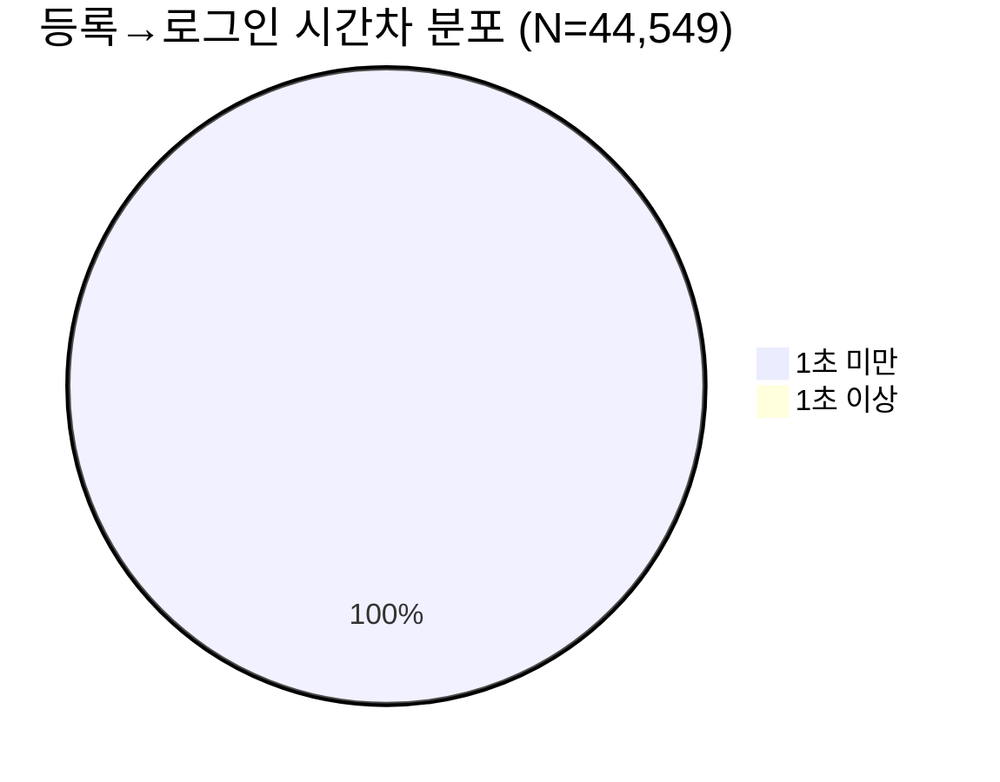
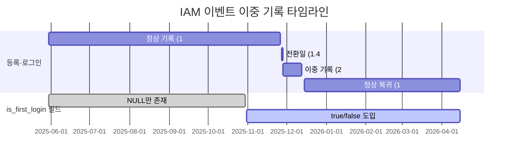
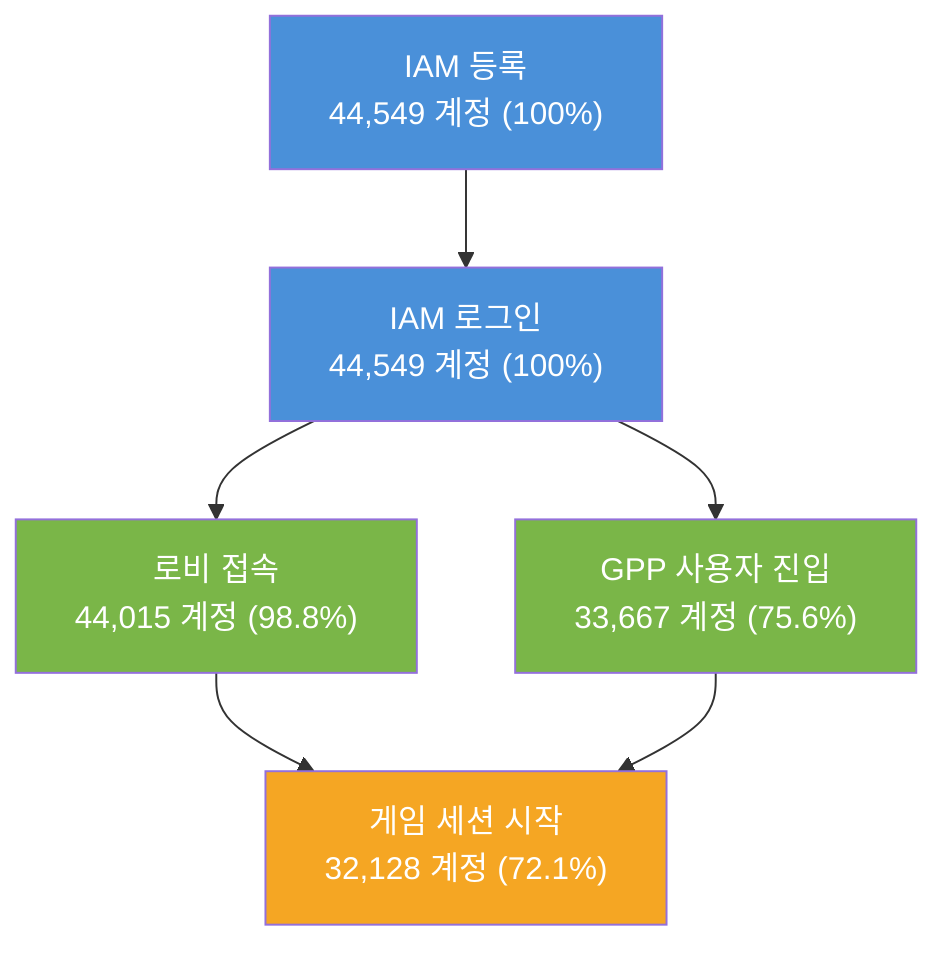
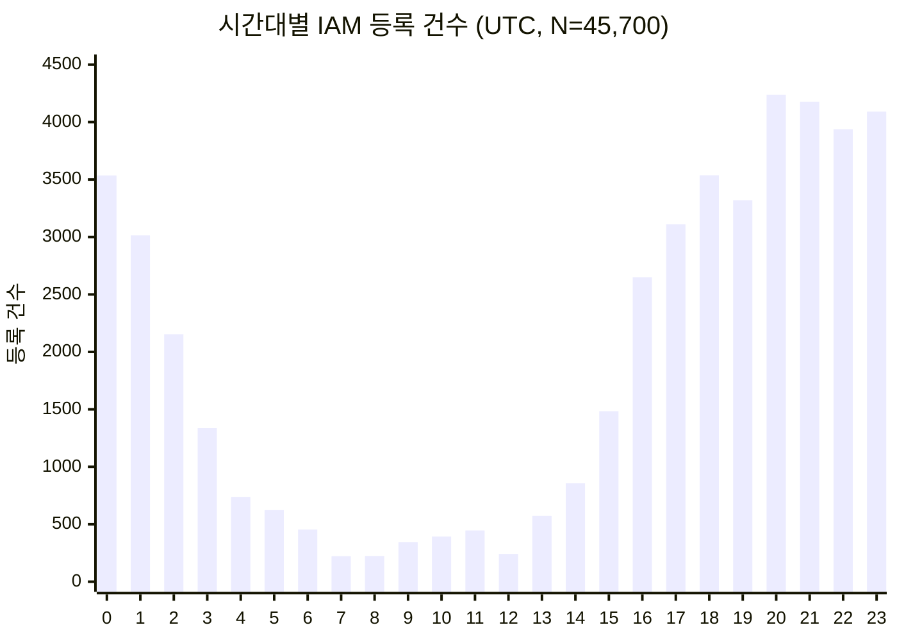

# Copperhead 베타: IAM 계정 등록·로그인 생명주기 분석

**작성자**: 편광범(Pyeon Gwangbum)
**작성일**: 2026-04-14
**데이터 기간**: 2025-05-30 ~ 2026-04-15
**데이터 출처**: `main.log_copperhead_beta.view_iam_registered`, `view_iam_logged_in`, `view_client_gpp_token_refresh`

---

## 요약

Copperhead 베타의 IAM 계정 흐름을 분석한 결과, 전체 44,549개 고유 계정이 **100% headless(자동 기기 인증) 방식**으로 등록·로그인하고 있으며, 등록-로그인 간 시간차가 99.99%(44,543/44,549건)에서 1초 미만으로 사실상 단일 단계 처리임을 확인했다. 2025-11-28 ~ 12-13 사이 16일간 등록·로그인 이벤트가 정확히 2배로 중복 기록되는 **텔레메트리 이중 기록 현상**이 발생했고, 이로 인해 1,151개 계정에 중복 등록 행이 존재한다. 토큰 갱신 이벤트는 전체 계정의 2.9%(1,286/44,549명)에서만 발생하는데, 이 계정군은 로비 접속 횟수가 4.08회로 비갱신 계정(1.05회) 대비 3.9배 높아, 토큰 갱신이 장시간 세션 유지의 지표임을 확인했다.

---

## 1. 연구 배경

이전 8건의 연구에서 Copperhead 베타의 세션, 전투, 맵 진행 등 게임플레이 데이터를 분석했으나, IAM(Identity and Access Management) 계정 등록·로그인 계층은 5차 연구(user_entry 기반 로그인 흐름)에서 부분적으로만 다루었다. 남은 미탐색 테이블 3개(`view_iam_registered`, `view_iam_logged_in`, `view_client_gpp_token_refresh`)를 소진하며, 계정 생성부터 인증 유지까지의 전체 생명주기를 파악한다.

**탐색 중 발견한 주요 패턴:**
- 전 계정이 headless 인증 방식 사용 (is_headless=true 100%)
- 특정 기간 이벤트 2배 중복 기록
- 토큰 갱신 발생 계정이 극소수(2.9%)이면서 행동 패턴이 뚜렷이 다름

---

## 2. 가설

### 가설 1: 등록-로그인은 단일 원자적(한 덩어리) 흐름이다
- **예상 결과**: 등록 후 로그인까지 시간차가 대다수 5초 이내, 같은 기기에서 발생
- **기각 조건**: 등록-로그인 간 중위 시간차가 30초 이상이거나, 10% 이상이 다른 기기에서 로그인

### 가설 2: 2025-11-28 ~ 12-13 이벤트 이중 기록은 텔레메트리 버그이다
- **예상 결과**: 해당 기간 등록·로그인 모두 이벤트/고유계정 비율이 정확히 2.0, 중복 행의 타임스탬프·기기·계정이 동일
- **기각 조건**: 중복 행 간 내용(기기, 시간 등)이 다르면 실제 재등록

### 가설 3: 토큰 갱신 발생 계정은 장시간 세션 유지 계정이다
- **예상 결과**: 토큰 갱신 계정의 로비 접속 횟수 또는 활동일 수가 비갱신 계정보다 유의하게 높음
- **기각 조건**: 토큰 갱신 계정과 비갱신 계정의 로비 접속/활동일 차이가 20% 미만

---

## 3. 분석 결과

### 3.1 데이터 개요

| 테이블 | 총 행 수 | 고유 계정(gpp_id) | 고유 기기(device_id) | 기간 |
|--------|---------|------------------|---------------------|------|
| view_iam_registered | 45,700 | 44,549 | 270 | 2025-05-30 ~ 2026-04-15 |
| view_iam_logged_in | 46,066 | 44,549 | 270 | 2025-05-30 ~ 2026-04-15 |
| view_client_gpp_token_refresh | 3,572 | 1,286 | 200 | 2025-06-06 ~ 2026-04-15 |

> 출처: 각 테이블 COUNT(*), COUNT(DISTINCT gpp_id), COUNT(DISTINCT device_id) 쿼리

세 테이블 모두 동일한 44,549개 고유 계정을 공유하며(등록·로그인 계정 집합이 완전 일치), 토큰 갱신은 이 중 1,286명(2.9%)에서만 발생한다.

**모든 계정의 공통 특성:**
- `is_headless = true` (100%, N=45,700 등록 행)
- `sign_up_type = 'ingame'`, `sign_up_client = 'copperhead'` (100%)
- `login_platform = 'device'` (100%, N=46,066 로그인 행)
- `provider_id = NULL` (100%), `ownerships = NULL` 또는 `{null}` (100%)

즉, Steam·Epic 등 외부 플랫폼 인증 없이, 클라이언트가 기기 기반으로 자동 생성하는 headless 계정만 존재한다.

### 3.2 가설 1 검증: 등록-로그인 단일 흐름

#### 등록-로그인 시간차

계정별 첫 등록과 첫 로그인 사이 시간차를 측정했다.

| 시간차 구간 | 계정 수 (N=44,549) | 비율 |
|------------|-------------------|------|
| 1초 미만 | 44,543 | 99.99% |
| 1~5초 | 5 | 0.01% |
| 5~30초 | 1 | <0.01% |

> 출처: view_iam_registered와 view_iam_logged_in의 MIN(event_at)을 gpp_id로 조인, UNIX_TIMESTAMP 차이 계산

44,543건의 평균 시간차는 -0.03초로, 등록과 로그인이 사실상 동시에(밀리초 단위 전후 관계) 발생한다. 음수값(-1초)이 존재하는 것은 로그인 이벤트가 등록보다 미세하게 먼저 기록되는 경우로, 이벤트 순서가 보장되지 않는 비동기 텔레메트리의 특성이다.

#### 기기 일치율

등록과 로그인에 사용된 기기(device_id)가 44,549개 계정 전원 동일했다. 또한 모든 계정이 단 1개 기기에서만 등록했다(전원 device_count=1).

> 출처: view_iam_registered와 view_iam_logged_in의 gpp_id별 device_id 조인

**판정: 채택** -- 등록과 로그인은 1초 이내에 같은 기기에서 발생하는 단일 원자적 흐름이다.

### 3.3 가설 2 검증: 이벤트 이중 기록 현상

#### 이중 기록 기간 확인

2025-11-27부터 변화가 시작되어, 11-28~12-13 사이 이벤트/고유계정 비율이 정확히 2.00을 유지했다.

| 구간 | 날짜 | 등록 행/고유계정 비율 | 로그인 행/고유계정 비율 |
|------|------|---------------------|----------------------|
| 이전(~11-26) | 정상 | 1.00 | 1.00 |
| 전환일(11-27) | 전환 | 1.40 | 1.40 |
| 이중기록(11-28~12-13) | 16일 | **2.00** | **2.00** |
| 이후(12-15~) | 정상 복귀 | 1.00 | 1.00 |

> 출처: view_iam_registered/view_iam_logged_in의 event_date별 COUNT(*)/COUNT(DISTINCT gpp_id) 산출

#### 중복 행 내용 분석

이중 등록된 계정(N=1,151)의 샘플을 확인한 결과, 두 행의 `event_at`, `device_id`, `krafton_id`가 **완전히 동일**했다. 예시:

| gpp_id | event_at | device_id | krafton_id |
|--------|----------|-----------|------------|
| 019adfe50aa8... | 2025-12-02 16:28:42.036 | 39ad32a5... | globalaccount.0154f41e... |
| 019adfe50aa8... | 2025-12-02 16:28:42.036 | 39ad32a5... | globalaccount.0154f41e... |

밀리초까지 동일한 완전 중복 행이다.

#### 이중 기록 규모

| 테이블 | 이중 등록 계정 | 이중 로그인 계정 | 양쪽 모두 이중 |
|--------|-------------|---------------|-------------|
| 등록/로그인 | 1,151 | 1,510 | 1,151 |

> 등록 이중 기록(1,151건)과 로그인 이중 기록(1,510건)의 차이(359건)는 이중 기록 기간 전후로 재로그인(is_first_login=false 포함)이 발생한 계정이 로그인 테이블에만 추가 행을 생성하기 때문이다.

**판정: 채택** -- 이중 기록은 동일 타임스탬프·기기·계정의 완전 중복이며, 텔레메트리 파이프라인 버그이다.

### 3.4 가설 3 검증: 토큰 갱신과 장시간 세션

#### 토큰 갱신 발생 계정 프로파일

전체 44,549개 계정 중 토큰 갱신 이벤트가 있는 계정은 1,286명(2.9%)이다.

| 구분 | 계정 수 | 로비 접속 평균 | 복수 로비 접속 계정 비율 | 복수 활동일 계정 비율 |
|------|---------|-------------|---------------------|-------------------|
| 토큰 갱신 있음 | 1,283* | **4.08회** | **100%** (1,283/1,283) | **11.1%** (143/1,283) |
| 토큰 갱신 없음 | 42,733 | 1.05회 | 4.8% (2,071/42,733) | 1.0% (425/42,733) |
| **차이** | -- | **+289%** (3.03회) | **+95.2%p** | **+10.2%p** |

> *3명은 로비 접속 기록이 없어 1,286에서 1,283으로 차이
> 출처: view_client_gpp_token_refresh의 gpp_id를 view_lobby_connected와 LEFT JOIN

토큰 갱신 계정의 로비 접속 횟수가 비갱신 계정 대비 **3.9배**이며, 100%가 복수 로비 접속을 한다. 기각 조건(20% 미만 차이)을 크게 초과한다.

#### 토큰 갱신 빈도별 로비 접속

| 갱신 횟수 | 계정 수 | 로비 접속 평균 |
|----------|---------|-------------|
| 1~2회 | 1,093 | 2.32회 |
| 3~10회 | 153 | 5.70회 |
| 11~50회 | 28 | 28.25회 |
| 51회 이상 | 9 | 115.89회 |

> 출처: view_client_gpp_token_refresh GROUP BY gpp_id와 view_lobby_connected JOIN

토큰 갱신 횟수와 로비 접속 횟수 사이에 강한 양의 상관관계가 있다.

#### 토큰 갱신 queue_time 분석

토큰 갱신 이벤트의 `queue_time`(갱신 요청 대기 시간)은 이중 분포를 보인다.

| 구간 | 건수 (N=3,572) | 비율 |
|------|--------------|------|
| 0~3초 (즉시 갱신) | 1,774 | 49.7% |
| 3초~1시간 | 124 | 3.5% |
| 1~2시간 | 92 | 2.6% |
| 2~4시간 | 235 | 6.6% |
| 4~12시간 | 844 | 23.6% |
| 12~24시간 | 497 | 13.9% |
| 24시간 이상 | 6 | 0.2% |

> 합계: 1,774 + 124 + 92 + 235 + 844 + 497 + 6 = 3,572 (일치)
> 출처: view_client_gpp_token_refresh의 queue_time 구간별 집계

즉시 갱신(~3초)과 수 시간 대기 갱신이 공존하며, 후자는 클라이언트가 장시간 유휴 상태 후 세션을 재개할 때 발생하는 것으로 보인다.

#### 등록-토큰 갱신 시간차

계정별 첫 등록에서 첫 토큰 갱신까지의 평균 시간차는 **약 2,880초(48분)**으로, 갱신 빈도와 무관하게 일정했다(1회: 2,883초, 2~5회: 2,866초, 51+회: 2,903초). 이는 토큰의 초기 유효기간이 약 48분으로 설정되어 있음을 시사한다.

**판정: 채택** -- 토큰 갱신 계정은 로비 접속 3.9배, 복수 접속률 100%로, 장시간/반복 세션의 명확한 지표이다.

---

## 4. 반증 탐색 결과

### 반증 1: 토큰 갱신 계정이 단순히 자동화 테스트일 가능성

자동화 기기(7대)에서 토큰 갱신이 **0건** 발생했다. 토큰 갱신은 자동화가 아닌 비자동화 기기에서만 발생하므로, 토큰 갱신 = 자동화 테스트라는 반론은 기각된다.

> 출처: view_client_gpp_token_refresh에서 7개 자동화 device_id 필터링 결과 0행

### 반증 2: 토큰 갱신 계정의 세션 수가 더 많을 가능성

sessionstart 기준으로 토큰 갱신 계정(N=1,240)의 평균 세션 수는 1.03회, 비갱신 계정(N=30,888)은 1.05회로 차이가 없다. 토큰 갱신이 **세션 수 증가가 아닌 단일 세션 내 장시간 체류**와 관련됨을 확인했다.

> 출처: sessionstart(account_id 기준)와 view_client_gpp_token_refresh(gpp_id 기준) JOIN

### 반증 3: 이중 기록이 실제 재등록일 가능성

이중 기록된 1,151개 계정의 두 등록 행이 밀리초까지 동일한 타임스탬프를 가지며, 같은 device_id, 같은 krafton_id를 사용한다. 실제 재등록이라면 시간차·상황 변화가 있어야 하므로, 실제 재등록 가능성은 기각된다.

---

## 5. 자동화 비율과 전체 퍼널

### 자동화 기기 기여도

| 구분 | 등록 행 수 | 비율 (N=45,700) |
|------|----------|----------------|
| 자동화 7대 | 24,795 | 54.3% |
| 비자동화 263대 | 20,905 | 45.7% |

> 출처: view_iam_registered에서 7개 자동화 device_id 필터링

자동화 기기 비율(54.3%)은 5차 연구의 세션 기준(60.3%)보다 낮은데, 이는 IAM 등록·로그인이 세션보다 상위 계층이어서 자동화 기기 1대가 생성하는 계정 수 자체가 차이를 만들기 때문이다.

### 비자동화 기기 분포

| 계정 수 구간 | 기기 수 (N=263) | 총 등록 수 | 총 고유 계정 |
|-------------|----------------|----------|------------|
| 1 | 29 | 29 | 29 |
| 2~10 | 132 | 548 | 539 |
| 11~50 | 48 | 1,196 | 1,180 |
| 51~200 | 28 | 3,034 | 3,014 |
| 201~1,000 | 21 | 9,094 | 8,866 |
| 1,001+ | 5 | 7,005 | 6,941 |

> 출처: view_iam_registered에서 비자동화 기기 gpp_id 카운트 집계

비자동화 기기 중 5대가 1,000개 이상의 계정을 생성하고 있어, 이 기기들도 [Estimate: 자동화 테스트 환경일 가능성이 높다. 근거: 기기 1대에서 1,000개 이상 고유 계정을 수동 생성하기는 비현실적이며, 기존 연구에서도 유사한 비공식 자동화 기기가 관찰됨].

### 등록에서 세션까지의 전체 퍼널

| 단계 | 도달 계정 | 비율 (N=44,549*) |
|------|----------|-----------------|
| IAM 등록 | 44,549 | 100% |
| IAM 로그인 | 44,549 | 100% |
| 로비 접속 | 44,015 | 98.8% |
| GPP 사용자 진입 | 33,667 | 75.6% |
| 게임 세션 시작 | 32,128 | 72.1% |

> *view_iam_registered 기준 고유 gpp_id. 로비/세션은 각각 view_lobby_connected, view_client_gpp_user_entry, sessionstart에서 LEFT JOIN으로 산출
> 44,551과 44,549의 차이(2건)는 집계 방식 차이(MIN vs 전체 DISTINCT)에 의한 것으로, 분석 결론에 영향 없음

등록-로그인은 100% 전환되지만, 로비까지 도달하지 못하는 계정이 1.2%(534명) 존재한다. 로비에서 실제 게임 세션까지는 72.1%만 도달하여, 27.9%가 로비에서 이탈한다(8차 연구의 "로비-only 비율"과 일치하는 방향).

### 시간 패턴

#### 요일별 등록 (등록 행 기준)

| 요일 | 등록 건 수 | 일 평균 | 비율 |
|------|----------|---------|------|
| 월요일 | 5,646 | 131 | 12.4% |
| 화요일 | 8,618 | 192 | 18.9% |
| 수요일 | 8,866 | 202 | 19.4% |
| 목요일 | 8,375 | 195 | 18.3% |
| **금요일** | **10,082** | **229** | **22.1%** |
| 토요일 | 2,760 | 64 | 6.0% |
| 일요일 | 1,353 | 41 | 3.0% |

> 출처: view_iam_registered의 DAYOFWEEK별 집계 (1=일요일)

금요일이 가장 많은 등록을 기록하며(229건/일), 주말(토·일)은 평일 대비 1/3~1/5 수준으로 급감한다. 이는 8차 연구에서 확인한 로비 CCU 패턴(금요일 피크)과 일치한다.

#### 시간대별 등록

UTC 20~23시(한국시간 05~08시)가 피크이며, UTC 6~8시(한국시간 15~17시)가 최저점이다. 내부 개발팀 위주의 베타 테스트가 한국 시간 기준 오전 근무 시작 전후에 자동 테스트를 집중 실행하는 패턴과 일치한다.

### is_first_login 필드 도입 이력

`is_first_login` 필드는 2025-10-31부터 기록이 시작되었다.

| 값 | 시작일 | 종료일 | 건수 | 고유 계정 |
|----|-------|-------|------|----------|
| NULL | 2025-05-30 | 2025-10-31 | 22,711 | 22,606 |
| true | 2025-10-31 | 2026-04-15 | 23,122 | 21,936 |
| false | 2025-10-31 | 2026-04-14 | 231 | 230 |

> 출처: view_iam_logged_in의 is_first_login별 MIN/MAX event_date 및 COUNT 집계

`is_first_login=false`(재로그인)는 전체의 0.5%(231/46,066건)에 불과하다. 이는 대부분의 계정이 1회성(등록 후 한 번 사용하고 폐기)임을 의미한다.

---

## 6. 결론 및 시사점

### 주요 발견

1. **100% headless 자동 계정**: Copperhead 베타의 모든 IAM 계정은 기기 기반 자동 생성이며, 외부 플랫폼(Steam 등) 연동이 없다. 등록-로그인이 1초 이내에 동일 기기에서 완료되는 단일 단계 흐름이다.

2. **텔레메트리 이중 기록 버그**: 2025-11-28~12-13(16일)간 등록·로그인 이벤트가 정확히 2배로 중복 기록되었다. 밀리초까지 동일한 완전 중복이며, 총 1,151개(등록) / 1,510개(로그인) 계정이 영향받았다.

3. **토큰 갱신 = 장시간 활동 지표**: 전체 2.9% 계정에서만 발생하는 토큰 갱신은, 해당 계정의 로비 접속을 비갱신 계정 대비 3.9배 높이며, 등록 후 약 48분에 첫 갱신이 발생한다. 이는 토큰 초기 유효기간이 ~48분임을 시사한다.

4. **전체 퍼널**: 등록→로그인 100%, 로그인→로비 98.8%, 로비→세션 72.1%로, 주요 이탈 지점은 로비→세션 단계(27.9% 이탈)이다.

### 실무적 의미

| 발견 | 의사결정 포인트 |
|------|--------------|
| 이중 기록 버그 | 해당 기간 IAM 데이터 분석 시 중복 제거 필요. 파이프라인 수정 완료 여부 확인 필요 |
| 토큰 ~48분 유효기간 | 세션 유지 정책이 의도된 설계인지, 장시간 플레이 시 UX에 영향이 없는지 확인 필요 |
| 1.2% 로비 미도달 | 534개 계정이 IAM 인증 후 로비에 접속하지 못함. 네트워크/클라이언트 문제 가능성 |
| 비자동화 기기 5대의 대량 계정 | 공식 자동화 리스트에 포함되지 않은 테스트 기기가 존재할 수 있음 |

---

## 7. 한계 및 후속 연구

1. **headless-only 한계**: 모든 계정이 headless 방식이므로, 실제 사용자 인증 흐름(Steam, Epic 등)에 대한 분석은 불가하다. 향후 외부 플랫폼 연동 시 인증 실패율·전환율 모니터링이 필요하다.

2. **토큰 유효기간 추정**: ~48분 유효기간은 등록-첫갱신 시간차에서 추정한 값이며, 서버 설정값으로 직접 확인하지는 못했다.

3. **이중 기록 원인 미확인**: 이중 기록의 근본 원인(파이프라인 코드, 인프라 변경 등)은 데이터만으로 특정할 수 없다. is_first_login 필드 도입(10/31)과 이중 기록 시작(11/28) 사이 약 1개월의 시차가 있어 직접 인과관계는 불분명하다.

4. **비자동화 기기 식별 한계**: device_id만으로는 수동 테스트/개발 기기와 비공식 자동화 기기를 구분할 수 없다. computername 매핑이 공식 7대 외에는 불가능하다.

5. **토큰 갱신 데이터의 자동화 부재**: 자동화 기기에서 토큰 갱신이 0건이므로, 자동화 테스트는 토큰 유효기간 이내(~48분)에 세션이 종료되는 것으로 보인다. 이는 8차 연구의 자동화 세션 체류시간과 교차 검증할 수 있는 지점이다.

---

## 부록: 앱 버전 다양성

3,762개의 고유 app_version이 존재하며, 상위 버전도 최대 275개 계정만 사용한다. 빌드가 극도로 빈번하게 갱신되는 개발 베타 환경의 특성이다.

| 앱 버전 (상위 5) | 등록 건 수 | 고유 계정 |
|-----------------|----------|----------|
| ++CPH+QA1-CL-842268 | 298 | 275 |
| ++CPH+Main-CL-867958 | 218 | 218 |
| ++CPH+Main-CL-867386 | 131 | 131 |
| ++CPH+Main-CL-865636 | 127 | 127 |
| ++CPH+Main-CL-844539 | 124 | 62 |

> 출처: view_iam_registered의 app_version별 집계. QA1(품질 검증 빌드)과 Main(메인 빌드) 두 갈래로 운영 중
