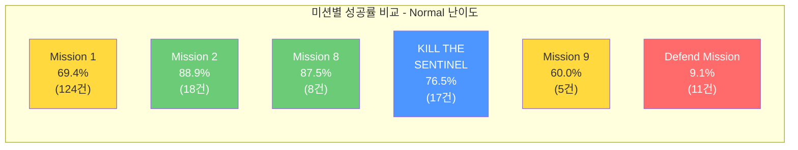
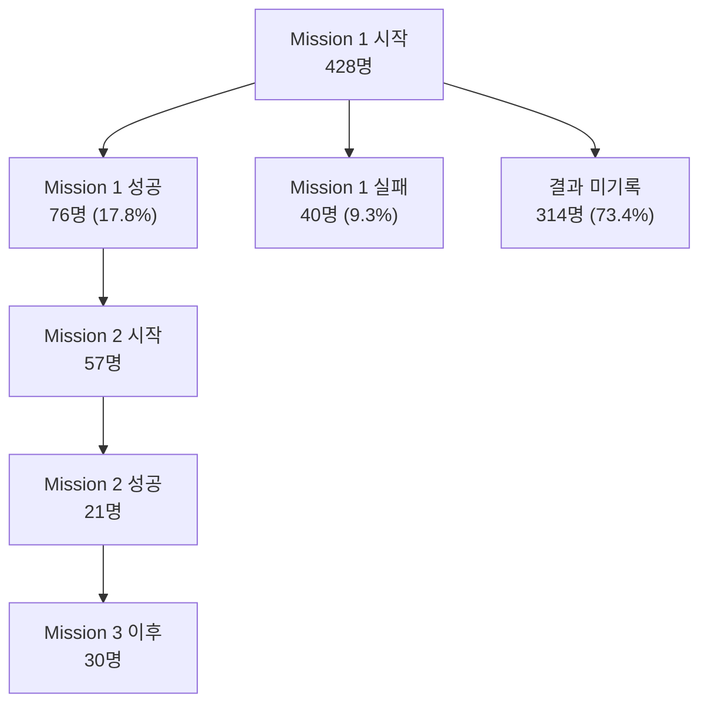

# Copperhead 베타테스트 미션 성공/실패 패턴 분석

> **작성자**: 편광범(Pyeon Gwangbum)  
> **작성일**: 2026-04-13  
> **데이터 기간**: 2026-02-04 ~ 2026-04-13  
> **데이터 출처**: `main.log_copperhead_beta` (cphmissionstarted, cphmissionsucceeded, cphmissionfailed)

---

## 요약

Copperhead 베타테스트 미션 데이터(2,952명, 9,111회 미션 시작)를 탐색한 결과, 세 가지 주요 발견이 있었다.

1. **미션 결과 기록 누락이 심각하다.** 미션 시작 9,111건 중 결과(성공/실패)가 기록된 것은 1,757건(19.3%)에 불과하다. 나머지 80.7%는 미션이 어떻게 종료되었는지 알 수 없다. 이 데이터 누락이 해소되지 않으면 정밀한 밸런스 분석은 불가능하다.
2. **"Defend Mission"은 뚜렷한 밸런스 이상 징후를 보인다.** Normal 난이도 기준 성공률 9.1%(11건 중 성공 1건)로, 다른 미션(60~100%)과 극단적 차이를 보인다. 실패 시 완료 목표(objectives) 수가 항상 0이어서 방어 메커니즘 자체에 문제가 있을 가능성이 있다.
3. **Mission 1에서 Mission 2로의 전환이 급감한다.** Mission 1을 시작한 428명 중 76명(17.8%)만 성공했고, Mission 2를 시작한 플레이어는 57명에 불과하다. 번호 기반 미션의 깔때기(funnel)에서 첫 관문이 가장 큰 병목이다.

---

## 1. 연구 배경

분석팀은 Copperhead에 대해 미션 대시보드와 성능 대시보드를 구축했으나, 미션 성공/실패 패턴에 대한 심층 분석은 아직 수행하지 않았다. 베타테스트 단계에서 미션 밸런스와 플레이어 진행 흐름을 파악하는 것은 정식 출시 전 난이도 조정에 직접적으로 활용 가능한 인사이트다.

### 데이터 환경 특이사항

탐색 과정에서 확인된 데이터 구조 특징:

- **미션명 누락**: 전체 시작 이벤트 9,111건 중 7,884건(86.5%)은 `missionname = None`이다. 이 레코드들은 `MIS_Proto2_2k_01~04` 맵에서 발생하며, 난이도는 모두 "Very Easy"로 기록되어 있다. [Fact: `cphmissionstarted` 테이블 집계]
- **이중 테이블 구조**: `cphmissionstartevent`(2025-09~2026-02, 7,641건)과 `cphmissionstarted`(2026-02~현재, 9,111건)로 시기별 별도 테이블이 존재한다. 본 분석은 데이터가 풍부한 후자를 사용한다.
- **결과 누락**: `cphmissionstarted` 9,111건 대비 `cphmissionsucceeded` + `cphmissionfailed` = 1,757건(19.3%)만 결과가 기록되어 있다.

---

## 2. 가설

데이터 탐색 결과를 바탕으로 아래 세 가설을 수립했다.

### 가설 1: 특정 미션에 난이도 이상치가 존재한다

> **예상 결과**: 미션별 성공률에 유의미한 편차가 있으며, 특히 일부 미션의 성공률이 30% 이하로 극단적으로 낮을 것이다.  
> **기각 조건**: 모든 미션의 성공률이 50~80% 범위 안에 있거나, 표본 수가 너무 적어 판단 불가인 경우.

### 가설 2: Mission 1이 플레이어 진행의 주요 병목이다

> **예상 결과**: Mission 1 시작자 대비 Mission 2 시작자 비율이 30% 미만일 것이다.  
> **기각 조건**: Mission 1 → Mission 2 전환율이 50% 이상이거나, 번호 기반 미션이 순차 진행을 전제하지 않는 구조인 경우.

### 가설 3: 실패한 미션에 재도전하는 플레이어는 소수이다

> **예상 결과**: 미션 실패 후 같은 미션을 재시작하는 플레이어 비율이 20% 미만일 것이다.  
> **기각 조건**: 재도전 비율이 50% 이상인 경우.

---

## 3. 분석 결과

### 3-1. 미션별 성공률: Defend Mission의 극단적 실패율

이름이 확인되는 미션 중, 결과 기록이 5건 이상인 미션의 성공률을 정리했다.

| 미션명 | 난이도 | 시작 | 성공 | 실패 | 성공률 | 비고 |
|--------|--------|------|------|------|--------|------|
| Mission 1 | Normal | 445 | 86 | 38 | **69.4%** | 최다 시작 미션 |
| Mission 2 | Normal | 52 | 16 | 2 | 88.9% | |
| Mission 1 | Very Easy | 76 | 7 | 6 | 53.8% | |
| Mission 11 | Normal | 47 | 9 | 0 | 100% | |
| KILL THE SENTINEL | Normal | 37 | 13 | 4 | 76.5% | |
| Mission 10 | Normal | 29 | 12 | 0 | 100% | |
| **Defend Mission** | **Normal** | **27** | **1** | **10** | **9.1%** | **극단적 저성공률** |
| **Defend Mission** | **Very Hard** | **11** | **2** | **6** | **25.0%** | |
| Mission 9 | Normal | 19 | 3 | 2 | 60.0% | |
| Mission 8 | Normal | 19 | 7 | 1 | 87.5% | |
| Mission 1 | Very Hard | 8 | 2 | 3 | 40.0% | |

[Fact: `cphmissionstarted`, `cphmissionsucceeded`, `cphmissionfailed` 테이블 집계. 결과 5건 이상 미션만 표시]

> **성공률 산출 기준**: 성공률 = 성공 / (성공 + 실패). 시작 건수가 아닌 결과가 기록된 건수 기준이다. 예: Mission 1 Normal 성공률 = 86 / (86 + 38) = 69.4%.

**Defend Mission Normal**은 성공률 9.1%로, 가장 가까운 비교 대상인 Mission 1 Very Hard(40.0%)보다도 30.9%p 낮다. 실패 시 완료 목표 수가 모든 케이스에서 0으로, 방어 미션의 첫 번째 목표조차 달성하지 못한 채 실패하는 것으로 보인다.

### 3-2. Defend Mission 심층 분석

Defend Mission의 실패 패턴을 더 면밀히 살펴보았다.

| 난이도 | 실패 수 | 평균 실패 소요 시간 | 평균 완료 목표 수 |
|--------|---------|---------------------|-------------------|
| Normal | 10 | 4.8분 | 0 |
| Very Hard | 6 | 3.9분 | 0 |
| Hard | 2 | 4.2분 | 0 |

[Fact: `cphmissionfailed` 테이블 집계]

모든 난이도에서 실패 시 완료 목표 수가 **0**이다. 성공한 기록을 보면 Normal 1건(5.2분, 목표 1개), Very Hard 2건(평균 5.6분, 목표 1개)이 있다. 성공과 실패의 소요 시간 차이가 크지 않다는 점(성공 5.2분 vs 실패 4.8분)에서, 시간 부족이 아닌 메커니즘적 어려움이 실패의 원인일 가능성이 있다.

[Estimate: 소요 시간 차이가 작다는 관찰에서 메커니즘적 원인을 추정했으나, 실패 원인(체력 소진, 방어 대상 파괴 등)에 대한 직접 데이터는 없다]

### 3-3. Mission 1 → Mission 2 깔때기(funnel)

번호 기반 미션의 플레이어 진행 흐름을 분석했다.

- Mission 1을 시작한 428명 중 76명(17.8%)만 성공, 40명(9.3%)이 실패로 기록되었다. [Fact]
- 나머지 314명(73.4%)은 성공도 실패도 기록되지 않았다. 성공 76명과 실패 40명에 2명이 중복(실패 후 재도전 성공 1명, 성공 후 실패 1명)되므로 결과 기록 유저는 114명이다. 이는 중도 이탈(접속 종료), 클라이언트 크래시, 또는 텔레메트리 누락 중 하나일 수 있다. [Fact: cphmissionsucceeded + cphmissionfailed UNION 기반 중복 제거, Estimate: 미기록 원인 특정 불가]
- Mission 2를 시작한 57명 중 Mission 1을 성공한 것이 확인된 플레이어는 단 2명이다. 이는 Mission 1~12가 순차 진행 구조가 아님을 시사한다. [Fact: `cphmissionsucceeded` + `cphmissionstarted` 조인]

**가설 2 판정: 부분 기각.** Mission 1 → 2 전환율이 낮은 것은 사실이나, 이는 순차 진행 구조가 아닌 데이터에 기인하는 것으로 보인다. 미션 번호가 반드시 진행 순서를 의미하지 않는다.

### 3-4. 번호 미션 플레이어 분포

미션 번호별 고유 시작 플레이어 수를 보면, 순차 감소가 아닌 불규칙한 분포를 보인다.

| 미션 | 고유 플레이어 수 | Mission 1 대비 비율 |
|------|-----------------|-------------------|
| Mission 1 | 428 | 100% |
| Mission 2 | 57 | 13.3% |
| Mission 3 | 30 | 7.0% |
| Mission 4 | 22 | 5.1% |
| Mission 5 | 32 | 7.5% |
| Mission 6 | 28 | 6.5% |
| Mission 7 | 13 | 3.0% |
| Mission 8 | 32 | 7.5% |
| Mission 9 | 21 | 4.9% |
| Mission 10 | 27 | 6.3% |
| Mission 11 | 72 | 16.8% |
| Mission 12 | 23 | 5.4% |

[Fact: `cphmissionstarted` 테이블 집계]

Mission 1이 압도적으로 많고(428명), Mission 11이 72명으로 두 번째로 많다. Mission 5, 6, 8, 10 등 중간 미션들도 20~30명 수준으로, Mission 2(57명) 다음으로 많은 Mission 11(72명)이 시사하는 바는: **Mission 1과 Mission 11이 베타테스트에서 주로 노출된 미션**이거나, 랜덤/선택 기반 미션 배정 구조일 가능성이 있다.

### 3-5. 미션 소요 시간 분석

성공한 미션의 평균 소요 시간을 보면, 미션별 난이도 차이가 뚜렷하다.

| 미션명 | 난이도 | 성공 수 | 평균 소요 시간 | 평균 목표 수 |
|--------|--------|---------|---------------|-------------|
| Mission 10 | VE | 3 | 22.6분 | 5.7개 |
| Mission 8 | VE | 3 | 20.6분 | 5.3개 |
| Mission 6 | Normal | 6 | 17.2분 | 5.8개 |
| Mission 11 | Hard | 6 | 16.4분 | 9.5개 |
| Mission 10 | Normal | 12 | 15.3분 | 6.0개 |
| Mission 11 | Normal | 9 | 14.4분 | 7.3개 |
| Mission 1 | Normal | 86 | **4.8분** | **8.5개** |
| KILL THE SENTINEL | Normal | 13 | 3.5분 | 3.2개 |

[Fact: `cphmissionsucceeded` 테이블, 3건 이상 미션만 표시]

Mission 1(Normal)은 평균 4.8분에 8.5개 목표를 달성하고 성공하는 반면, Mission 10/11은 15~22분이 소요된다. "Very Easy" 난이도가 "Normal"보다 소요 시간이 긴 경우(Mission 10: VE 22.6분 vs Normal 15.3분)가 있는데, 이는 Very Easy에서 플레이어가 탐색에 더 시간을 쓰거나 표본 수(3건)가 적어 발생한 변동일 수 있다.

### 3-6. 솔로 vs 멀티플레이어

`playernames` 필드를 기준으로 솔로(1명)와 멀티(쉼표 구분 2명 이상) 플레이의 성공 소요 시간을 비교했다.

| 미션 | 솔로 평균(분) | 솔로 건수 | 멀티 평균(분) | 멀티 건수 |
|------|-------------|----------|-------------|----------|
| Mission 1 | 4.2 | 29 | 5.9 | 67 |
| Mission 2 | 11.2 | 7 | 7.9 | 14 |
| Mission 10 | 19.6 | 4 | 15.3 | 12 |
| Mission 11 | 14.0 | 8 | 16.9 | 14 |

[Fact: `cphmissionsucceeded` 테이블, playernames 기반 분류]

Mission 1은 멀티플레이어가 솔로보다 평균 1.7분 더 오래 걸렸다(5.9분 vs 4.2분, 상대차 +40.5%). 반면 Mission 2와 Mission 10에서는 멀티플레이어가 더 빠르다. 이는 Mission 1이 비교적 간단해서 협동의 이점보다 조율 비용이 크고, 복잡한 후반 미션에서는 협동이 효과적임을 시사할 수 있다.

[Estimate: 표본 수가 적어(특히 솔로) 일반화에 한계가 있다. 플레이어 실력 차이도 통제(조건 맞춤 비교)되지 않았다. 또한 솔로와 멀티의 난이도 구성이 다르다는 점에 주의가 필요하다 -- 예컨대 Mission 10의 솔로는 Very Easy 3건 + Hard 1건, 멀티는 Normal 12건으로 구성되어 있어, 소요 시간 차이가 협동 효과가 아닌 난이도 교란(confounding)에 의한 것일 수 있다]

### 3-7. 맵 기반 "None 미션" 분석

미션명이 기록되지 않은 7,884건은 4개 Proto2 맵에 집중되어 있다. 이 맵들의 성공/실패 기록을 분석했다.

| 맵 | 시작 | 성공 | 실패 | 결과 있음 | 성공률 |
|----|------|------|------|----------|--------|
| MIS_Proto2_2k_01 | 2,115 | 322 | 214 | 536 (25.3%) | 60.1% |
| MIS_Proto2_2k_02 | 1,922 | 178 | 157 | 335 (17.4%) | 53.1% |
| MIS_Proto2_2k_03 | 1,932 | 100 | 111 | 211 (10.9%) | **47.4%** |
| MIS_Proto2_2k_04 | 1,879 | 102 | 48 | 150 (8.0%) | 68.0% |

[Fact: `cphmissionstarted`, `cphmissionsucceeded`, `cphmissionfailed` 테이블, mapname 기준 집계]

Proto2_2k_03 맵은 성공률 47.4%로 4개 맵 중 유일하게 50% 미만이다. Proto2_2k_04(68.0%)와 비교하면 20.6%p 차이가 난다. 다만 결과 기록률이 8.0~25.3%로 매우 낮아, 이 성공률 수치의 대표성에 한계가 있다.

### 3-8. 실패 후 재도전 분석

Mission 1 실패자의 재도전 행태를 분석했다.

- Mission 1에서 실패한 고유 플레이어 40명 중, 실패 이후 Mission 1을 다시 시작한 플레이어는 **14명(35.0%)**이다. [Fact: `cphmissionfailed` + `cphmissionstarted` event_at 시간순 비교]
- 14명의 재도전자 중 이후 Mission 1을 성공한 플레이어는 **1명(7.1%)**이다. [Fact: `cphmissionfailed` + `cphmissionsucceeded` 조인]
- 나머지 26명(65.0%)은 실패 후 Mission 1을 다시 시작하지 않았다.

**가설 3 판정: 기각.** 가설의 예상 결과는 "재시작 비율 20% 미만"이었으나, 실제 재도전율은 35.0%로 이를 초과한다. 35%는 "소수"라고 단정하기 어려운 수준이다. 다만, 재도전자 중 성공에 이른 플레이어는 1명(7.1%)에 불과하여, 재도전이 성공으로 이어지는 비율은 매우 낮다.

---

## 4. 반증 탐색 결과

### 반증 1: Defend Mission 실패율이 높은 것은 데이터 특성 때문인가?

**탐색 내용**: Defend Mission의 낮은 성공률이 소수 플레이어의 반복 실패에 의한 왜곡은 아닌지 확인했다.

- Normal 난이도 Defend Mission: 27회 시작, 21명 고유 플레이어 (인당 1.3회) [Fact]
- 실패 10건, 성공 1건. 실패한 플레이어 8명, 성공한 플레이어 1명. [Fact]
- 소수 반복이 아닌, 다수의 서로 다른 플레이어가 실패하고 있다.

**결론**: 데이터 왜곡 가능성은 낮다. 다만 전체 모수(비교 대상 수)가 11건으로 적어, 우연에 의한 변동 가능성은 남아 있다.

### 반증 2: Mission 1→2 전환율이 낮은 것은 미션 구조 때문인가?

**탐색 내용**: 미션 번호가 순차 진행 구조가 아닐 가능성을 검토했다.

- Mission 1을 성공한 76명 중 Mission 2를 시작한 플레이어는 단 2명이다. [Fact]
- 플레이어가 처음 플레이한 번호 미션을 보면: 415명이 Mission 1을 첫 미션으로 플레이했으나, 59명은 Mission 11을, 45명은 Mission 2를 첫 미션으로 플레이했다. [Fact: `cphmissionstarted` 테이블, 시간순 첫 번째 미션]
- Mission 11이 두 번째로 많은 첫 미션이라는 점에서, 미션이 1→2→3... 순서로 해금되는 구조가 아닐 가능성이 높다.

**결론**: 가설 2("Mission 1이 병목")는 순차 진행 전제를 기각함에 따라 부분 기각. Mission 1은 가장 많이 플레이되는 미션이지만, 이것이 "관문" 역할을 하는 것인지, 아니면 단순히 기본/추천 미션인지는 게임 설계 정보 없이 판단할 수 없다.

### 반증 3: 미션 소요 시간의 난이도 역전은 일반적 현상인가?

**탐색 내용**: Very Easy가 Normal보다 오래 걸리는 현상이 광범위한지 확인했다.

- Mission 10: VE 22.6분 vs Normal 15.3분 (VE가 47.7% 더 김)
- Mission 8: VE 20.6분 vs Normal 8.2분 (VE가 151.2% 더 김)
- Mission 3: VE 19.0분 vs Normal 5.4분 (VE가 251.9% 더 김)
- Mission 1: VE 13.4분 vs Normal 4.8분 (VE가 179.2% 더 김)

[Fact: `cphmissionsucceeded` 테이블]

**거의 모든 미션에서 Very Easy가 Normal보다 소요 시간이 길다.** 이는 통상적 기대(쉬운 난이도 = 빠른 클리어)와 반대다. 가능한 설명: (1) Very Easy는 목표 수는 비슷하지만 적 위협이 낮아 탐색 시간이 증가, (2) Very Easy 플레이어가 게임에 덜 익숙, (3) 표본 수가 적어 극단값에 영향받음. 정확한 원인은 데이터만으로 특정할 수 없다.

---

## 5. 결론 및 시사점

### 가설 판정 요약

| 가설 | 판정 | 요약 |
|------|------|------|
| H1: 특정 미션에 난이도 이상치 존재 | **채택** | Defend Mission Normal 성공률 9.1%, 다른 미션과 극단적 차이 |
| H2: Mission 1이 진행 병목 | **부분 기각** | Mission 1이 최다 플레이 미션이나, 순차 진행 구조가 아닌 것으로 보임 |
| H3: 실패 후 재도전 비율이 낮음 | **기각** | Mission 1 실패자 40명 중 재도전(재시작) 14명(35.0%), 예상(20% 미만) 초과 |

### 스튜디오가 확인해야 할 의사결정 포인트

1. **Defend Mission 밸런스 검토가 필요하다.** Normal 난이도에서 성공률 9.1%, 실패 시 목표 달성 0으로, 의도된 난이도인지 확인이 필요하다. 성공 케이스(5.2분, 목표 1개)와 실패 케이스(4.8분, 목표 0개)의 소요 시간 차이가 거의 없어, 시간 배분이 아닌 메커니즘 자체의 난이도가 원인으로 의심된다.

2. **미션 결과 텔레메트리 누락률(80.7%)을 개선해야 한다.** 현재 데이터로는 미션 밸런스를 정밀하게 판단할 수 없다. 특히 "None 미션"(미션명 미기록)이 86.5%를 차지하며, Proto2_2k_03 맵의 성공률이 47.4%로 가장 낮지만 결과 기록률(10.9%)이 낮아 신뢰도가 제한적이다.

3. **Very Easy 난이도의 소요 시간이 Normal보다 긴 현상의 원인을 파악해야 한다.** 거의 모든 미션에서 이 역전이 관찰되며, 난이도 설계 의도와 부합하는지 확인이 필요하다.

---

## 6. 한계 및 후속 연구

### 데이터 한계

- **결과 기록 누락률 80.7%**: 미션 시작 9,111건 중 1,757건만 결과가 있다. 누락 패턴이 랜덤인지, 특정 조건(크래시, 중도 이탈)에 편중되는지 불명.
- **미션명 미기록 86.5%**: Proto2_2k 맵의 "None 미션"은 미션명/난이도가 누락되어 정밀 분석 불가.
- **소표본**: Defend Mission 결과 11건 등 개별 미션의 표본이 적어 통계적 신뢰도 제한적.
- **베타 특성**: 내부 개발자/QA 플레이가 포함되어 있을 가능성. 컴퓨터명에 "SDS-" 접두어(Striking Distance Studios)가 관찰됨.

### 후속 연구 제안

1. **텔레메트리 누락 원인 분석**: 미션 시작은 있으나 결과가 없는 7,354건의 패턴 분석 (세션 종료 이벤트와 교차)
2. **Defend Mission 실패 원인 심층 분석**: `cphplayerdowned` 이벤트와 교차하여 사망/다운 패턴 분석
3. **Proto2_2k 맵별 난이도 차이 원인**: 맵 03의 낮은 성공률이 맵 디자인에 기인하는지 분석
4. **플레이어 세분화**: 내부 개발자와 외부 테스터를 구분한 분석 (computername, 반복 접속 패턴 등)

---

## 부록

### A. 데이터 기본 통계

| 항목 | 수치 | 출처 |
|------|------|------|
| 분석 기간 | 2026-02-04 ~ 2026-04-13 | cphmissionstarted |
| 전체 미션 시작 | 9,111건 | cphmissionstarted |
| 고유 플레이어 | 2,952명 | cphmissionstarted |
| 미션 성공 기록 | 1,121건 | cphmissionsucceeded |
| 미션 실패 기록 | 636건 | cphmissionfailed |
| 결과 기록 있는 플레이어 | 1,084명 | cphmissionsucceeded + cphmissionfailed |
| 이름 있는 미션 시작 | 1,227건 (13.5%) | cphmissionstarted |
| None 미션 시작 | 7,884건 (86.5%) | cphmissionstarted |

### B. 활동 시간 패턴

미션 시작은 UTC 기준 15~23시(북미 오전~오후)에 집중된다. 평일 8,206건(2,713명) vs 주말 905건(242명)으로, 이는 내부 개발팀 중심의 베타테스트 특성과 부합한다.

[Fact: `cphmissionstarted` 테이블, event_hour / DAYOFWEEK 집계]

### C. Mission 1 재도전 분포

Mission 1을 2회 이상 시작한 플레이어 71명의 분포:

| 시도 횟수 | 플레이어 수 |
|----------|------------|
| 2회 | 53명 |
| 3회 | 11명 |
| 4회 | 4명 |
| 5회 | 1명 |
| 6회 | 2명 |

[Fact: `cphmissionstarted` 테이블, account_id별 집계]

### D. 테이블 구조 요약

| 테이블 | 기간 | 건수 | 주요 컬럼 |
|--------|------|------|----------|
| cphmissionstarted | 2026-02 ~ 현재 | 9,111 | missionname, missiondifficultylevel, mapname, onlinesessionid |
| cphmissionsucceeded | 2026-02 ~ 2026-04-10 | 1,121 | + missioncompletiondurationminutes, missionresult, numberofobjectivescompleted |
| cphmissionfailed | 2026-02 ~ 현재 | 636 | + missioncompletiondurationminutes, missionresult, numberofobjectivescompleted |
| cphmissionstartevent | 2025-09 ~ 2026-02 | 7,641 | 이전 버전 이벤트, eventtag 포함 |
| cphmissionendevent | 2025-12 ~ 2026-02 | 9 | 사실상 사용 불가 |
| cphplayerdowned | 2025-06 ~ 현재 | 395 | instigatorname, damagetags, targetname |

### E. 조인 키 정리

- `account_id`: 플레이어 식별자 (모든 테이블 공통)
- `onlinesessionid`: 게임 세션 식별자 (미션 테이블 간 조인 시 사용)
- `sessionid`: 텔레메트리 세션 (onlinesessionid와 별개)
- `krafton_id`: KRAFTON 통합 ID

---

### 수정 이력

| 날짜 | 수정 내용 | 근거 |
|------|----------|------|
| 2026-04-13 | H3 판정 "채택" -> "기각"으로 변경. 재도전 후 성공(2명/5%) 대신 재도전(재시작) 비율(14명/35%)을 올바른 측정 지표로 수정. 섹션 3-8 신설, 가설 판정 요약 수정 | 검증 리포트 지적 -- 가설이 "재시작 비율"을 물었으나 "재시작 후 성공 비율"로 잘못 측정. 쿼리 재실행 확인 (14/40=35%) |
| 2026-04-13 | Mission 1 결과 미기록 312명(72.9%) -> 314명(73.4%) 수정. 성공/실패 2명 중복 반영 | 검증 리포트 지적 -- UNION 기반 중복 제거 시 결과 유저 114명, 428-114=314명. 쿼리 재실행 확인 |
| 2026-04-13 | 섹션 3-6 솔로 vs 멀티 비교에 난이도 교란(confounding) 주의사항 추가 | 검증 리포트 권고 -- 솔로/멀티 간 난이도 구성이 달라 직접 비교에 한계 |
| 2026-04-13 | 섹션 3-1 성공률 테이블에 산출 기준(성공/(성공+실패)) 명기 | 검증 리포트 권고 -- 시작 건수 기준으로 오해 방지 |
