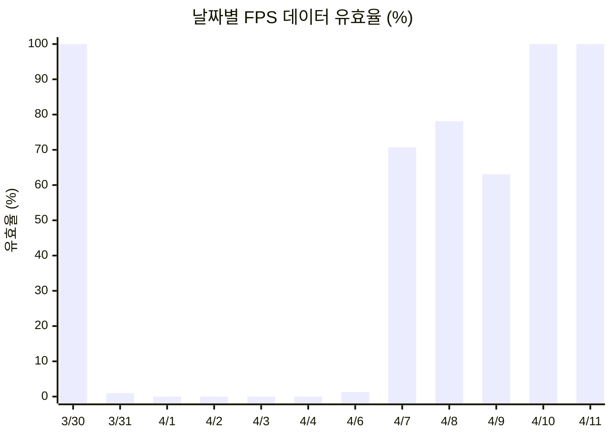
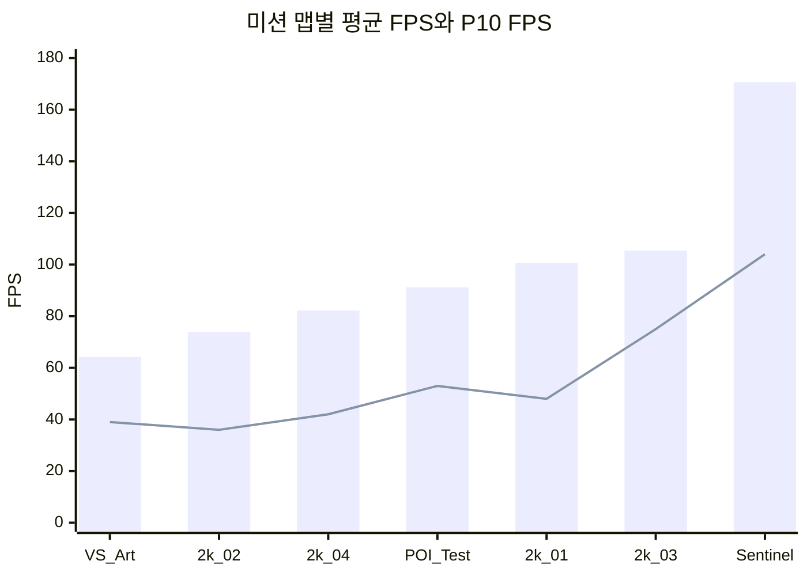

# Copperhead 베타 성능 텔레메트리(Heartbeat) 분석

**작성자**: 편광범(Pyeon Gwangbum)
**작성일**: 2026-04-13
**데이터 기간**: 2026-03-30 ~ 2026-04-11 (12일간)
**데이터 출처**: `main.log_copperhead_beta.cphplayerheartbeat` (190,902건, 339명)

---

## 1. 요약

Copperhead 베타의 heartbeat(성능 텔레메트리) 데이터를 탐색한 결과, **데이터 품질 이슈와 성능 패턴 모두에서 의미 있는 발견**이 있었다.

- **[Fact] 전체 190,902건 중 96,780건(50.7%)의 FPS/Ping 값이 누락**되어 있다. 다만 이 누락은 시간에 따라 개선되어(4/1~4/4 100% 누락 -> 4/10부터 100% 수집) 4월 10일 이후에는 거의 0%까지 떨어졌다.
- **[Fact] 멀티플레이 세션에서 호스트(Listen Server)의 평균 FPS는 91.9, 클라이언트는 82.3으로, 호스트가 9.6 FPS(+11.7%) 높다.** 단, 이 방향은 맵에 따라 역전되기도 한다.
- **[Fact] 맵 간 FPS 편차가 크다.** MIS_VS_2k_ArtPrimaryPOI의 평균 FPS가 64.2로 가장 낮고, MIS_Proto2_2k_Sentinel은 170.7으로 가장 높다.
- **[Fact] 30 FPS 미만 구간의 89%(2,703/3,035건)가 Listen Server에서 발생한다.** 저사양 환경에서의 심각한 프레임 저하가 호스트에 집중적으로 발생한다.
- **[Fact] 4인 이상 세션의 평균 FPS(70.5)는 솔로 세션(105.4)보다 34.9 FPS(-33.1%) 낮다.** 플레이어 수 증가와 FPS 하락이 동반된다.

---

## 2. 연구 배경

분석팀은 heartbeat 데이터를 기반으로 Tableau 대시보드를 구축했으나, 심층 연구 리포트는 작성되지 않았다. 첫 번째 연구에서 미션 텔레메트리의 80.7% 누락을 발견한 바 있어, heartbeat 데이터의 품질 상태를 확인할 필요가 있었다.

또한 heartbeat은 1초 단위로 수집되는 고해상도 시계열 데이터이므로, 성능 이슈 구간의 패턴을 정밀하게 분석할 수 있다. 베타 단계에서 성능 병목 지점을 식별하면 출시 전 최적화 우선순위 결정에 도움이 된다.

**탐색 과정에서 발견한 패턴:**
- FPS 값의 절반이 누락되어 있으나, 날짜별로 누락률이 극적으로 변함 (텔레메트리 수정 시점 추정)
- Listen Server와 Client 간 성능 차이가 뚜렷함
- 맵별 FPS 편차가 2.7배에 달함

---

## 3. 가설

### H1: 데이터 누락은 특정 시기/빌드에 집중되어 있다
- **예상**: 초기 빌드에서 누락이 많고, 이후 빌드에서 개선
- **기각 조건**: 모든 날짜에서 누락률이 비슷하면 기각 (예: 전 기간 40~60% 균등 분포)

### H2: Listen Server(호스트)는 서버 부하로 인해 Client보다 FPS가 낮다
- **예상**: Listen Server의 평균 FPS가 Client보다 10% 이상 낮음
- **기각 조건**: FPS 차이가 5% 미만이거나 Client가 더 낮으면 기각

### H3: 맵별 FPS 차이가 크며, 특정 맵이 성능 병목이다
- **예상**: 맵 간 평균 FPS 차이가 30% 이상
- **기각 조건**: 모든 맵의 평균 FPS가 +/- 10% 범위 내이면 기각

---

## 4. 분석 결과

### 4.1 데이터 품질: 누락 패턴 분석 (H1 검증)

전체 190,902건 중 96,780건(50.7%)의 FPS/Ping/미션명이 동시에 누락되어 있다. 그러나 이 누락은 균등하지 않다.

**날짜별 FPS 데이터 유효율 추이:**

| 날짜 | 전체 건수 | 유효 건수 | 유효율 | 비고 |
|------|--------:|--------:|------:|------|
| 3/30 | 68 | 68 | 100.0% | 초기 빌드, 소규모 테스트 |
| 3/31 | 2,402 | 24 | 1.0% | |
| 4/1 | 16,434 | 0 | 0.0% | |
| 4/2 | 10,457 | 0 | 0.0% | |
| 4/3 | 44,586 | 0 | 0.0% | |
| 4/4 | 114 | 0 | 0.0% | |
| 4/6 | 8,218 | 105 | 1.3% | 텔레메트리 수정 시작 추정 |
| 4/7 | 15,052 | 10,644 | 70.7% | |
| 4/8 | 31,588 | 24,677 | 78.1% | |
| 4/9 | 9,086 | 5,731 | 63.1% | |
| 4/10 | 50,488 | 50,464 | 100.0% | 수정 완료 추정 |
| 4/11 | 2,409 | 2,409 | 100.0% | |

**출처**: `SELECT event_date, COUNT(*), SUM(CASE WHEN averagefps != 'None' ...) FROM cphplayerheartbeat GROUP BY event_date`

**[Fact]** 3월 30일에는 68건 전부 FPS가 유효(100%)했으나, 3월 31일(1.0%)을 거쳐 4월 1일~4월 4일에는 FPS 값이 100% 누락되었다. 4월 6일부터 일부 수집이 재개(1.3%)되었고, 4월 10일부터 100% 수집되었다.

**[Estimate]** 이 패턴은 빌드 업데이트에 의한 텔레메트리 수정으로 보인다. 총 103개의 빌드 버전이 관측되어 빈번한 빌드 배포가 확인된다. 다만, 특정 빌드와 누락의 정확한 대응 관계는 추가 분석이 필요하다.

**H1 판정: 채택.** 누락은 특정 시기에 집중되어 있으며, 시간이 지남에 따라 개선되었다.

---

### 4.2 호스트 vs 클라이언트 성능 비교 (H2 검증)

Copperhead는 Listen Server 방식의 멀티플레이를 사용한다. 한 플레이어가 호스트(Listen Server)가 되고, 나머지는 클라이언트(Client)로 접속한다.

| 구분 | heartbeat 수 | 계정 수 | 평균 FPS | 중앙값 FPS | P10 FPS | P90 FPS | 평균 Ping |
|------|----------:|-------:|--------:|--------:|-------:|-------:|--------:|
| Listen Server | 51,541 | 135 | 91.9 | 91.0 | 39.0 | 134.0 | 0.0 ms |
| Client | 42,489 | 48 | 82.3 | 78.0 | 51.0 | 119.0 | 108.1 ms |

**출처**: `SELECT netmode, ... FROM cphplayerheartbeat WHERE averagefps != 'None' AND netmode IN ('Listen Server','Client')`

전체 평균에서는 Listen Server가 9.6 FPS(+11.7%) 높다. 이는 호스트가 Client보다 FPS가 "낮다"는 가설(H2)의 반대 결과이다.

그러나 FPS 구간별로 보면 다른 그림이 나타난다:

| FPS 구간 | Listen Server 비율 | Client 비율 |
|----------|------------------:|------------:|
| 30 미만 (심각) | 2,703건 (89.0%) | 332건 (10.9%) |
| 30~59 | 9,626건 (52.1%) | 8,865건 (47.9%) |
| 60~119 | 27,944건 (48.9%) | 29,202건 (51.1%) |
| 120+ | 11,268건 (73.4%) | 4,090건 (26.6%) |

**[Fact]** 30 FPS 미만의 심각한 저성능 구간에서는 Listen Server가 89%를 차지한다.

**[Fact]** 동시에 120+ FPS 구간에서도 Listen Server가 73%를 차지한다. 이는 Listen Server의 FPS 분포가 양극단(매우 낮거나 매우 높음)으로 넓게 퍼져 있음을 의미한다. P10(39) vs P90(134)의 차이가 Client(51 vs 119)보다 크다.

**[Estimate]** Listen Server가 전체 평균에서 높은 이유는, 솔로 플레이 시 서버 부하가 거의 없어 높은 FPS를 기록하기 때문으로 추정된다. 반대로 멀티플레이 호스트일 때는 서버 부하로 인해 FPS가 급격히 낮아지는 것으로 보인다.

맵별로 보면 이 패턴이 더 분명하다:

```mermaid
xychart-beta
  title "맵별 Listen Server vs Client 평균 FPS"
  x-axis ["VS_Art", "2k_02", "2k_04", "POI_Test", "2k_01", "2k_03", "Sentinel"]
  y-axis "FPS" 0 --> 200
  bar [72.4, 70.5, 85.4, 82.9, 109.4, 106.8, 182.1]
  bar [56.4, 77.6, 79.5, 95.3, 85.8, 71.0, 152.6]
```

| 맵 | Listen Server FPS | Client FPS | 차이 |
|----|------------------:|-----------:|-----:|
| MIS_Proto2_2k_01 | 109.4 | 85.8 | +23.6 (LS 우세) |
| MIS_Proto2_2k_03 | 106.8 | 71.0 | +35.8 (LS 우세) |
| MIS_VS_2k_ArtPrimaryPOI | 72.4 | 56.4 | +16.0 (LS 우세) |
| MIS_Proto2_2k_04 | 85.4 | 79.5 | +5.9 (근소) |
| MIS_Proto2_2k_02 | 70.5 | 77.6 | **-7.2 (CL 우세)** |
| MIS_POI_Test_01 | 82.9 | 95.3 | **-12.4 (CL 우세)** |

**[Fact]** 7개 미션 맵 중 5개에서 Listen Server가 우세하고, 2개(MIS_Proto2_2k_02, MIS_POI_Test_01)에서는 Client가 우세하다.

**H2 판정: 기각.** Listen Server가 Client보다 FPS가 낮다는 가설은 전체 평균에서 지지되지 않았다. 다만 저FPS(30 미만) 구간의 89%가 Listen Server에서 발생하며, FPS 변동 폭이 더 크다는 점은 호스트 역할의 부하가 특정 조건에서 집중적으로 작용함을 시사한다.

---

### 4.3 맵별 성능 프로파일 (H3 검증)

| 맵 | 평균 FPS | P10 FPS | 중앙값 FPS | 30미만 비율 | 유효 heartbeat 수 |
|----|--------:|-------:|--------:|----------:|---------------:|
| MIS_VS_2k_ArtPrimaryPOI | 64.2 | 39.0 | 61.0 | 1.4% | 1,964 |
| MIS_Proto2_2k_02 | 73.9 | 36.0 | 68.0 | 5.8% | 13,430 |
| MIS_Proto2_2k_04 | 82.2 | 42.0 | 79.0 | 4.3% | 38,593 |
| MIS_POI_Test_01 | 91.2 | 53.0 | 86.0 | 2.4% | 9,384 |
| MIS_Proto2_2k_01 | 100.6 | 48.0 | 92.0 | 1.5% | 20,941 |
| MIS_Proto2_2k_03 | 105.4 | 75.0 | 107.0 | 0.4% | 4,603 |
| MIS_Proto2_2k_Sentinel | 170.7 | 104.0 | 141.0 | 0.0% | 161 |

**출처**: `SELECT mapname, AVG(CAST(averagefps AS DOUBLE)), PERCENTILE_APPROX(...) FROM cphplayerheartbeat WHERE mapname LIKE 'MIS_%'`

**[Fact]** 가장 낮은 맵(VS_Art, 64.2 FPS)과 가장 높은 맵(Sentinel, 170.7 FPS) 간 차이는 2.66배이다. 가장 높은 Sentinel을 제외하더라도 VS_Art(64.2) vs 2k_03(105.4)은 1.64배 차이.

**[Fact]** MIS_Proto2_2k_02는 P10 FPS가 36으로 가장 낮고, 30 미만 비율이 5.8%로 가장 높다.

**[Fact]** MIS_Proto2_2k_Sentinel은 데이터가 161건으로 적어 대표성이 제한적이다.

**H3 판정: 채택.** 맵 간 FPS 차이가 30%를 넘어 기각 조건(10% 이내)을 충족하지 못했다.

---

### 4.4 추가 발견: 플레이어 수와 FPS

| 파티 크기 | 세션 수 | 평균 FPS | 평균 플레이타임(초) |
|----------|-------:|--------:|-----------------:|
| Solo | 119 | 105.4 | 278 |
| Duo | 10 | 81.3 | 486 |
| Trio | 2 | 71.2 | 619 |
| 4+ | 9 | 70.5 | 982 |

**출처**: `WITH session_perf AS (... GROUP BY onlinesessionid HAVING COUNT(*) >= 10)`

**[Fact]** 솔로(105.4) -> 4+(70.5)로 플레이어 수가 늘수록 평균 FPS가 낮아진다. 솔로 대비 4+ 세션은 -33.1%.

**[Estimate]** 플레이어 수 증가 -> FPS 하락의 인과관계는 단정할 수 없다. 멀티플레이 세션은 더 무거운 맵/미션에서 진행될 가능성이 있고, 세션이 길어지면서 FPS가 자연 하락할 수도 있다. Trio(2건)와 4+(9건)은 표본이 적다.

### 4.5 추가 발견: 세션 경과 시간에 따른 FPS 변화

| 세션 경과 | 평균 FPS | 중앙값 FPS | heartbeat 수 |
|----------|--------:|--------:|------------:|
| 0~1분 | 109.6 | 101.0 | 13,432 |
| 1~5분 | 87.0 | 81.0 | 33,843 |
| 5~10분 | 82.8 | 81.0 | 18,996 |
| 10~20분 | 76.0 | 75.0 | 20,268 |
| 20분+ | 93.4 | 93.0 | 7,583 |

**[Fact]** 세션 시작(0~1분, 109.6 FPS) -> 10~20분(76.0 FPS)까지 FPS가 31% 하락한다.

**[Fact]** 20분 이후 FPS가 93.4로 반등한다. 이 반등은 20분 이상 플레이하는 유저의 하드웨어가 상대적으로 고사양인 생존 편향(survival bias)일 수 있다.

### 4.6 추가 발견: 지역별 성능 (Client 기준)

| 지역 | 계정 수 | 평균 FPS | Client 평균 Ping |
|------|------:|--------:|---------------:|
| US | 89 | 84.2 | 121.0 ms |
| CA | 39 | 89.2 | 65.5 ms |
| GB | 49 | 107.1 | (데이터 부재) |

**출처**: `SELECT country_code_ip, AVG(CAST(averagefps AS DOUBLE)), AVG(CAST(pingms AS DOUBLE)) FROM cphplayerheartbeat WHERE netmode='Client'`

**[Fact]** US 유저의 Client Ping이 121ms로 CA(65.5ms)의 약 1.8배이다.

**[Fact]** GB(영국) 유저의 Client Ping 데이터가 없다 -- 해당 유저들이 Listen Server로만 접속했거나 데이터 누락일 수 있다.

### 4.7 추가 발견: 조직별 분포

| 컴퓨터명 접두어 | 기기 수 | 계정 수 | heartbeat 수 | 평균 FPS |
|---------------|------:|------:|-----------:|--------:|
| SDS- (Striking Distance Studios) | 33 | 223 | 127,720 | 82.1 |
| BBI- | 5 | 30 | 27,931 | 97.5 |
| Other | 8 | 86 | 35,251 | 104.2 |

**[Fact]** SDS- 접두어 기기가 전체 heartbeat의 66.9%를 차지하며, 평균 FPS가 82.1로 가장 낮다.

---

## 5. 반증 탐색 결과

### 5.1 H1(누락 시기 집중) 반증 탐색

"누락이 특정 빌드가 아닌 네트워크 환경 등 다른 요인 때문일 수 있다"는 가능성을 검토했다.

- 4/1~4/4에는 모든 맵, 모든 netmode에서 100% 누락이 발생 -> 특정 맵/모드 문제가 아님 (3/30은 68건 전부 유효, 3/31은 1.0% 유효)
- 4/6 이후에도 맵별 누락률이 다름 (GYM_FlyingAI 100%, MAP_ENV128M_VisTargetMS2 0%) -> 맵 유형이 누락에 영향을 줄 수 있음
- **결론**: 시기별 패턴이 지배적이나, 맵 유형도 부분적으로 영향. H1은 유지하되 "맵 유형에 따른 부분적 누락도 존재"를 부기한다.

### 5.2 H2(호스트 FPS 저하) 반증 탐색

가설의 방향 자체가 반대로 나왔으므로, "왜 Listen Server가 오히려 높은가"를 탐색했다.

- Listen Server의 FPS 분포는 양극단 -- P10(39)이 Client(51)보다 낮고 P90(134)이 Client(119)보다 높음
- 솔로 플레이 시 Listen Server의 FPS가 높아 전체 평균을 끌어올리는 효과
- **2개 맵에서 Client FPS가 높음** -- MIS_Proto2_2k_02(-7.2), MIS_POI_Test_01(-12.4). 이는 "호스트가 항상 우세"가 아님을 보여줌
- **결론**: 전체 평균의 방향은 솔로 플레이 혼재에 의한 것이며, 멀티플레이 상황에서의 호스트 부하는 저FPS 구간에서 확인된다.

### 5.3 H3(맵별 차이) 반증 탐색

"맵 차이가 플레이어 구성 차이에 의한 것일 수 있다"를 검토했다.

- MIS_VS_2k_ArtPrimaryPOI(FPS 64.2): 16명의 플레이어가 참여. 고유 맵 콘텐츠에 의한 성능 차이인지, 해당 맵을 저사양 유저가 많이 플레이했는지 구분 불가
- MIS_Proto2_2k_Sentinel(FPS 170.7): 6명, 161건으로 표본 매우 적음. 경량 맵이거나 고사양 테스터가 집중된 것일 수 있음
- **결론**: 맵별 FPS 차이는 실재하나, 플레이어 구성의 교란(confounding)을 완전히 배제할 수 없다. 동일 플레이어의 맵 간 FPS 비교가 필요하나 이번 분석에서는 미수행.

---

## 6. 결론 및 시사점

### 6.1 데이터 품질

**텔레메트리 수정은 진행 중이다.** 3월 30일에는 소규모 테스트(68건, 100% 유효)가 있었으나, 4월 1일~4월 4일에는 FPS/Ping이 전혀 수집되지 않았다. 4월 10일부터는 100% 수집된다. **4월 10일 이후 데이터(52,873건)만이 성능 분석에 신뢰할 수 있다.**

heartbeat은 339명의 계정을 포함하며, 미션 데이터(2,952명)와 236명만 겹친다. heartbeat 데이터 수집이 미션 텔레메트리보다 늦게 시작(3월 30일 vs 2월 4일)되었기 때문이다.

**의사결정 포인트**: 분석팀의 Tableau 대시보드가 전체 기간 데이터를 사용한다면, 4월 10일 이전 데이터의 누락을 반영하여 필터링 조건을 추가할 필요가 있다.

### 6.2 성능 병목

1. **맵별 최적화 우선순위**: MIS_VS_2k_ArtPrimaryPOI(64.2 FPS)와 MIS_Proto2_2k_02(73.9 FPS, 30미만 5.8%)가 성능 최적화의 우선 대상이다.

2. **Listen Server 저FPS 집중**: 30 FPS 미만 이벤트의 89%가 호스트에서 발생한다. 멀티플레이 호스트의 서버 부하 최적화 또는 데디케이티드 서버 전환이 검토 대상이다.

3. **플레이어 수 증가에 따른 FPS 하락**: 솔로(105.4) -> 4+(70.5)로 33% 하락한다. 다만 표본이 적어(Trio 2건, 4+ 9건) 추가 데이터 축적 후 재검증이 필요하다.

4. **세션 시간 경과에 따른 FPS 하락**: 시작 시점 대비 10~20분에 31% 하락한다. FPS 하락 원인에 대한 추가 조사가 필요하다.

### 6.3 네트워크

Client 평균 Ping 108.1ms(중앙값 94ms)이며, P99는 566ms에 달한다. US 유저(121ms)가 CA(65.5ms)보다 높은 것은 서버 위치에 따른 차이로 보이나, 서버 위치 정보가 데이터에 없어 확인 불가.

---

## 7. 한계 및 후속 연구

### 한계
1. **4월 10일 이전 데이터의 FPS/Ping 누락** -- 전체 기간 분석이 아닌 4/10~4/11(2일간, 52,873건)만 신뢰 가능
2. **하드웨어 정보 부재** -- CPU, GPU, RAM 등의 정보가 없어 성능 차이의 원인(하드웨어 vs 소프트웨어)을 구분할 수 없음
3. **서버 위치 정보 부재** -- Ping 차이가 물리적 거리인지 네트워크 품질인지 구분 불가
4. **내부 테스터 중심 데이터** -- SDS/BBI 접두어가 대부분이며, 외부 유저 행동과 다를 수 있음
5. **교란 변수 미통제** -- 맵별/시간대별 FPS 차이가 플레이어 구성 차이에 의한 것인지 순수 환경 차이인지 분리하지 못함

### 후속 연구 제안
1. **4월 10일 이후 데이터 축적 후 재분석** -- 현재 2일치 신뢰 데이터로는 시간대/요일 패턴 분석이 불가
2. **동일 플레이어의 맵 간 FPS 비교** -- 플레이어 구성 교란을 제거한 순수 맵 효과 측정
3. **heartbeat과 미션 결과의 조인 분석** -- 저FPS/고Ping 구간이 미션 실패와 연관되는지 검증
4. **FPS 시계열 분석** -- 1초 단위 데이터를 활용하여 FPS 급락의 정확한 시점과 패턴 식별
5. **빌드 버전별 성능 추이** -- 103개 빌드 중 성능 개선/악화가 발생한 빌드 식별

---

## 부록

### A. 데이터 개요

| 항목 | 값 |
|------|---|
| 총 heartbeat 건수 | 190,902 |
| 유효 FPS 건수 | 94,122 (49.3%) |
| 고유 계정 수 | 339 |
| 고유 세션 수 | 266 |
| 기간 | 2026-03-30 ~ 2026-04-11 |
| heartbeat 주기 | 약 1초 (중앙값 1초) |
| 플랫폼 | Windows 100% |

### B. FPS 분포 상세 (유효 건 기준, N=94,122)

| 구간 | 건수 | 비율 |
|------|----:|----:|
| 0~29 (Low) | 3,050 | 3.2% |
| 30~59 (Medium) | 18,510 | 19.7% |
| 60~89 (Good) | 32,253 | 34.3% |
| 90~119 (High) | 24,942 | 26.5% |
| 120~199 (Very High) | 15,040 | 16.0% |
| 200+ (이상치) | 327 | 0.3% |

FPS 전체 통계: 평균 87.5, 중앙값 83.0, P10=45.0, P25=61.0, P75=108.0, P90=129.0, P95=142.0, P99=165.0

### C. Ping 분포 상세 (Client만, Ping > 0, N=42,435)

| 구간 | 건수 | 비율 | 해당 구간 평균 FPS |
|------|----:|----:|----------------:|
| 1~50 ms | 6,589 | 15.5% | 100.2 |
| 51~100 ms | 17,361 | 40.9% | 82.5 |
| 101~150 ms | 14,440 | 34.0% | 74.9 |
| 151~200 ms | 2,248 | 5.3% | 72.2 |
| 201~300 ms | 555 | 1.3% | 68.6 |
| 301~500 ms | 785 | 1.8% | 71.3 |
| 500+ ms | 457 | 1.1% | 124.8 |

Ping-FPS 상관계수(Client): r = -0.033 (사실상 무상관).
500ms 이상 구간의 높은 FPS(124.8)는 해당 유저의 하드웨어가 고사양이거나 이상치 영향.

### D. 플레이어 성능 등급 분포 (20회 이상 heartbeat 기준, N=172)

| 등급 | 플레이어 수 | 비율 | 평균 FPS | 평균 FPS 표준편차 |
|------|----------:|----:|--------:|-----------------:|
| Low (45 미만) | 5 | 2.9% | 36.9 | 24.7 |
| Mid (45~74) | 33 | 19.2% | 61.3 | 16.1 |
| High (75~104) | 68 | 39.5% | 88.6 | 17.4 |
| Very High (105+) | 66 | 38.4% | 143.1 | 35.9 |

### E. 스키마 참고

heartbeat 테이블의 주요 컬럼 (모든 값 컬럼은 string 타입):
- `averagefps`: 평균 FPS (정수값, string 저장)
- `pingms`: 핑 밀리초 (정수값, Listen Server=0)
- `missionplaytimeseconds`: 미션 플레이 시간(초, 누적 카운터)
- `netmode`: Listen Server / Client / None
- `mapname`: 맵 이름
- `computername`: 컴퓨터 이름 (SDS-/BBI- 접두어로 조직 추정)
- `country_code_ip`: 국가 코드 (US/CA/GB/KR)
- `onlinesessionid`: 세션 ID (미션 데이터와 조인 키)
- snake_case 중복 컬럼(`average_fps`, `ping_ms` 등)은 모두 None -- camelCase 컬럼에 데이터 존재
