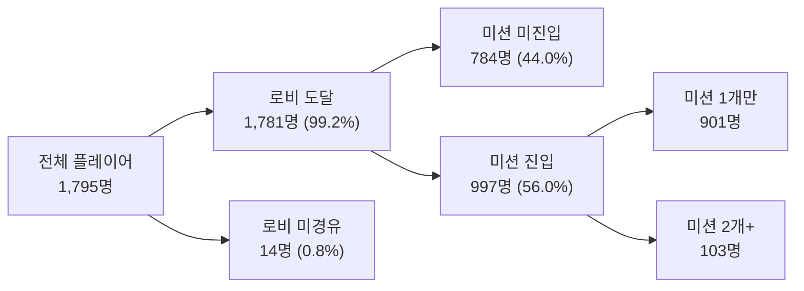
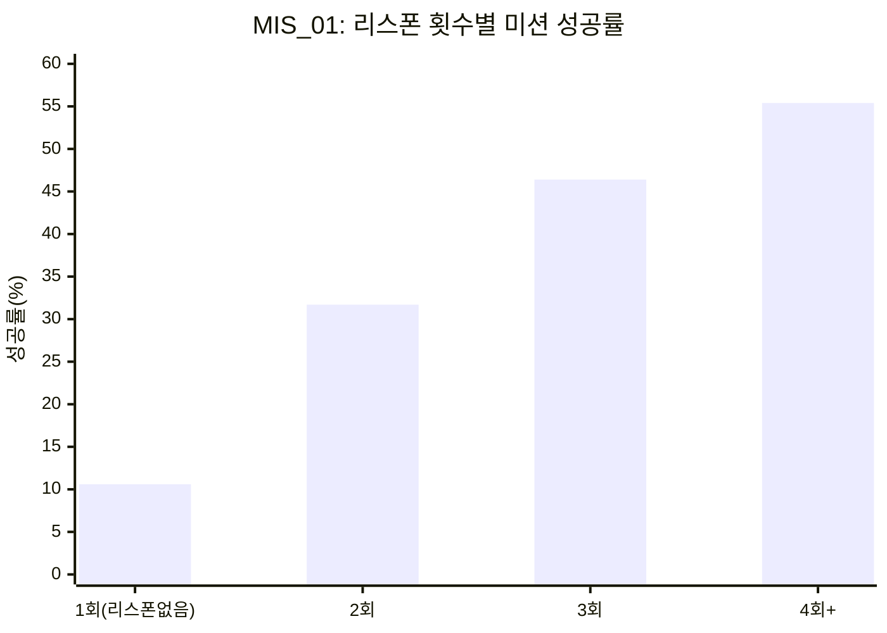
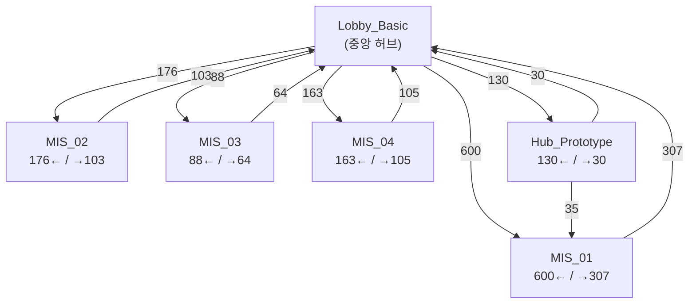

# Copperhead 플레이어 스폰 패턴과 맵 진행 퍼널 분석

> **작성자**: 편광범(Pyeon Gwangbum) | **작성일**: 2026-04-14
> **데이터 기간**: 2026-02-04 ~ 2026-04-14
> **데이터 원천**: `main.log_copperhead_beta.cphplayerspawned` (6,599건, 자동화 제외)
> **상태**: 초안 — 검증/팀장 리뷰 대기

---

## 1. 요약

- 자동화 테스트 계정 제외 후 1,795명의 플레이어 스폰 기록(6,599건)을 분석한 결과, **37.4%가 로비에서 단 한 번도 미션 맵에 도달하지 못했다.**
- 로비에서 미션 맵(MIS_01)까지의 전환율은 37.6%이며, 1차 미션에서 2차 미션으로의 전환율은 22.4%로 급감한다. **전체 미션 맵 중 2개 이상을 경험한 플레이어는 5.7%(103명)에 불과하다.**
- 미션 맵 내 리스폰(재출현) 횟수와 미션 성공률은 강한 양의 상관관계를 보인다. MIS_01에서 리스폰 없는 세션의 성공률은 10.6%인 반면, 4회 이상 리스폰한 세션은 55.4%다. 이는 성공 미션이 더 오래 진행되어 리스폰이 누적되는 **생존자 편향**으로, 이전 연구(#4)의 결론과 일관된다.
- 미션 맵은 **순차 진행 구조가 아니다.** MIS_04(128명)가 MIS_03(87명)보다 많은 플레이어가 방문했고, MIS_02/03/04 모두 로비에서 직접 진입하는 패턴이 지배적이다.
- 단, 스폰 텔레메트리는 전체 비자동화 세션 플레이어(4,480명)의 40.1%만 포함하므로, 위 수치는 스폰 이벤트가 기록된 표본에 한정된 결과다.

---

## 2. 연구 배경

Copperhead 베타의 기존 6건 연구는 미션 결과, 성능, 세션, 전투, PC환경, 무기 패턴을 다뤘다. 그러나 **"플레이어가 어떤 맵에 어디서 등장(스폰)하는가"** 라는 기초적인 행동 데이터는 분석된 적이 없었다.

`cphplayerspawned` 테이블은 플레이어가 맵에 진입할 때마다 기록되는 이벤트로, 맵 이름(mapname), 위치 좌표(playerlocation), 온라인 세션 ID(onlinesessionid)를 포함한다. 이 데이터를 통해 다음을 탐색할 수 있다:

1. **맵 진행 퍼널**: 로비에서 미션 맵까지 얼마나 도달하는가
2. **리스폰 패턴**: 미션 내 재출현 빈도가 난이도/성공률과 관련이 있는가
3. **맵 전환 흐름**: 플레이어가 어떤 순서로 맵을 경험하는가

### 데이터 전처리

전체 스폰 이벤트에서 자동화 테스트 머신(PFLIGHT, MINSPEC, RECSPEC)을 `computername` 필터로 제외했다.

| 구분 | 전체 | 자동화 제외 후 |
|------|------|--------------|
| 스폰 이벤트 수 | 24,935+ | 6,599 |
| 고유 플레이어 수 | - | 1,795 |
| 고유 세션 수 | - | 1,741 |
| 관측 맵 수 | - | 21 |

> [Fact] 출처: `cphplayerspawned` WHERE event_date >= '2026-02-04' AND computername NOT LIKE '%PFLIGHT%' / '%MINSPEC%' / '%RECSPEC%'

---

## 3. 가설

### H1: 로비에서 미션 진입까지 상당수 플레이어가 이탈한다

- **예상 결과**: 로비에만 머무르는 플레이어 비율이 30% 이상
- **기각 조건**: 로비-only 비율이 10% 미만이면 기각

### H2: 미션 맵 내 리스폰 횟수가 많을수록 미션 성공률이 낮다 (난이도 지표)

- **예상 결과**: 리스폰 횟수가 많은 세션이 성공률이 낮다 (리스폰 = 다운/죽음 후 재시작)
- **기각 조건**: 리스폰 횟수와 성공률 사이에 음의 상관이 없거나 역방향이면 기각

### H3: 미션 맵은 01 → 02 → 03 → 04 순서로 순차 진행되는 구조다

- **예상 결과**: MIS_01 방문자 중 MIS_02 방문 비율이 50% 이상이고, 번호 순서대로 이탈이 누적된다
- **기각 조건**: MIS_02~04 방문자 수가 번호 순서와 무관하거나, 이전 맵 미경험자가 상당수면 기각

---

## 4. 분석 결과

### 4.1 맵 진행 퍼널 (H1 검증)

스폰 기록이 있는 1,795명을 맵 도달 깊이별로 분류했다.

| 플레이어 구분 | 인원 | 비율 |
|-------------|------|------|
| 로비에만 머무름 | 671명 | 37.4% |
| 미션 맵 1개 도달 | 901명 | 50.2% |
| 미션 맵 2개 이상 도달 | 103명 | 5.7% |
| 허브(Hub)만 (미션 없음) | 64명 | 3.6% |
| 기타 (GYM/POI만) | 56명 | 3.1% |

> [Fact] 출처: `cphplayerspawned` 맵 도달 분류. 기타 56명 = 미션/허브 미진입이지만 GYM/POI/WB 등 개발 테스트 맵만 방문한 플레이어

**로비 → 미션 맵별 퍼널:**

| 맵 | 도달 플레이어 | 로비 대비 전환율 | 직전 단계 전환율 |
|----|------------|---------------|---------------|
| 로비(Lobby_Basic) | 1,781명 | 100% | - |
| MIS_Proto2_2k_01 | 669명 | 37.6% | 37.6% |
| MIS_Proto2_2k_02 | 150명 | 8.4% | 22.4% |
| MIS_Proto2_2k_03 | 87명 | 4.9% | 58.0% |
| MIS_Proto2_2k_04 | 128명 | 7.2% | 147.1%* |

> [Fact] 출처: `cphplayerspawned` 맵별 DISTINCT account_id
> \* MIS_03 → MIS_04 전환율이 147.1%로 100%를 초과함. 이는 MIS_03 미방문자가 MIS_04를 직접 방문하기 때문이며, 맵이 순차 구조가 아님을 보여줌 (H3에서 상세 분석)

**로비에만 머무른 671명의 행동 패턴:**

| 로비 스폰 횟수 | 인원 | 비율 | 평균 세션 내 체류(분) |
|-------------|------|------|-----------------|
| 1회 (즉시 이탈) | 468명 | 69.7% | 0.0분 |
| 2회 | 153명 | 22.8% | 1.2분 |
| 3~5회 | 42명 | 6.3% | 8.3분 |
| 6회 이상 | 8명 | 1.2% | 5.6분 |

> [Fact] 출처: `cphplayerspawned` 로비-only 플레이어 스폰 수 분포

671명 중 **468명(69.7%)이 로비에서 단 한 번 스폰한 뒤 다시는 기록이 없다.** [Estimate] 이들은 접속 후 즉시 이탈한 것으로 추정되나, 스폰 이후 활동이 있었으나 추가 스폰 이벤트가 발생하지 않았을 가능성도 배제할 수 없다.

**H1 판정: 채택.** 로비-only 비율 37.4%로 기각 조건(10% 미만)을 크게 초과.

---

### 4.2 미션 맵 리스폰과 성공률 (H2 검증)

미션 맵 내에서 동일 플레이어가 같은 맵에서 여러 번 스폰하는 것을 "리스폰"으로 정의했다.

**맵별 리스폰 현황:**

| 맵 | 총 플레이어-세션 | 리스폰 세션 | 리스폰율 | 리스폰 시 평균 스폰 | 리스폰 시 평균 경과(분) |
|----|--------------|-----------|---------|-----------------|-------------------|
| MIS_01 | 693 | 209 | 30.2% | 3.21회 | 7.3분 |
| MIS_02 | 156 | 76 | 48.7% | 3.20회 | 5.7분 |
| MIS_03 | 91 | 36 | 39.6% | 3.39회 | 13.6분 |
| MIS_04 | 132 | 71 | 53.8% | 3.24회 | 7.4분 |
| MIS_Sentinel | 27 | 11 | 40.7% | 3.09회 | 11.5분 |

> [Fact] 출처: `cphplayerspawned` 미션 맵 리스폰 집계

MIS_01의 리스폰율(30.2%)이 가장 낮고, MIS_04(53.8%)와 MIS_02(48.7%)가 높다.

**리스폰 횟수별 미션 성공률 (MIS_01, 미션 시작 기록이 있는 세션 한정):**

| 스폰 횟수 | 세션 수 | 성공 세션 | 성공률 |
|----------|---------|----------|-------|
| 1회 (리스폰 없음) | 320 | 34 | 10.6% |
| 2회 | 123 | 39 | 31.7% |
| 3회 | 28 | 13 | 46.4% |
| 4회 이상 | 56 | 31 | 55.4% |

> [Fact] 출처: `cphplayerspawned` + `cphmissionsucceeded` JOIN on onlinesessionid. 전체 MIS_01 세션 693건 중 `cphmissionstarted` 기록이 있는 527건만 집계. 나머지 166건(24.0%)은 미션 시작 이벤트가 기록되지 않아 성공률 분석에서 제외됨. 이 166건 중 대부분이 1회 스폰(리스폰 없음) 세션으로, 전체 기준으로 계산하면 1회 스폰 성공률은 7.0%(34/484)로 더 낮아진다.

**가설 H2와 반대 방향의 결과가 나타났다.** 리스폰이 많을수록 성공률이 높다. 이는 성공한 미션이 더 오래 진행되면서 리스폰이 자연스럽게 누적되는 **생존자 편향(survivorship bias)** 으로 해석된다.

이 패턴은 모든 미션 맵에서 동일하게 관찰된다:

| 맵 | 리스폰 없음 성공률 | 4+ 리스폰 성공률 | 차이 |
|----|----------------|---------------|------|
| MIS_01 | 10.6% | 55.4% | +44.8%p |
| MIS_02 | 19.7% | 65.4% | +45.7%p |
| MIS_03 | 27.0% | 84.6% | +57.6%p |
| MIS_04 | 15.8% | 62.5% | +46.7%p |

> [Fact] 출처: `cphplayerspawned` + `cphmissionsucceeded`/`cphmissionfailed` JOIN

추가로, 전체 미션 맵 세션 중 미션 결과(성공/실패) 미기록 세션이 상당수에 달한다(MIS_01 기준 693세션 중 성공/실패 기록 있는 세션은 약 30%). 이전 연구(#1)에서 확인된 미션 결과 누락(80.7%)과 일관된 패턴이다.

**H2 판정: 기각.** 리스폰 횟수와 성공률은 음의 상관이 아닌 **양의 상관**을 보임. 생존자 편향에 의한 교란으로 판정.

---

### 4.3 맵 순차 진행 구조 검증 (H3 검증)

플레이어가 방문한 미션 맵 조합을 분석했다.

| 맵 조합 | 플레이어 수 | 순차 여부 |
|--------|-----------|----------|
| 01만 | 603명 | - |
| 02만 | 103명 | 비순차 (01 미경유) |
| 04만 | 87명 | 비순차 (01~03 미경유) |
| 03만 | 62명 | 비순차 (01~02 미경유) |
| 01+02 | 25명 | 순차 가능 |
| 01+04 | 18명 | 비순차 (02~03 건너뜀) |
| 01+02+03+04 | 7명 | 순차 가능 |

> [Fact] 출처: `cphplayerspawned` COLLECT_SET(mapname) per account_id

**미션 맵 하나만 방문한 855명의 분포:**
- MIS_01: 603명 (70.5%)
- MIS_02: 103명 (12.0%)
- MIS_04: 87명 (10.2%)
- MIS_03: 62명 (7.3%)

MIS_01이 지배적이지만, MIS_02~04(Proto2 맵)를 MIS_01 없이 직접 방문하는 플레이어가 264명(미션 방문자 1,003명의 26.3%)에 달한다.

**맵 전환 흐름 (상위 10건):**

| 출발 맵 | 도착 맵 | 전환 횟수 |
|---------|---------|----------|
| Lobby_Basic | MIS_Proto2_2k_01 | 600 |
| MIS_Proto2_2k_01 | Lobby_Basic | 307 |
| Lobby_Basic | MIS_Proto2_2k_02 | 176 |
| Lobby_Basic | MIS_Proto2_2k_04 | 163 |
| Lobby_Basic | Hub_Prototype | 130 |
| MIS_Proto2_2k_04 | Lobby_Basic | 105 |
| MIS_Proto2_2k_02 | Lobby_Basic | 103 |
| Lobby_Basic | MIS_Proto2_2k_03 | 88 |
| MIS_Proto2_2k_03 | Lobby_Basic | 64 |
| Lobby_Basic | MIS_VS_2k_ArtPrimaryPOI | 61 |

> [Fact] 출처: `cphplayerspawned` LAG(mapname) OVER (PARTITION BY account_id, onlinesessionid ORDER BY event_at)

모든 맵 전환은 **Lobby를 경유하는 허브-스포크(hub-and-spoke) 구조**다. 미션 맵 간 직접 전환(예: MIS_01 → MIS_02)은 상위 전환 목록에 없다. 플레이어는 미션 완료/이탈 후 항상 로비로 돌아간 뒤 다음 미션을 선택한다.

**H3 판정: 기각.** 미션 맵은 순차 구조가 아니라 **독립 선택 구조**이며, 로비를 중심으로 한 허브-스포크 패턴을 따른다.

---

## 5. 반증 탐색 결과

### 5.1 스폰 텔레메트리 커버리지 한계

가장 중요한 반증: 비자동화 세션 플레이어 4,480명 중 **스폰 데이터가 있는 플레이어는 1,795명(40.1%)** 에 불과하다.

| 구분 | 인원 |
|------|------|
| sessionstart 기록 있는 비자동화 플레이어 | 4,480명 |
| 이 중 cphplayerspawned 기록도 있는 플레이어 | 1,795명 (40.1%) |
| sessionstart만 있고 spawn 없는 플레이어 | 2,685명 (59.9%) |

> [Fact] 출처: `sessionstart` vs `cphplayerspawned` account_id 교차 확인

스폰 데이터가 없는 2,685명이 실제로 로비에서 이탈한 것인지, 아니면 스폰 텔레메트리 자체가 일부 빌드/시점에서 발동하지 않았는지 구분할 수 없다. 따라서 **본 분석의 퍼널 수치(37.4% 로비-only)는 스폰 기록이 있는 표본에 한정된 결과**이며, 전체 베타 참여자의 이탈률과 동일하다고 단정할 수 없다.

### 5.2 로비-only 플레이어의 미션 교차 확인

로비에서만 스폰 기록이 있는 671명을 `cphmissionstarted` 테이블과 교차 확인한 결과, **13명(1.9%)은 실제 미션 시작 기록이 있었다.** 이는 스폰 이벤트가 100% 발화하지 않을 수 있음을 시사한다. 다만 13/671 = 1.9%로 퍼널의 전체 방향성에는 영향이 미미하다.

> [Fact] 출처: 671명 account_id IN `cphmissionstarted` 확인 → 13명 일치

### 5.3 리스폰-성공률 양의 상관에 대한 교란 요인

리스폰이 많을수록 성공률이 높은 패턴에 대해, "실력 좋은 플레이어가 많이 리스폰하면서도 클리어한다"는 대안 해석도 가능하다. 그러나 이전 연구(#1, #4)에서 확인된 바와 같이 성공 미션의 평균 소요 시간(12.1분)이 실패 미션(3.2분)의 3.8배이므로, **미션 시간 교란이 주된 설명**이다. 리스폰이 성공의 원인이 아니라 결과(긴 미션 → 더 많은 리스폰 기회)인 것이다.

### 5.4 세션별 고유 맵 수와 미션 데이터 교차 검증

| 세션 내 고유 맵 수 | 세션 수 | 미션 데이터 있는 세션 | 미션 데이터 비율 |
|-----------------|--------|-------------------|--------------|
| 1개 | 767 | 20 | 2.6% |
| 2개 | 812 | 721 | 88.8% |
| 3개 | 135 | 133 | 98.5% |
| 4개+ | 28 | 28 | 100% |

> [Fact] 출처: `cphplayerspawned` unique_maps per session + `cphmissionstarted` LEFT JOIN

1개 맵 세션(주로 로비-only)의 미션 데이터 보유율이 2.6%인 반면, 2개 이상은 88.8%+이다. 이는 로비-only 세션이 실제로 미션에 진입하지 않았음을 다른 테이블에서도 확인하는 보강 근거다.

---

## 6. 결론 및 시사점

### 6.1 로비 이탈이 가장 큰 퍼널 병목

스폰 데이터가 기록된 플레이어 중 37.4%(671명)가 로비에서 미션에 진입하지 않았다. 이 중 69.7%(468명)는 단 한 번 스폰 후 기록이 종료됐다.

- **의사결정 포인트**: 로비에서 미션 진입까지의 UX 흐름에 마찰이 있는지 검토가 필요하다. 로비 체류 시간이 0분인 플레이어가 절대 다수이므로, 접속 즉시 이탈하는 원인이 기술적 문제(크래시, 로딩 실패)인지 콘텐츠 가이드 부족인지 구분이 중요하다.

### 6.2 미션 맵은 독립 선택 구조

맵 번호(01~04)는 순차 진행이 아닌 독립 선택 구조이며, 로비를 중심으로 한 허브-스포크 패턴이다. MIS_04가 MIS_03보다 방문자가 많다(128명 vs 87명).

- **의사결정 포인트**: 미션 선택 UI에서 추천 순서나 난이도 표시가 MIS_04를 유도하는지 확인할 필요가 있다. 현재 맵 번호가 난이도나 진행 순서를 의미하지 않는다면, 플레이어에게 이를 명확히 전달하는 것이 바람직하다.

### 6.3 리스폰은 난이도 지표로 부적합

미션 내 리스폰 횟수는 난이도의 직접 지표가 아니다. 성공한 미션이 더 오래 진행되면서 리스폰이 누적되는 구조이므로, 리스폰 빈도를 난이도 밸런싱의 근거로 사용할 경우 **역방향 해석의 위험**이 있다. 단위 시간당 리스폰 빈도(리스폰/분)를 사용하면 시간 교란을 통제할 수 있으나, 현재 데이터로는 이 분석이 어렵다.

---

## 7. 한계 및 후속 연구

### 데이터 한계

1. **스폰 텔레메트리 커버리지 40.1%**: 비자동화 세션 플레이어 4,480명 중 1,795명만 스폰 기록 존재. 나머지 2,685명의 행동을 알 수 없어 퍼널 수치의 대표성에 한계가 있다.
2. **스폰 ≠ 접속 시작**: 스폰은 게임 내 캐릭터 출현 이벤트이므로, 클라이언트 크래시나 로딩 실패로 스폰 전 이탈한 경우는 포착되지 않는다.
3. **리스폰의 의미 불명확**: 스폰 이벤트가 사망 후 재등장인지, 맵 전환 시 재진입인지, 체크포인트 복귀인지 구분할 수 있는 필드가 없다.
4. **미션 결과 누락 66.7%**: 스폰-성공률 교차 분석에서 대다수 세션의 미션 결과가 없어 성공률 수치가 결과 기록된 표본에 한정된다.

### 후속 연구 제안

1. **로비 이탈 원인 조사**: `view_lobby_disconnected`(15,738건)와 `view_lobby_connected`(15,952건) 테이블을 활용하여 로비 접속-이탈 사이의 duration과 이탈 패턴을 분석하면, 로비 이탈이 기술적 문제인지 의도적 이탈인지 구분할 수 있다.
2. **스폰 위치 기반 공간 분석**: `playerlocation` 좌표(V(X=, Y=, Z=) 형식)를 파싱하여 미션 맵 내 사망 빈번 구역(hotspot)을 식별할 수 있다. 이전 연구(#4)의 적 유형별 다운 데이터와 교차하면 난이도 병목 구간을 시각화할 수 있다.
3. **맵 로드 시간 분석**: `queue_time` 필드(중앙값 25~36초)를 맵별로 비교하면 로딩 최적화 우선순위를 파악할 수 있다. 단, 극단 이상치(최대 92시간)는 데이터 오류이므로 필터링이 필요하다.

---

## 부록: 보충 데이터

### A1. 맵별 스폰 건수 (자동화 제외)

| 맵 | 스폰 수 | 고유 플레이어 | 고유 세션 | 인당 평균 스폰 |
|----|--------|-----------|---------|-------------|
| Lobby_Basic | 3,964* | 1,781 | 1,741 | 2.2 |
| MIS_Proto2_2k_01 | 1,154 | 669 | - | 1.7 |
| Hub_Prototype | 341 | 122 | 73 | 2.8 |
| MIS_Proto2_2k_02 | 323 | 150 | 59 | 2.2 |
| MIS_Proto2_2k_04 | 291 | 128 | 32 | 2.3 |
| MIS_Proto2_2k_03 | 177 | 87 | 41 | 2.0 |
| 기타 11개 맵 | 349 | - | - | - |

> \* Lobby 스폰 수 3,964는 queue_time NOT NULL 기준. 전체 Lobby 스폰은 queue_time NULL 포함 시 상이할 수 있음

### A2. 일별 활동 추이

평일 활동이 주말보다 높은 패턴(이전 연구에서 확인된 내부 개발팀 중심 베타)이 스폰 데이터에서도 일관되게 관찰된다. 주말(토/일)은 평일의 약 10~20% 수준으로 감소한다.
