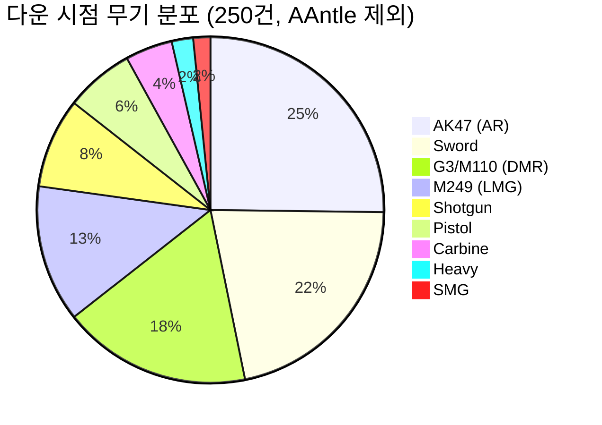
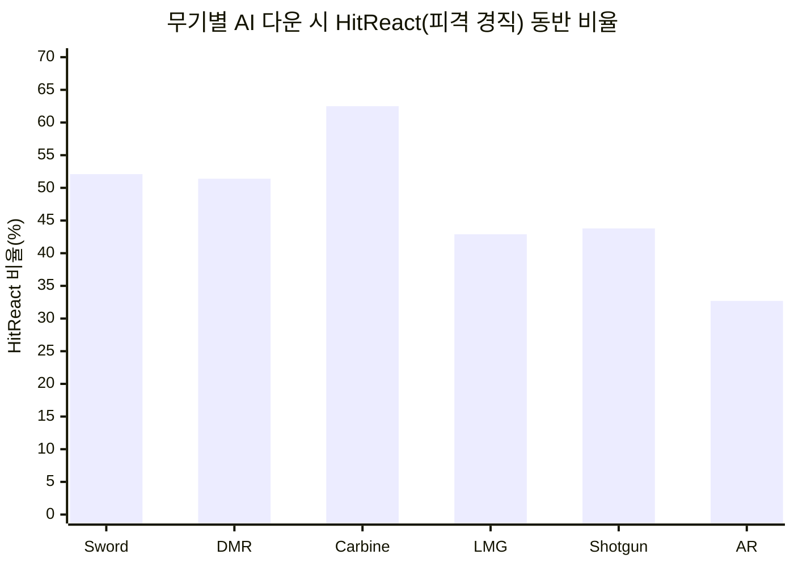
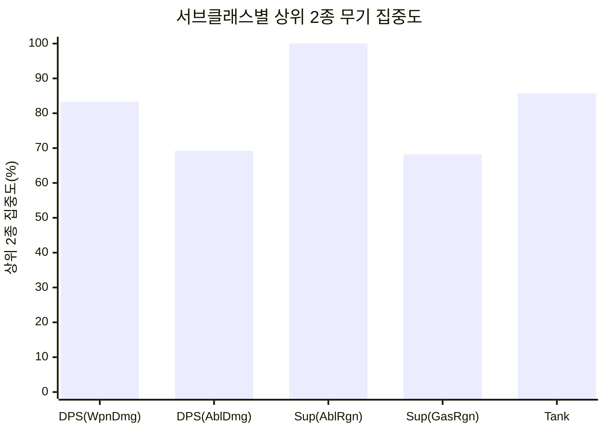

# Copperhead 무기 선택과 전투 생존 패턴 분석

> **작성자**: 편광범(Pyeon Gwangbum)
> **작성일**: 2026-04-14
> **데이터 기간**: 2026-02-04 ~ 2026-04-10
> **분석 대상**: `cphplayerdowned` 357건 (자동화 필터링 후, AAntle 극단값 제외 시 293건)

---

## 1. 요약

Copperhead 베타의 다운(전투 사망) 이벤트 293건을 무기 장착 상태 기준으로 분석했다(극단값 플레이어 AAntle 64건 별도 처리). 9종 무기가 관측되었으며, **상위 3종(AR, Sword, DMR)이 전체 다운의 64.4%를 차지**했다. 특히 근접 무기(Sword) 사용자는 원거리 무기 사용자 대비 **피격 경직(HitReact) 동반 다운 비율이 52.1%로, AR(32.7%) 대비 19.4%p 높았다**. 서브클래스별로 명확한 무기 선호 패턴이 관측되었으며(DPS-LMG/AR, Support-DMR, Tank-Sword/Shotgun), 이는 역할 설계 의도와 대체로 부합하되 **Tank의 근접 무기 편중은 생존성 면에서 잠재적 밸런스 이슈**를 시사한다.

---

## 2. 연구 배경

4차 연구(플레이어 다운 패턴 분석)에서 AI 적 유형별 다운 분포와 피격 경직 패턴을 확인했으나, **플레이어가 어떤 무기를 사용하고 있었는지**는 분석하지 않았다. `cphplayerdowned` 테이블의 `targettags` 필드에 다운 시점의 무기 장착 상태, 서브클래스(역할), 캐릭터 상태(사격 중, 장전 중, 경직 등)가 기록되어 있음을 발견하여, 이를 활용한 무기-전투 패턴 분석을 시도했다.

Copperhead 베타에는 전용 무기/장비 텔레메트리 테이블이 존재하지 않으며, 35개 테이블 중 무기 정보가 포함된 유일한 테이블이 `cphplayerdowned.targettags`이다. 따라서 본 분석은 **"다운 시점에 장착하고 있던 무기"** 기준이며, 전체 게임 플레이에서의 무기 사용 비율과는 다를 수 있다.

---

## 3. 가설

### H1: 무기 사용이 소수 무기 유형에 집중되어 있다

- **예상 결과**: 상위 3종 무기가 전체 다운의 60% 이상을 차지
- **기각 조건**: 상위 3종의 합산 비율이 50% 미만이면 기각
- **측정 지표**: 다운 시점 무기 태그별 건수 비율 (9종 무기 분류)

### H2: 근접 무기(Sword) 사용자는 원거리 무기 사용자보다 피격 경직(HitReact) 동반 다운 비율이 높다

- **예상 결과**: Sword 사용자의 HitReact 동반 다운 비율이 원거리 무기 평균보다 10%p 이상 높음
- **기각 조건**: 차이가 10%p 미만이거나, Sword의 HitReact 비율이 원거리 평균 이하이면 기각
- **측정 지표**: AI 다운 중 HitReact 태그 동반 비율 (무기별)

### H3: 서브클래스(역할)별로 특정 무기 선호 패턴이 존재한다

- **예상 결과**: 각 서브클래스에서 1~2종 무기가 50% 이상 집중
- **기각 조건**: 모든 서브클래스에서 최다 무기의 비율이 30% 미만이면 기각
- **측정 지표**: 서브클래스별 무기 분포 (서브클래스 태그가 있는 다운 건만 대상)

---

## 4. 분석 결과

### 4.1 데이터 준비: AAntle 극단값 분리

[Fact] 전체 357건 중 AAntle 1인이 64건(17.9%) 기록. DMR 다운 89건 중 AAntle이 45건(50.6%), 그중 33건이 자해(SelfRevive 테스트 목적). AAntle을 포함하면 DMR이 1위가 되지만, 제외하면 AR이 1위로 역전된다.

> 출처: `cphplayerdowned`, `event_date BETWEEN '2026-02-04' AND '2026-04-10'`, 자동화 필터링(computername NOT LIKE '%PFLIGHT%/%MINSPEC%/%RECSPEC%') 적용

| 구분 | AAntle 포함 | AAntle 제외 |
|------|-----------|-----------|
| 전체 다운 | 357건 | 293건 |
| DMR 다운 | 89건 (1위) | 44건 (3위) |
| AR 다운 | 65건 (2위) | 63건 (1위) |
| 고유 플레이어 | 55명 | 54명 |

**이하 분석은 AAntle을 제외한 293건 기준으로 수행한다.**

### 4.2 H1 검증: 무기 집중도

[Fact] 9종 무기가 관측되었으며, 상위 3종(AR, Sword, DMR)이 전체 무기 태그 보유 다운 250건의 64.4%를 차지한다.

| 순위 | 무기 | 다운 건수 | 비율 | 고유 플레이어 |
|------|------|----------|------|-------------|
| 1 | AK47 (AR) | 63 | 25.2% | 22명 |
| 2 | Sword (Melee) | 54 | 21.6% | 26명 |
| 3 | G3/M110 (DMR) | 44 | 17.6% | 20명 |
| 4 | M249 (LMG) | 32 | 12.8% | 10명 |
| 5 | R870/KSG (Shotgun) | 21 | 8.4% | 10명 |
| 6 | M1911/VP9 (Pistol) | 16 | 6.4% | 13명 |
| 7 | MK (Carbine) | 11 | 4.4% | 5명 |
| 8 | Bazooka (Heavy) | 5 | 2.0% | 5명 |
| 9 | MP (SMG) | 4 | 1.6% | 3명 |
| - | 무기 태그 없음 | 43 | - | 18명 |

> 출처: `cphplayerdowned`, AAntle 제외, 자동화 필터링 적용. 무기 태그 없는 43건은 이미 다운 상태(CharacterState.Health.Downed) 중 추가 기록된 이벤트.

**H1 판정: 채택.** 상위 3종 합산 64.4%로 기각 조건(50% 미만) 초과. 9종 무기 중 3종이 거의 2/3를 점유한다.

단, **주의**: 이 분포는 "다운 시점"의 무기이므로, 자주 다운되는 무기 = 자주 사용되는 무기인지, 아니면 해당 무기를 쓸 때 더 취약한 것인지 구분할 수 없다. AR/Sword/DMR의 높은 비율은 단순히 인기 무기여서일 가능성이 크다.

#### 플레이어별 무기 다양성

[Fact] 무기 태그가 있는 다운을 기록한 53명 중, 36명(67.9%)이 1~2종 무기만 사용했다. 무기를 많이 바꿔 쓴 플레이어일수록 다운 건수가 많았다(플레이 타임이 길어서 다양한 무기를 시도한 것으로 추정).

| 사용 무기 수 | 플레이어 수 | 평균 다운 |
|------------|-----------|---------|
| 1종 | 19명 | 2.7건 |
| 2종 | 17명 | 3.7건 |
| 3종 | 11명 | 5.2건 |
| 4종 이상 | 6명 | 13.0건 |

주 무기(가장 많이 다운된 무기) 기준으로 AR(13명)과 Sword(13명)가 공동 1위, DMR(11명) 3위, Pistol(6명) 4위. **LMG는 다운 건수는 4위(32건)이지만 사용 플레이어(10명)가 적어 소수 헤비 유저가 집중 사용**한 패턴이다.

### 4.3 H2 검증: Sword 사용자의 HitReact 취약성

[Fact] AI에 의한 다운 중, Sword 사용자의 HitReact(피격 경직) 동반 비율은 52.1%(48건 중 25건)으로, AR 사용자 32.7%(55건 중 18건)보다 **19.4%p 높다**.

| 무기 | AI 다운 | HitReact 동반 | HitReact 비율 | 고유 플레이어 |
|------|---------|-------------|-------------|-------------|
| Sword (Melee) | 48건 | 25건 | **52.1%** | 24명 |
| DMR | 35건 | 18건 | 51.4% | 17명 |
| Carbine | 8건 | 5건 | 62.5% | 5명 |
| LMG | 28건 | 12건 | 42.9% | 10명 |
| Shotgun | 16건 | 7건 | 43.8% | 10명 |
| AR | 55건 | 18건 | **32.7%** | 19명 |
| 기타(Pistol+Heavy+SMG) | 24건 | 11건 | 45.8% | 18명 |

> 출처: `cphplayerdowned`, `instigatorname LIKE 'BP_AICharacter%'`, AAntle 제외

**H2 판정: 부분 채택.** Sword HitReact 비율(52.1%)이 AR(32.7%) 대비 19.4%p 높으며 기각 조건(10%p 미만) 초과. 단, DMR(51.4%)도 Sword와 거의 동일한 비율을 보여, **Sword 고유의 취약성이라기보다 근접 교전 상황 자체의 위험성**일 가능성이 높다. "근접 무기여서 위험"이 아닌 "근접 거리에서 싸우면 위험"으로 해석하는 것이 더 정확하다.

#### Sword 사용자의 다운 시 상태 상세

[Fact] Sword 사용자의 AI 다운 48건의 상태를 분류하면:

| 다운 시 상태 | 근접 AI에 의한 다운 | 원거리 AI에 의한 다운 | 합계 |
|-----------|--------------|---------------|------|
| 공격 중(MeleeAttack) | 11건 | 2건 | 13건 |
| 피격 경직(HitReact) | 10건 | 9건 | 19건 |
| 이동/대기 중 | 10건 | 6건 | 16건 |

Sword 사용자의 다운 시나리오:
- **공격 중 역습 패턴(27.1%)**: 근접 공격 도중 적에게 다운. 근접 AI와의 교전이 11/13건으로 대다수
- **경직 연쇄 패턴(39.6%)**: 원거리/근접 적에게 경직된 상태에서 추가 피해를 받아 다운. 특히 원거리 AI의 경직(9건)은 Sword 사용자의 접근 중 노출을 시사
- **접근 중 피격(33.3%)**: 특별한 상태 없이 다운. 이동 중 피격으로 추정

#### 무기 유형별 적 유형 취약성

[Fact] Sword 사용자는 근접 AI(Husk_Mover + Husk_Bomber + Trooper_Melee)에 의한 다운이 31/48건(64.6%)인 반면, AR 사용자는 원거리 AI(Trooper)에 의한 다운이 28/55건(50.9%)으로 최다.

| 무기 | 최다 위협 적 유형 | 해당 적에 의한 다운 비율 |
|------|---------------|-------------------|
| AR | Trooper(사격형) | 28/55 = 50.9% |
| Sword | Husk(근접형) | 15/48 = 31.3% |
| Sword | Husk+Trooper_Melee | 25/48 = 52.1% |
| DMR | Husk(근접형) | 16/35 = 45.7% |
| LMG | Trooper(사격형) | 18/28 = 64.3% |

[Estimate] DMR 사용자의 Husk 취약성(45.7%)이 높은 것은, DMR이 원거리 저격형 무기여서 근접 돌격하는 Husk에 대한 대응이 어렵기 때문으로 추정된다. 단, 이는 무기 특성에서 비롯된 추론이며 데이터로 직접 입증된 인과관계는 아니다.

### 4.4 H3 검증: 서브클래스별 무기 선호 패턴

[Fact] 서브클래스 태그가 있는 128건(250건 중 51.2%)에서 서브클래스별 무기 분포를 분석했다.

| 서브클래스 | 1위 무기 | 비율 | 2위 무기 | 비율 | 합산 |
|-----------|---------|------|---------|------|------|
| DPS(WeaponDmg) | LMG | 22/48 = **45.8%** | AR | 18/48 = 37.5% | **83.3%** |
| DPS(AbilityDmg) | LMG | 10/26 = 38.5% | AR | 8/26 = 30.8% | 69.2% |
| Support(AbilityRegen) | DMR | 8/11 = **72.7%** | 기타 | 3/11 = 27.3% | 100% |
| Support(GasRegen) | Carbine | 8/22 = 36.4% | Sword | 7/22 = 31.8% | 68.2% |
| Tank | Sword | 10/21 = **47.6%** | Shotgun | 8/21 = 38.1% | **85.7%** |

> 출처: `cphplayerdowned`, `targettags` 내 SubclassPassive 태그 + Weapon 태그 교차 분석

**H3 판정: 조건부 채택.** 모든 서브클래스에서 상위 1종 무기의 비율이 38.5~72.7%로 기각 조건(30% 미만) 초과. 단, 분석 대상이 서브클래스 태그 보유 128건(전체 250건의 51.2%)에 한정되어 대표성에 제한이 있다.

서브클래스-무기 조합 해석:
- **DPS 역할**: LMG와 AR을 주로 사용. 화력 극대화를 위한 높은 연사력/대구경 무기 선호
- **Support(AbilityRegen)**: DMR 집중. 후방 지원 포지션에서 정밀 사격 무기 선택
- **Support(GasRegen)**: Carbine(36.4%)과 Sword(31.8%)를 주로 사용. 치유 가스 특성상 전방/후방 유동적
- **Tank**: Sword(47.6%)와 Shotgun(38.1%)에 85.7% 집중. 근거리 교전 역할에 부합

---

## 5. 반증 탐색 결과

### 5.1 H1 반증: 무기 분포가 균등할 가능성

[Fact] 9종 무기 중 하위 4종(Pistol, Carbine, Heavy, SMG)의 합산은 36건(14.4%)에 불과하다. 그러나 이 하위 무기군의 **고유 플레이어 수(26명)는 상위 3종(AR 22명, Sword 26명, DMR 20명)에 견줄 만하다**. 즉, 많은 플레이어가 한두 번 시도했지만 주 무기로 삼지 않은 것이다. 이는 "집중"이 특정 무기의 압도적 우위보다는 **범용적으로 사용 가능한 무기와 상황적 무기의 차이**를 반영할 가능성을 시사한다.

Pistol(16건, 13명)은 사이드암(보조무기) 성격으로, 주 무기 전환 과정에서 일시적으로 장착된 상태에서 다운되었을 가능성이 있다. 이 경우 "선호"가 아닌 "불가피한 노출"이다.

### 5.2 H2 반증: Sword의 HitReact이 높은 것은 교전 거리 때문인가

[Fact] DMR 사용자의 HitReact 비율도 51.4%로 Sword(52.1%)와 거의 동일하다. 한편, DMR은 원거리 무기임에도 Husk(근접형)에 의한 다운이 45.7%로 높다. 이는 Sword만이 아닌 **"근접 거리에서 교전하게 되는 상황 자체"가 HitReact 높은 비율의 원인**일 수 있다.

Carbine(62.5%)이 Sword보다 높은 HitReact 비율을 보이지만, 표본이 8건으로 통계적 신뢰도가 낮다.

AR이 가장 낮은 HitReact 비율(32.7%)을 보이는 것은, AR의 높은 연사력이 적을 제압하여 경직 상태에 빠질 기회를 줄이기 때문일 수 있으나, 이는 [Estimate]이며 데이터로 입증되지 않았다.

### 5.3 H3 반증: 서브클래스-무기 조합이 자유 선택인가 시스템 제한인가

서브클래스 태그가 없는 다운이 122건(250건의 48.8%)으로 거의 절반이다. 서브클래스 미표기가 "서브클래스 미선택 상태"인지 "태그 누락"인지 구분할 수 없다. 만약 태그 누락이라면 분석 대상의 대표성에 한계가 있다.

[Fact] Support(AbilityRegen)-DMR 조합은 11건 중 8건이지만, **고유 플레이어가 3명뿐**으로 소수 플레이어의 패턴이 전체를 대표하는 것일 수 있다.

---

## 6. 결론 및 시사점

### 무기 밸런스 관점

1. **AR/Sword/DMR 3강 구도**: 다운 기준 상위 3종이 64.4%를 차지. 9종 무기 중 실질적으로 활발히 사용되는 것은 5~6종으로 보인다. SMG(4건), Heavy(5건)는 거의 사용되지 않았다. 
   - **의사결정 포인트**: SMG, Heavy 무기의 매력도가 부족한 것인지, 아직 게임에 충분히 노출되지 않은 것인지 확인 필요

2. **Sword 사용자의 높은 경직 취약성**: Sword 사용자는 근접 교전에서 적의 공격에 경직되며 연쇄 피해를 받는 패턴이 빈번하다(52.1%). 특히 공격 도중 역습으로 다운되는 경우가 13건(27.1%)이다.
   - **의사결정 포인트**: 근접 공격 중 슈퍼아머(피격 무시) 부여 여부, 경직 회복 속도 조정 검토

3. **DMR-Husk 취약성**: 원거리 무기인 DMR 사용자가 근접형 Husk에 의해 많이 다운(45.7%)되는 것은 근접 돌격 AI에 대한 원거리 무기의 대응 수단이 부족할 수 있음을 시사한다.

### 역할 설계 관점

4. **서브클래스-무기 연계가 자연스럽게 형성**: DPS-화력무기, Support-정밀무기, Tank-근접무기의 조합이 데이터에서 관측된다. 이는 역할 설계가 플레이어 행동에 반영되고 있다는 긍정적 신호다.

5. **Tank의 근접 편중 주의**: Tank 서브클래스의 Sword+Shotgun 집중(85.7%)은 역할에 부합하지만, 앞서 확인된 Sword의 HitReact 취약성과 결합하면 **Tank가 가장 많이 다운되는 역할이 될 위험**이 있다. 현재 데이터에서 Tank의 다운 21건 중 AI 다운이 16건(76.2%)으로 DPS(82.4%)보다는 낮지만, 표본이 적어 단정할 수 없다.

---

## 7. 한계 및 후속 연구

### 데이터 한계

1. **다운 시점 무기 = 사용 무기는 아니다**: 본 분석은 다운 이벤트의 `targettags`에서 추출한 무기 정보로, 전체 게임에서의 무기 사용 비율과 다를 수 있다. "자주 다운되는 무기"가 "인기 무기"인지 "취약한 무기"인지 구분하려면 전체 무기 사용 시간 데이터가 필요하다.

2. **서브클래스 미표기 비율 48.8%**: 서브클래스 태그가 없는 다운이 절반에 가까워, H3의 분석 대상이 전체를 대표하는지 불확실하다.

3. **AAntle 극단값**: 전체 다운의 17.9%를 차지하는 1인 플레이어. SelfRevive 테스트 목적의 자해가 대부분이어서 제외했으나, 이로 인해 DMR 분석의 표본이 줄어든다.

4. **표본 크기**: 자동화 필터링 + AAntle 제외 후 293건, 무기 태그 보유 250건은 통계적 검정에는 부족하다. 특히 하위 무기(SMG 4건, Heavy 5건)는 개별 분석이 불가능한 수준이다.

5. **무기 교체 추적 불가**: 한 세션에서 플레이어가 여러 무기를 교체하며 사용할 수 있으나, 다운 시점의 스냅샷만 기록되어 무기 전환 패턴은 알 수 없다.

### 후속 연구 제안

- **heartbeat 데이터와의 연계**: `cphplayerheartbeat`에 무기 관련 태그가 있다면, 전체 게임 시간 중 무기별 사용 비율을 추정할 수 있다 (현재 heartbeat에는 무기 정보 미포함)
- **미션 성공/실패와 무기 조합의 관계**: 세션 내 다양한 무기를 사용하는 팀 vs 단일 무기 팀의 성공률 비교
- **Sword 경직 문제의 빌드별 추이**: 후속 빌드에서 경직 메커니즘이 수정되었는지 시계열 분석

---

## 부록: 전체 무기 목록

| 무기 태그 | 카테고리 | 관측 다운(AAntle 제외) |
|----------|---------|---------------------|
| Weapon.Ranged.AR.AK47 | 돌격소총(AR) | 63건 |
| Weapon.Melee.Sword | 근접(Melee) | 54건 |
| Weapon.Ranged.DMR.G3 | 지정사수소총(DMR) | 41건 |
| Weapon.Ranged.LMG.M249 | 경기관총(LMG) | 32건 |
| Weapon.Ranged.Shotgun.R870 | 산탄총 | 19건 |
| Weapon.Ranged.Pistol.M1911 | 권총 | 14건 |
| Weapon.Ranged.Carbine.MK | 카빈 | 11건 |
| Weapon.Ranged.Heavy.Bazooka | 중화기 | 5건 |
| Weapon.Ranged.SMG.MP | 기관단총(SMG) | 4건 |
| Weapon.Ranged.DMR.M110 | 지정사수소총(DMR) | 3건 |
| Weapon.Ranged.Shotgun.KeltecKSG | 산탄총 | 2건 |
| Weapon.Ranged.Pistol.VP9 | 권총 | 2건 |
