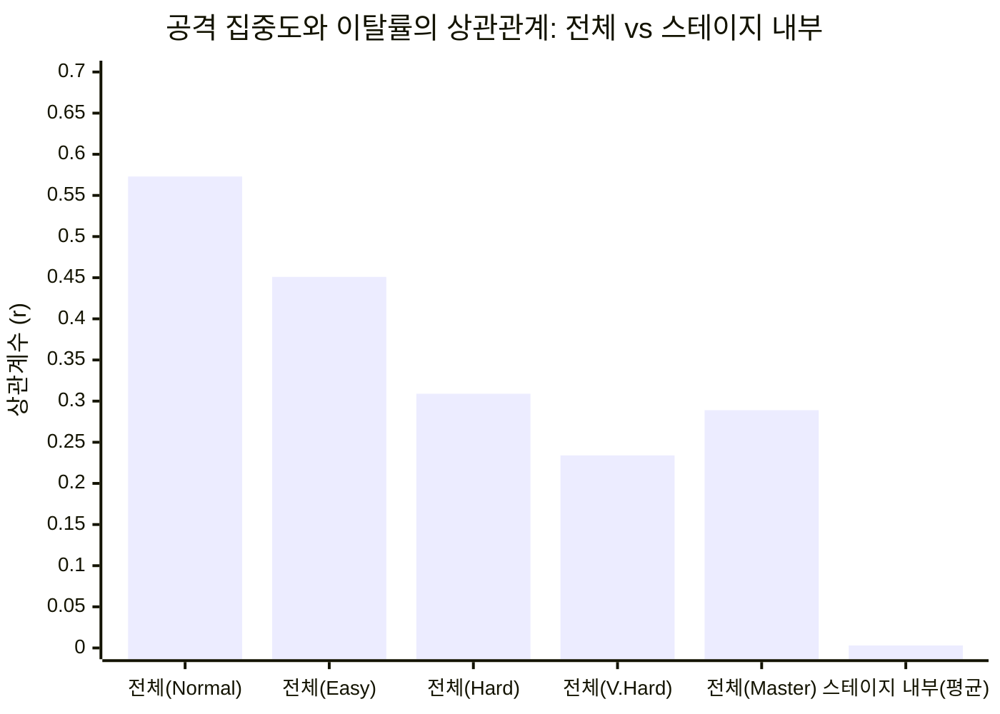
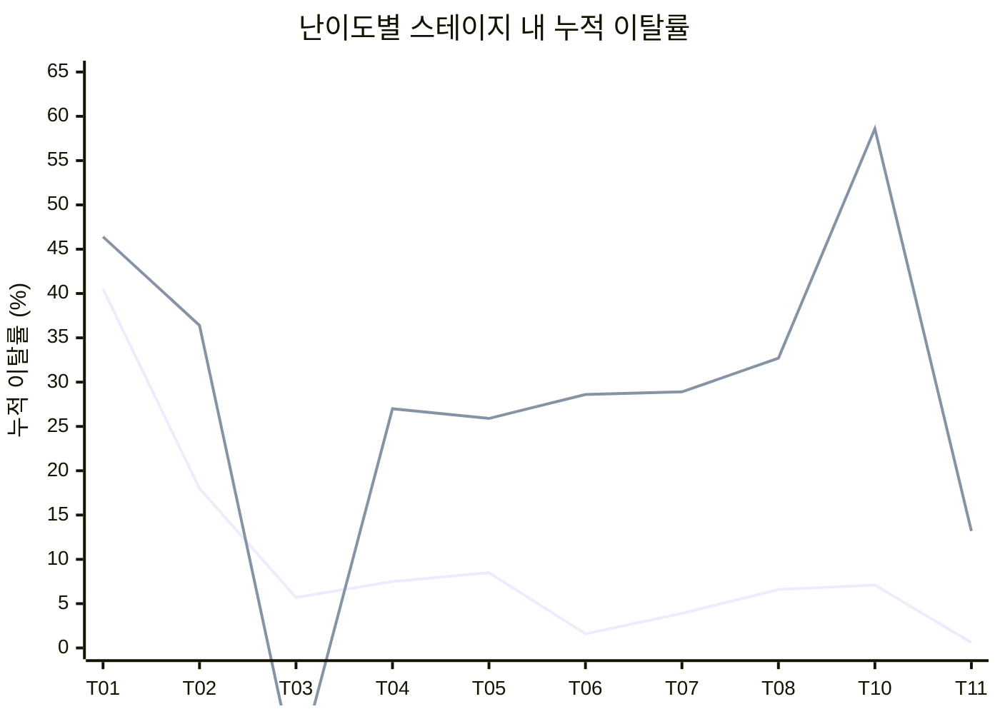

# Hi-Fi Rush: 배틀 단위 이탈 스파이크와 플레이어 행동 변화

**작성자**: 편광범(Pyeon Gwangbum)
**작성일**: 2026-04-15
**데이터 출처**: 제니맥스 제공 집계 CSV 4종 (`C:/Users/doodles/project_repo/ai_agent_team/hifirush/logs/`)
**분석 범위**: 12개 트랙의 73개 전투 라운드(CR), 5개 난이도, 3개 플랫폼

---

## 1. 요약

- **Track01 CR04->CR05 전투가 전체 게임에서 가장 큰 이탈 병목**이다. Normal 난이도에서 295만 명 중 45.5만 명(15.4%)이 이 한 전투에서 이탈했다. 이 전투에서 Special Attack(필살기) 사용률이 직전 전투의 0.2%에서 9.3%로 급등하며, 게임이 처음으로 필살기(Powerchord) 사용을 요구하는 지점으로 추정된다.
- **대부분의 스테이지에서는 전투 간 이탈률 편차가 작다**(Normal 기준 10개 스테이지 중 7개가 편차 5%p 미만). 이탈이 크게 벌어지는 곳은 Track01과 Track03 두 곳뿐이다.
- **난이도가 높을수록 병목 전투가 바뀐다**. Normal과 Master 난이도의 상위 5개 이탈 전투는 **단 하나도 겹치지 않는다**. Master에서는 게임 후반부 전투(Track06~10)에서 집중적으로 이탈이 발생한다.
- 공격 다양성(소수 공격 편중도)과 이탈률의 상관관계는 스테이지 진행 효과를 통제하면 사실상 **0에 가깝다**(평균 r=0.003). 이탈의 원인은 공격 패턴의 단순함이 아니라 특정 전투의 난이도 설계에 있을 가능성이 높다.

---

## 2. 연구 배경

분석팀이 이미 스테이지 단위 이탈 퍼널을 분석하여 Track01에서 Track02로 넘어갈 때 53.9%가 이탈한다는 사실을 확인했다. 그러나 각 스테이지 안에는 3~10개의 전투 라운드(CR: Combat Round)가 있고, **스테이지 내부 어느 전투에서 이탈이 집중되는지**는 분석되지 않았다.

`stage_completion` CSV에는 92개 배틀별 `player_count`(완료 인원)가 있고, `attacks_used` CSV에는 배틀별 공격 패턴 데이터가 있다. 이 두 데이터를 교차하면 "이탈이 심한 전투에서 플레이어가 어떤 공격을 쓰는지" 분석할 수 있다.

**분석 대상**: 12개 트랙의 CR(Combat Round) 전투만 분석했다. SR(Side Round) 전투는 선택적 콘텐츠로, 완료 인원이 본편의 1~3% 수준이어서 제외했다.
(출처: `stage_completion.csv` -- Track01 마지막 CR인 TR01_CR08 완료 인원 2,172,905명 vs SR인 TR01_SR01 완료 인원 94,046명)

---

## 3. 가설

### 가설 1: 스테이지 내부 전투 간 이탈률 편차가 크다
- **예상**: 스테이지 내 최대 이탈 전투와 최소 이탈 전투의 차이가 10%p 이상
- **기각 조건**: 편차 5%p 미만이면 전투 간 이탈이 균일한 것으로 판정

### 가설 2: 이탈이 심한 전투에서 공격 다양성이 낮다
- **예상**: 이탈 상위 전투에서 상위 3개 공격의 집중도가 더 높음
- **기각 조건**: 이탈 상위/하위 전투 간 공격 다양성 차이 없음
- **반증 가능성**: 이탈이 높은 전투에서 오히려 다양한 공격을 시도할 수도 있음

### 가설 3: 난이도별로 이탈 병목 전투가 다르다
- **예상**: Normal과 Hard/Master에서 가장 큰 이탈이 발생하는 전투가 다름
- **기각 조건**: 모든 난이도에서 동일한 전투가 병목

---

## 4. 분석 결과

### 4.1 가설 1: 스테이지 내부 이탈 편차 -- 부분 지지

**Normal 난이도 기준**, 10개 스테이지(Track09, Track12는 전투 1개라 분석 불가) 중 2개만 편차 10%p 이상이다. 7개 스테이지는 편차 5%p 미만으로, **대부분의 스테이지에서는 전투 간 이탈이 비교적 균일하다.**

| 스테이지 | 전투 수 | 최대 이탈 전투 (이탈률) | 최소 이탈 전투 (이탈률) | 편차 |
|---------|--------|----------------------|----------------------|-----|
| Track03 | 5 | TR03_CR05 (7.1%) | TR03_CR06 (-5.7%) | **12.8pp** |
| Track01 | 7 | TR01_CR05 (15.4%) | TR01_CR07 (3.4%) | **12.0pp** |
| Track05 | 5 | TR05_CR02 (4.2%) | TR05_CR04 (-3.8%) | 8.0pp |
| Track04 | 5 | TR04_CR02 (2.8%) | TR04_CR05 (-0.8%) | 3.6pp |
| Track02 | 9 | TR02_CR07 (3.5%) | TR02_CR05 (0.7%) | 2.8pp |
| Track10 | 9 | TR10_CR07 (2.3%) | TR10_CR08 (-0.5%) | 2.9pp |

(출처: `stage_completion.csv`, 전 플랫폼 합산)

단, **난이도가 올라가면 편차가 급증한다**:

| 난이도 | 평균 편차 | 편차 10pp 이상 스테이지 |
|-------|----------|---------------------|
| Normal | 4.8pp | 2/10 (20%) |
| Hard | 6.1pp | 2/10 (20%) |
| Very Hard | 10.0pp | 6/10 (60%) |
| Master | 21.6pp | 7/10 (70%) |

(출처: 동일)

**판정**: 가설은 **부분 지지**. Normal에서는 대부분 균일하지만, Track01과 Track03에서는 뚜렷한 병목이 존재한다. 고난이도에서는 가설이 강하게 지지된다.

### 4.2 TR01_CR05: 게임 전체 최대 이탈 지점

Track01 CR04에서 CR05로 넘어가는 전투는 **전 난이도 공통 최대 병목**이다.

| 난이도 | CR04 완료 인원 | CR05 완료 인원 | 이탈 수 | 이탈률 |
|-------|-------------|-------------|--------|------|
| Easy | 579,946 | 471,094 | 108,852 | 18.8% |
| Normal | 2,950,981 | 2,495,434 | 455,547 | 15.4% |
| Hard | 920,600 | 816,101 | 104,499 | 11.4% |
| Very Hard | 227,653 | 199,703 | 27,950 | 12.3% |
| Master | 89,282 | 76,331 | 12,951 | 14.5% |

(출처: `stage_completion.csv`, 전 플랫폼 합산)

**플랫폼별 차이 (Normal)**:
- Other Platforms(Xbox/Game Pass/Epic): **17.1%** 이탈 (2,201,606 -> 1,825,833)
- Steam: **11.0%** 이탈 (611,384 -> 544,233)
- PlayStation 5: **9.1%** 이탈 (137,991 -> 125,368)

Other Platforms의 이탈률이 Steam 대비 6.1%p(상대차 +55%), PS5 대비 8.0%p(상대차 +88%) 높다.

**이 전투에서 발생하는 변화 -- 공격 패턴**:

CR05에서 Special Attack(필살기) 사용률이 급등한다:

| 전투 | Combo 비율 | Partner Attack 비율 | Special Attack 비율 |
|-----|----------|-------------------|-------------------|
| TR01_CR04 | 97.6% | 2.2% | **0.2%** |
| TR01_CR05 | 89.0% | 1.7% | **9.3%** |
| TR01_CR06 | 80.9% | 3.1% | **16.0%** |

(출처: `attacks_used.csv`, Normal 난이도)

CR05에서 **Powerchord** 필살기가 처음 대량 사용된다(2,530,131회, 전체 공격의 9.1%). 직전 CR04에서 Powerchord는 7,740회(0.03%)에 불과했다(CR01~CR04 누적 8,446회). [Estimate] 이 전투가 Powerchord 사용을 처음으로 강제하는 보스/미니보스 전투로 추정되며, 새로운 메카닉 도입이 이탈 급증의 원인일 가능성이 높다.

### 4.3 가설 2: 공격 다양성과 이탈 -- 기각 (교란 변수 통제 시)

**표면적 결과 (Normal 난이도)**:
- 이탈 상위 25% 전투(N=16): 상위 3개 공격 집중도 66.9%, HHI(집중도 지수) 2,199
- 이탈 하위 25% 전투(N=16): 상위 3개 공격 집중도 60.9%, HHI 1,549
- **차이**: 집중도 +6.0pp, HHI +650 (+42%)

일견 이탈이 높은 전투에서 공격이 더 편중된 것처럼 보인다. 그러나 이것은 **게임 진행 단계(스테이지)라는 교란 변수** 때문이다. 초반 스테이지에서는 해금된 공격이 적어 집중도가 높고, 동시에 이탈률도 높다(신규 유저가 많으므로).

**스테이지 진행 효과를 통제한 결과**:
- 동일 스테이지, 동일 난이도 내에서의 이탈률-HHI 상관계수: **평균 r=0.003** (40개 스테이지-난이도 쌍)
- 양의 상관: 20/40 (50%), 음의 상관: 20/40 (50%) -- 동전 던지기 수준

**판정**: 가설 **기각**. 공격 다양성과 이탈률 사이의 관계는 스테이지 진행 효과를 통제하면 사실상 소멸한다.

### 4.4 가설 3: 난이도별 병목 전투 -- 강하게 지지

**10개 스테이지 모두에서 난이도별 최대 이탈 전투가 달랐다.** 특히 Normal과 Master의 상위 5개 이탈 전투는 **단 하나도 겹치지 않는다**.

**Normal 상위 5개 이탈 전투** (출처: `stage_completion.csv`, 전 플랫폼 합산):

| 순위 | 전투 | 이탈률 | 이탈 인원 |
|-----|------|------|---------|
| 1 | TR01_CR04->CR05 | 15.4% | 455,547 |
| 2 | TR01_CR03->CR04 | 9.3% | 303,283 |
| 3 | TR03_CR04->CR05 | 7.1% | 83,146 |
| 4 | TR01_CR05->CR06 | 6.6% | 164,439 |
| 5 | TR01_CR02->CR03 | 6.1% | 213,001 |

**Master 상위 5개 이탈 전투** (출처: 동일):

| 순위 | 전투 | 이탈률 | 이탈 인원 |
|-----|------|------|---------|
| 1 | TR01_CR07->CR08 | 17.6% | 12,664 |
| 2 | TR10_CR08->CR09 | 17.4% | 4,863 |
| 3 | TR06_CR01->CR02 | 16.5% | 4,509 |
| 4 | TR08_CR05->CR06 | 16.1% | 4,313 |
| 5 | TR03_CR01->CR02 | 16.0% | 6,647 |

Normal은 **Track01 초반(CR03~CR06)**에 병목이 집중되어 있다. 신규 플레이어가 게임의 기본 메카닉에 적응하는 과정에서 이탈하는 패턴이다.

Master는 **게임 중후반(Track06, 08, 10)**에 병목이 분산되어 있다. 숙련 플레이어도 후반부 전투에서 난이도 벽에 부딪히는 패턴이다.

(주: Track03 Master의 -14.3%는 마지막 전투 완료 인원이 첫 전투보다 많은 경우로, 리플레이의 영향으로 추정됨)

**Master 난이도의 공격 패턴 차이**:

TR01_CR05(Normal과 Master 공통 이탈 구간)에서의 공격 패턴 비교:

| 공격 유형 | Normal | Master | 차이 |
|----------|--------|--------|-----|
| Combo(기본 콤보) | 89.0% | 74.9% | -14.1pp |
| Partner Attack(동료 공격) | 1.7% | 20.8% | +19.1pp |
| Special Attack(필살기) | 9.3% | 4.2% | -5.1pp |

(출처: `attacks_used.csv`)

Master 플레이어는 동료 공격을 Normal의 12배(상대차) 더 많이 사용하며, 기본 콤보 의존도가 14.1%p 낮다. Humbucker(XXXX) 콤보의 비중이 Normal 46.3% vs Master 25.8%로, Master 플레이어가 훨씬 다양한 공격을 구사한다.

---

## 5. 반증 탐색 결과

### 5.1 가설 2 반증: 공격 다양성-이탈 관계의 허상

가설 2에서 표면적 상관(r=0.573)이 스테이지 통제 후 소멸(r=0.003)하는 것을 확인했다. 추가로 반례를 확인했다:

**높은 이탈 + 낮은 집중도** (Normal):
- TR05_CR02 (Track05): 이탈 4.2%, 상위3 집중도 55.1% (하위 40%)
- TR05_CR05 (Track05): 이탈 2.7%, 상위3 집중도 63.1%

**낮은 이탈 + 높은 집중도** (Normal):
- TR04_CR05 (Track04): 이탈 -0.8%, 상위3 집중도 69.2% (상위 25%)
- TR03_CR06 (Track03): 이탈 -5.7%, 상위3 집중도 68.2%

이러한 반례는 공격 다양성이 이탈의 직접적 원인이 아님을 보여준다.

### 5.2 음수 이탈(리플레이) 현상

일부 전투에서 완료 인원이 직전 전투보다 **증가**하는 현상이 5개 난이도 전체에서 관찰되었다:

| 전투 | 발생 난이도 수 | 평균 증가율 |
|------|-------------|----------|
| TR07_CR10 | 5개 전체 | +3.5% |
| TR05_CR04 | 4개 | +10.1% |
| TR03_CR06 | 4개 | +17.9% |
| TR10_CR08 | 5개 전체 | +4.5% |

(출처: `stage_completion.csv`, 전 플랫폼 합산)

[Estimate] 이는 플레이어가 특정 전투를 선택적으로 리플레이하는 것으로 추정된다. `player_count`는 "해당 전투를 완료한 고유 인원"이 아니라 "완료 횟수"를 집계할 가능성이 있다. 이 데이터 특성은 이탈률 해석 시 주의가 필요하며, 특히 음수 이탈이 나타나는 전투의 이탈률은 과소추정될 수 있다.

### 5.3 데이터 교차 검증

`attacks_used`의 `total_battle_count`(전투 도달 인원)와 `stage_completion`의 `player_count`(전투 완료 인원)를 비교했다:

| 전투 (Normal) | player_count (완료) | total_battle_count (도달) | 비율 |
|-------------|-----------------|---------------------|-----|
| TR01_CR04 | 2,950,981 | 2,842,309 | 0.963 |
| TR01_CR05 | 2,495,434 | 2,389,429 | 0.958 |
| TR01_CR08 | 2,172,905 | 2,437,402 | **1.122** |

(출처: `stage_completion.csv`, `attacks_used.csv`)

대부분 비율이 0.8~1.0 범위이지만, TR01_CR08에서 1.122로 역전되는 것은 리플레이 영향을 시사한다.

---

## 6. 결론 및 시사점

### 의사결정 포인트 1: Track01 CR05 전투의 난이도 검토

Normal 난이도에서 45.5만 명이 이 전투 하나에서 이탈했다. 이 전투에서 Powerchord 필살기 사용이 처음 대량 발생하며, [Estimate] 새로운 메카닉이 도입되는 지점으로 추정된다. 특히 Other Platforms(Xbox/Game Pass/Epic) 이탈률이 17.1%로 Steam(11.0%)보다 6.1%p 높다.

**스튜디오가 검토할 수 있는 사항**: 이 전투의 튜토리얼/가이드가 충분한지, 특히 게임패드 기반 플랫폼(Other Platforms)에서의 조작 안내가 적절한지 확인.

### 의사결정 포인트 2: Master 난이도의 후반부 밸런싱

Master 난이도의 스테이지 내 누적 이탈률은 Track10에서 58.6%에 달한다. Normal에서 이탈이 집중되는 초반(Track01)과 달리, Master에서는 Track06~10 전반에서 고르게 높은 이탈이 발생한다.

**스튜디오가 검토할 수 있는 사항**: Master 난이도의 후반부 전투 밸런스가 의도된 수준인지, 특히 Track10 CR09(17.4% 이탈)의 전투 설계 검토.

### 의사결정 포인트 3: 이탈은 공격 패턴이 아니라 전투 설계의 문제

공격 다양성과 이탈률의 상관은 스테이지 진행 효과를 통제하면 사라진다(r=0.003). 이는 "플레이어가 공격을 다양하게 쓰지 않아서 이탈하는 것"이 아니라, **특정 전투의 난이도 설계 자체가 이탈의 원인**임을 시사한다.

---

## 7. 한계 및 후속 연구

### 데이터 한계
1. **집계 데이터**: 개별 유저 단위 추적이 불가하여 "이탈한 유저가 재접속했는지" 확인 불가
2. **시간 차원 부재**: `stage_completion`에 날짜가 없어 시기별 변화 분석 불가
3. **player_count의 정의 불확실**: 고유 인원인지 완료 횟수인지 불명확. 음수 이탈(리플레이) 현상에서 드러나듯, 완료 횟수를 집계할 가능성이 있음
4. **attacks_used에 플랫폼 컬럼 없음**: 플랫폼별 공격 패턴 차이 분석 불가

### 후속 연구 제안
1. **TR01_CR05 심층 분석**: 이 전투에서 사용된 공격 패턴과 직전/직후 전투의 패턴을 난이도별로 비교하여, 메카닉 도입 실패의 정확한 지점 파악
2. **리플레이 전투 특성 분석**: 음수 이탈(TR03_CR06, TR07_CR10 등)이 발생하는 전투의 공통점 탐색 -- 보상, 전투 재미, 특정 아이템 파밍 등
3. **아이템 구매와 이탈의 관계**: `bought_item_ability` 데이터와 교차하여, 이탈 직전 스테이지에서의 아이템 구매 패턴 분석
