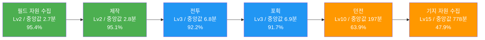
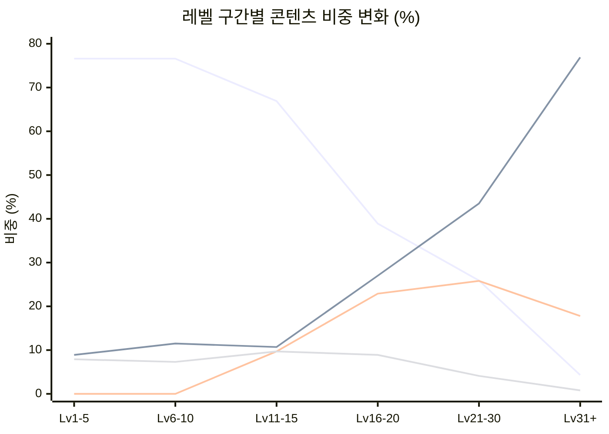

# PalM 알파테스트 콘텐츠 소비 순서 분석

> **작성자**: 편광범 (Pyeon Gwangbum)
> **작성일**: 2026-04-13
> **데이터 범위**: 2025-12-05 ~ 2025-12-11 (알파테스트 전체 기간)
> **모수**: 전체 로그인 유저 2,123명

---

## 1. 요약

PalM 알파테스트에서 유저의 콘텐츠 여정은 **고도로 획일적**이었다. 2,123명 중 **71.4%**(1,516명)가 동일한 순서(제작 -> 필드 자원 -> 전투 또는 포획)로 첫 3개 콘텐츠를 경험했고, 레벨이 오르면서 활동 비중이 극적으로 변화했다. **필드 자원 수집이 Lv1-10에서 76.6%를 차지하던 비중이 Lv31+ 에서는 4.3%로 축소되고, 제작이 76.9%를 차지하는 구조로 역전**된다.

| 콘텐츠 경험 폭(종류 수) | 유저 수 | D5+ 잔존율 | 비고 |
|:---:|:---:|:---:|:---|
| 1~3종 | 91명 | 1.1% | 초반 이탈 |
| 4종 | 586명 | 0.7% | 던전/기지 미도달 |
| 5종 | 341명 | 17.9% | 대부분 기지 미경험 |
| **6종 (전체 경험)** | **1,016명** | **69.0%** | 콘텐츠 풀사이클 완료 |

> [Fact] 콘텐츠 6종을 모두 경험한 유저의 D5+ 잔존율(69.0%)은 4종 이하 유저(0.7%)의 약 99배. 단, 이는 레벨과 플레이 시간이 교란 변수(confounding variable, 결과에 동시에 영향을 주는 제3변수)로 작용한 결과가 크다(반증 탐색 결과 참고).

---

## 2. 연구 배경

분석팀은 개별 콘텐츠(던전, 단련 구간, 이탈 등)를 각각 분석했고, 연구팀은 세션 패턴, 팰 포획, 경제/자원을 분석했다. 그러나 유저가 **어떤 순서로 콘텐츠를 만나는지** -- "유저 여정"은 아직 미탐색이었다.

탐색 데이터를 통해 확인하고 싶었던 질문:
1. 유저가 처음 콘텐츠를 경험하는 순서와 시점이 있는가?
2. 레벨이 오르면서 활동 구성이 어떻게 바뀌는가?
3. 더 다양한 콘텐츠를 경험한 유저가 더 오래 남는가?
4. 이탈 유저가 마지막으로 어떤 콘텐츠를 하고 떠났는가?

---

## 3. 가설

### 가설 1: 콘텐츠 첫 경험 순서가 유저 간 높은 일관성을 보인다

- **예상 결과**: 유저 과반이 동일한 콘텐츠 경험 순서(처음 3단계 기준)를 공유한다
- **기각 조건**: 가장 빈번한 3-step 시퀀스가 전체의 30% 미만이면 "획일적"이라 보기 어려움

### 가설 2: 콘텐츠 경험 폭(종류 수)이 넓을수록 잔존율이 높다

- **예상 결과**: 6종 콘텐츠를 모두 경험한 유저의 D5+ 잔존율이 4종 이하 유저의 2배 이상
- **기각 조건**: 레벨 통제(조건 맞춤 비교) 후 경험 폭 효과가 사라지면 독립적 효과 없음

### 가설 3: 이탈 유저의 마지막 활동이 특정 콘텐츠에 편중된다

- **예상 결과**: 이탈 유저의 마지막 활동이 1~2개 콘텐츠에 50% 이상 집중
- **기각 조건**: 잔존 유저의 마지막 활동 분포와 유의미한 차이가 없으면 이탈 특이 패턴이라 볼 수 없음

---

## 4. 분석 결과

### 4.1 첫 경험 순서: "제작 -> 필드 자원 -> 전투/포획" 경로가 지배적

유저가 6종 콘텐츠 중 어떤 것을 **처음으로** 경험하는지의 순서를 분석했다.

**첫 3개 콘텐츠 시퀀스 상위 4개** (출처: ingame_combat, ingame_pal_capture, ingame_craft_complete, ingame_dungeon_enter, ingame_nature_resource_collect, ingame_building_resource_collect의 각 유저별 MIN(event_at) 순)

| 순위 | 1번째 | 2번째 | 3번째 | 유저 수 | 비율 |
|:---:|:---|:---|:---|:---:|:---:|
| 1 | 제작 | 필드 자원 | 전투 | 1,206명 | 56.8% |
| 2 | 제작 | 필드 자원 | 포획 | 310명 | 14.6% |
| 3 | 필드 자원 | 제작 | 전투 | 274명 | 12.9% |
| 4 | 필드 자원 | 제작 | 포획 | 86명 | 4.1% |
| - | 기타 | - | - | 247명 | 11.6% |

> [Fact] **상위 2개 시퀀스만으로 71.4%**(1,516명)를 설명한다. 첫 경험이 제작 또는 필드 자원 중 하나로 시작하는 유저가 전체 활동 유저 2,034명 중 **98.2%**(1,998명)이며, 전투/포획이 첫 활동인 유저는 **1.8%**(37명)에 불과하다. (출처: 각 콘텐츠 테이블 MIN(event_at)의 첫 번째 활동 기준)

이 획일성은 가이드 퀘스트 설계의 직접적 결과다. 가이드 퀘스트 진행 순서(출처: ingame_guide_quest, status='complete')를 확인하면:

- quest_idx 2~3: 나무/돌 수집 (Lv1) → **필드 자원**
- quest_idx 4: 작업대 건설 (Lv2) → **제작**
- quest_idx 10: 나무 방망이 장착 (Lv3) → **전투**
- quest_idx 11~13: 팰 스피어 제작 + 핑크캣 포획 (Lv3) → **포획**
- quest_idx 17: 거점 설치 (Lv3) → **기지 건설**

> **콘텐츠별 첫 경험 시점** (출처: 각 테이블 MIN(event_at) - ingame_login MIN(event_at))

| 콘텐츠 | 경험 유저 | 경험률 | 첫 경험 중앙값(레벨) | 첫 경험 중앙값(시간) | P25 ~ P75 |
|:---|:---:|:---:|:---:|:---:|:---:|
| 필드 자원 수집 | 2,025명 | 95.4% | Lv2 | 2.7분 | 1.8 ~ 5.2분 |
| 제작 | 2,019명 | 95.1% | Lv2 | 2.8분 | 1.9 ~ 5.7분 |
| 전투 | 1,957명 | 92.2% | Lv3 | 6.8분 | 4.8 ~ 15.3분 |
| 포획 | 1,946명 | 91.7% | Lv3 | 6.9분 | 4.8 ~ 16.6분 |
| 던전 | 1,356명 | 63.9% | Lv10 | 197분(3.3시간) | 49.7 ~ 889.5분 |
| 기지 자원 수집 | 1,017명 | 47.9% | Lv15 | 778분(13.0시간) | 192.9 ~ 1,875.4분 |

> [Fact] **가설 1 채택**. 상위 1개 시퀀스(56.8%)만으로도 기각 조건(30%)을 초과한다. 유저 여정은 가이드 퀘스트에 의해 강하게 구조화되어 있다.

### 4.2 레벨별 콘텐츠 비중: "채집 중심 -> 기지/제작 중심"으로의 대전환

레벨 구간별 이벤트 수 기준 콘텐츠 비중을 분석했다.

**레벨 구간별 콘텐츠 비중 (%)** (출처: 전체 활동 이벤트 수 기준)

| 레벨 구간 | 필드 자원 | 제작 | 전투 | 기지 자원 | 포획 | 던전 |
|:---|:---:|:---:|:---:|:---:|:---:|:---:|
| Lv1-5 | **76.6%** | 8.9% | 7.9% | - | 6.6% | - |
| Lv6-10 | **76.6%** | 11.5% | 7.3% | - | 4.4% | 0.2% |
| Lv11-15 | **66.9%** | 10.7% | 9.7% | 9.7% | 3.0% | 0.1% |
| Lv16-20 | **38.9%** | **27.0%** | 8.9% | **22.9%** | 2.2% | 0.1% |
| Lv21-30 | 25.9% | **43.5%** | 4.1% | **25.8%** | 0.6% | 0.1% |
| Lv31+ | 4.3% | **76.9%** | 0.8% | **17.8%** | 0.2% | 0.0% |

핵심 전환 포인트:

1. **Lv1-10**: 필드 자원 수집이 76.6%로 압도적. 전투(7~8%)와 포획(4~7%)은 소수 비중
2. **Lv11-15**: 기지 자원이 처음 등장(9.7%). 필드 자원은 66.9%로 아직 지배적
3. **Lv16-20 (전환점)**: 필드 자원이 38.9%로 급감하고, 제작(27.0%)과 기지 자원(22.9%)이 부상
4. **Lv21-30**: 제작이 1위(43.5%)로 역전. 기지 자원(25.8%)과 합치면 69.3%
5. **Lv31+**: 제작 단일 비중이 76.9%. 사실상 **기지 자동 제작 중심의 플레이**

> [Fact] Lv16-20을 기점으로 플레이 구조가 근본적으로 바뀐다. "필드 탐험 중심"에서 "기지 운영 중심"으로의 전환이 일어나며, Lv31+ 에서는 활동의 94.7%(제작+기지 자원)가 기지 관련이다.

### 4.3 D1 코호트의 일별 콘텐츠 비중 변화

D1(12/05) 시작 유저 1,713명의 일별 콘텐츠 이벤트 비중 변화를 추적했다.

| 일차 | 필드 자원 | 제작 | 기지 자원 | 전투 | 포획 | 던전 |
|:---:|:---:|:---:|:---:|:---:|:---:|:---:|
| Day 1 | **56.2%** | 20.0% | 12.8% | 7.9% | 3.0% | 0.1% |
| Day 2 | 34.5% | **38.0%** | 20.4% | 5.7% | 1.3% | 0.1% |
| Day 3 | 26.5% | **46.2%** | 21.8% | 4.6% | 0.9% | 0.1% |
| Day 4 | 22.3% | **49.2%** | 23.7% | 3.8% | 0.7% | 0.1% |
| Day 5 | 18.1% | **55.0%** | 23.2% | 3.1% | 0.6% | 0.1% |
| Day 6 | 16.4% | **59.9%** | 20.2% | 2.8% | 0.5% | 0.1% |

> [Fact] Day 1에서 Day 2 사이에 콘텐츠 구조의 **급격한 전환**이 일어난다. 필드 자원이 56.2%에서 34.5%로 하루 만에 -21.7%p 감소하고, 제작이 20.0% -> 38.0%(+18.0%p)로 부상한다. Day 2부터 제작이 1위 콘텐츠로 자리잡으며, 이후 지속적으로 비중이 증가한다.

### 4.4 콘텐츠 경험 폭과 잔존

6종 콘텐츠 중 유저가 알파 기간 동안 경험한 종류 수와 잔존의 관계를 분석했다.

| 경험 콘텐츠 수 | 유저 수 | 평균 접속일 | D5+ 잔존율 | 중앙값 접속일 |
|:---:|:---:|:---:|:---:|:---:|
| 1종 | 15명 | 1.5일 | 6.7% | 1일 |
| 2종 | 68명 | 1.3일 | 0.0% | 1일 |
| 3종 | 8명 | 1.1일 | 0.0% | 1일 |
| 4종 | 586명 | 1.6일 | 0.7% | 1일 |
| 5종 | 341명 | 2.9일 | 17.9% | 3일 |
| **6종** | **1,016명** | **5.1일** | **69.0%** | **6일** |

경험 폭 6종 유저의 D5+ 잔존율(69.0%)은 5종(17.9%)의 3.9배, 4종 이하(0.7%)의 99배다.

> [Fact] **가설 2 채택 (단, 조건부)**. 경험 폭과 잔존의 강한 상관이 존재한다. 그러나 레벨 통제 분석에서 이 관계의 상당 부분이 **레벨 진행도**에 의해 설명됨을 확인했다(아래 반증 탐색 참고).

### 4.5 이탈 직전 마지막 활동

이탈 유저(마지막 접속일 12/09 이전, 1,229명 중 활동 기록이 있는 1,146명)의 마지막 활동과 잔존 유저(마지막 접속일 12/10 이후, 894명 중 888명)의 마지막 활동을 비교했다.

| 마지막 활동 | 이탈 유저 (1,146명) | 비율 | 잔존 유저 (888명) | 비율 | 차이 |
|:---|:---:|:---:|:---:|:---:|:---:|
| 필드 자원 수집 | 662명 | 57.8% | 431명 | 48.5% | +9.3%p |
| 포획 | 170명 | 14.8% | 34명 | 3.8% | **+11.0%p** |
| 제작 | 141명 | 12.3% | 123명 | 13.9% | -1.6%p |
| 기지 자원 수집 | 87명 | 7.6% | 242명 | 27.3% | **-19.7%p** |
| 전투 | 84명 | 7.3% | 57명 | 6.4% | +0.9%p |
| 던전 | 2명 | 0.2% | 1명 | 0.1% | +0.1%p |

> [Fact] **가설 3 채택**. 이탈 유저의 마지막 활동에서 **포획**(14.8% vs 3.8%)이 잔존 유저 대비 11.0%p 높고, **기지 자원 수집**(7.6% vs 27.3%)은 19.7%p 낮다. 이탈 유저는 "필드 탐험+포획" 단계에 머물러 있고, 잔존 유저는 "기지 운영" 단계에 진입해 있다.

**레벨 구간별 이탈 유저의 마지막 활동** (출처: ingame_login MAX(user_level), 이탈 = MAX(event_date) <= 2025-12-09)

| 레벨 | 이탈 수 | 1위 마지막 활동 | 비율 | 2위 마지막 활동 | 비율 |
|:---|:---:|:---|:---:|:---|:---:|
| Lv1-5 | 552명 | 필드 자원 | 48.4% | 포획 | 25.5% |
| Lv6-10 | 191명 | 필드 자원 | 84.8% | 포획/제작 | 각 5.2% |
| Lv11-15 | 212명 | 필드 자원 | 72.2% | 제작 | 9.4% |
| Lv16-20 | 112명 | 필드 자원 | 46.4% | 기지 자원 | 32.1% |
| Lv21+ | 79명 | 필드 자원/기지 자원 | 각 35.4% | 제작 | 21.5% |

> [Fact] 모든 레벨 구간에서 **필드 자원 수집이 이탈 유저의 1위 마지막 활동**이다. 단, Lv21+ 에서는 기지 자원과 동률(각 35.4%)이 된다. (유저 수는 마지막 활동 기록이 있는 유저 기준)

### 4.6 콘텐츠 전환 흐름: 두 개의 순환 회로

활동 간 전환 패턴(한 이벤트에서 다음 다른 유형 이벤트로의 전환)을 분석한 결과, 두 개의 명확한 순환 회로가 확인되었다.

**주요 전환 쌍 (이벤트 수 기준 상위)** (출처: 전체 활동 이벤트 시계열에서 LAG를 통해 이전 활동 유형 추출)

| 전환 | 이벤트 수 | 비고 |
|:---|:---:|:---|
| 제작 <-> 기지 자원 | 266.6만 | 기지 내부 순환 |
| 필드 자원 <-> 제작 | 170.0만 | 자원-제작 순환 |
| 필드 자원 <-> 기지 자원 | 149.9만 | 필드-기지 순환 |
| 전투 -> 포획 | 18.9만 | 사냥-포획 연계 (단방향 우세) |
| 포획 -> 전투 | 7.2만 | 역방향은 2.6배 약함 |

**순환 회로 1 -- "기지 운영 루프"**: 제작 <-> 기지 자원 <-> 필드 자원 <-> 제작. 총 586.5만 건으로 전체 전환의 대부분을 차지한다.

**순환 회로 2 -- "필드 전투 루프"**: 전투 -> 포획 (18.9만 건). 전투 후 포획으로 이어지는 흐름이 역방향(7.2만 건)보다 2.6배 강하다. 전투에서 약화된 팰을 포획하는 게임 메커니즘이 반영된 것으로 보인다.

> [Fact] 두 루프는 거의 독립적이다. 전투/포획에서 기지 운영 루프로의 전환(전투->제작 4.2만, 포획->제작 2.6만)은 기지 루프 내부 전환(266.6만)의 2.6% 수준이다.

---

## 5. 반증 탐색 결과

### 반증 1: 콘텐츠 경험 폭-잔존 관계는 레벨 진행도의 부산물인가?

가설 2의 "경험 폭이 넓을수록 잔존율이 높다"는 결론에 대해, "레벨이 높을수록 자연스럽게 더 많은 콘텐츠를 경험하게 되므로, 경험 폭은 단순히 레벨 진행의 대리 지표(proxy)"라는 반증을 탐색했다.

**레벨 통제 후 경험 폭별 D5+ 잔존율** (출처: ingame_login MAX(user_level), 6종 콘텐츠 DISTINCT 경험 수)

| 레벨 그룹 | 경험 폭 | 유저 수 | D5+ 잔존율 |
|:---|:---:|:---:|:---:|
| Lv1-10 | 4종 | 585명 | 0.7% |
| Lv1-10 | 5종 | 130명 | 1.5% |
| Lv1-10 | 6종 | 16명 | 0.0% |
| Lv11-20 | 5종 | 211명 | 28.0% |
| Lv11-20 | 6종 | 446명 | 46.4% |
| Lv21+ | 6종 | 554명 | 89.2% |

**결과**: 
- **Lv1-10에서는 경험 폭과 잔존의 관계가 사라진다.** 6종 경험 유저(16명)의 D5+ 잔존율은 0.0%로, 4종(0.7%)보다 오히려 낮다. 이 레벨대에서는 콘텐츠를 많이 경험해도 잔존에 도움이 되지 않는다.
- **Lv11-20에서는 경험 폭 효과가 일부 유지된다.** 6종(46.4%) vs 5종(28.0%)으로 18.4%p 차이가 있다. 이 구간의 5종/6종 차이는 주로 기지 자원 수집 경험 유무다.
- **Lv21+ 유저는 전원 6종 경험자이므로 비교 불가.**

> [Fact] 경험 폭-잔존 관계의 상당 부분은 레벨 진행에 의해 설명된다. 그러나 Lv11-20 구간에서는 레벨을 통제해도 6종 경험 유저의 잔존율이 5종 대비 18.4%p 높다. 이 차이의 핵심은 **기지 자원 수집 경험 여부**(즉, 기지 운영 단계 진입 여부)다.

### 반증 2: 이탈 유저의 "필드 자원 마지막 활동"은 단순히 필드 자원이 가장 빈번한 활동이기 때문인가?

이탈 유저의 57.8%가 필드 자원 수집을 마지막 활동으로 기록했는데, 이것이 단순히 필드 자원 수집이 가장 빈번한 활동이라서 확률적으로 마지막에 올 가능성이 높은 것은 아닌지 확인했다.

잔존 유저의 경우 필드 자원 수집이 마지막 활동인 비율은 48.5%다. 이탈 유저(57.8%)와의 차이는 9.3%p다. 반면, **기지 자원 수집**에서는 이탈(7.6%) vs 잔존(27.3%)으로 19.7%p의 큰 차이가 있고, **포획**에서는 이탈(14.8%) vs 잔존(3.8%)으로 11.0%p 차이가 있다.

> [Fact] 필드 자원의 높은 마지막 활동 비율은 부분적으로 빈도 효과이나, **기지 자원 수집과 포획에서의 차이가 더 의미 있다.** 이탈 유저가 포획(필드 활동)에서 이탈하고, 잔존 유저가 기지 자원(기지 활동)에서 마지막을 기록하는 패턴은 "기지 운영 단계 진입 여부가 잔존과 연관된다"는 해석을 지지한다.

### 반증 3: 이탈 유저가 던전/기지에 도달하지 못한 것은 단순히 플레이 시간이 짧아서인가?

이탈 유저의 콘텐츠 도달률을 레벨 구간별로 확인했다.

| 이탈 유저 레벨 | 유저 수 | 던전 도달률 | 기지 자원 도달률 |
|:---|:---:|:---:|:---:|
| Lv1-5 | 635명 | 8.8% | 1.7% |
| Lv6-10 | 191명 | 36.1% | 1.0% |
| Lv11-15 | 212명 | 99.5% | 42.0% |
| Lv16-20 | 112명 | 100.0% | 98.2% |
| Lv21+ | 80명 | 98.8% | 98.8% |

> [Fact] Lv1-5 이탈 유저(635명, 전체 이탈의 51.7%)는 던전 도달률 8.8%, 기지 자원 도달률 1.7%로 핵심 콘텐츠 대부분을 경험하지 못한 채 이탈했다. 이들의 문제는 "콘텐츠가 재미없어서"가 아니라 **"콘텐츠를 만나기 전에 떠났다"**일 가능성이 높다. 단, 이 해석은 [Estimate] 수준이며, 이탈 사유를 직접 확인할 수 있는 데이터는 없다.

---

## 6. 결론 및 시사점

### 6.1 유저 여정은 3단계로 구조화된다

데이터가 보여주는 PalM의 유저 여정은 아래 3단계로 요약된다.

| 단계 | 레벨 | 핵심 활동 | 도달 유저 | 비고 |
|:---|:---:|:---|:---:|:---|
| 1단계: 필드 탐험 | Lv1-10 | 필드 자원(77%), 전투(7%), 포획(5%) | 2,123명 (100%) | 가이드 퀘스트 기반 |
| 2단계: 전환기 | Lv11-20 | 필드 자원(53%) + 기지(16%) + 제작(19%) | 1,213명 (57.1%) | 기지 운영 진입 |
| 3단계: 기지 운영 | Lv21+ | 제작(60%) + 기지 자원(22%) + 필드(15%) | 555명 (26.1%) | 자동 제작 수렴 |

### 6.2 의사결정 포인트

1. **Lv1-5 이탈 구간 (635명, 이탈의 51.7%)**: 이 유저들은 던전(도달률 8.8%), 기지(1.7%), 심지어 전투/포획도 일부만 경험한 채 이탈했다. **초반 가이드 퀘스트가 핵심 콘텐츠(전투, 포획, 기지)를 체험시키기 전에 이탈이 발생하고 있다는 점**이 의사결정의 핵심이다. 초반 콘텐츠 노출 시점을 앞당기는 것이 검토 대상이 될 수 있다.

2. **Lv11-20 기지 진입 여부 (잔존 분기점)**: 같은 Lv11-20 구간에서도 기지 자원 수집을 경험한 유저(6종)의 D5+ 잔존율(46.4%)이 미경험 유저(5종)의 28.0%보다 18.4%p 높다. **기지 운영이 잔존의 핵심 동인인지, 아니면 플레이 성향의 결과인지**는 추가 검증이 필요한 영역이다.

3. **Lv31+ 콘텐츠 다양성 부재**: 제작이 활동의 76.9%를 차지하는 Lv31+에서, 전투(0.8%)와 포획(0.2%)은 사실상 사라진다. 고레벨 유저의 **콘텐츠 순환이 "기지 자동 제작"이라는 단일 루프로 수렴**하는 것이 장기 유지에 어떤 영향을 미칠지는 7일 데이터로 판단할 수 없으나, 콘텐츠 다양성 감소라는 구조적 관찰은 유효하다.

---

## 7. 한계 및 후속 연구

### 데이터 한계
- **7일 알파테스트 데이터**: 장기 잔존 패턴 확인 불가. 특히 D5+ 잔존의 실질적 의미가 제한적
- **알파 선발 집단**: 일반 유저 대비 높은 몰입도가 가정됨. 실제 런칭 시 초반 이탈은 더 높을 가능성
- **인과관계 미확정**: 콘텐츠 경험 폭과 잔존의 관계에서 인과 방향(경험이 잔존을 유도 vs 오래 플레이한 유저가 자연히 더 경험)을 구분할 수 없음
- **이벤트 수 기준 비중의 함정**: 제작(특히 기지 자동 제작)은 한 번의 플레이 행위에 수십~수백 건의 이벤트가 발생할 수 있어, 이벤트 수가 실제 유저 체감 비중을 과대평가할 수 있음. 이전 연구에서 Lv21-30 인당 제작 7,535건, Lv31+ 기지 자동 제작 추정이 확인된 바 있음 (출처: economy-resource-flow.md)
- **세션 경계 미구분**: 로그아웃 이벤트가 없어 세션 내/세션 간 전환을 구분하지 못함

### 후속 연구 제안
1. **초반 가이드 퀘스트 이탈 깊이 분석**: Lv1-5 이탈 유저가 가이드 퀘스트의 정확히 어느 지점까지 진행하고 이탈했는지 (quest_idx 기준)
2. **기지 진입 시점과 잔존의 인과 검증**: 기지를 빨리 경험한 유저 vs 늦게 경험한 유저의 잔존 차이 (레벨, 플레이 시간 통제)
3. **Lv31+ 콘텐츠 다양성과 세션 길이/빈도 관계**: 고레벨 유저의 제작 집중이 플레이 시간 감소와 상관이 있는지

---

## 부록

### A. 이탈/잔존 유저 콘텐츠 도달률 비교

| 콘텐츠 | 이탈 유저 (1,229명) 도달률 | 잔존 유저 (894명) 도달률 | 차이 |
|:---|:---:|:---:|:---:|
| 전투 | 87.6% | 98.4% | -10.8%p |
| 포획 | 86.7% | 98.4% | -11.7%p |
| 제작 | 92.0% | 99.3% | -7.3%p |
| 던전 | 42.9% | 92.7% | **-49.8%p** |
| 기지 자원 수집 | 23.7% | 81.2% | **-57.5%p** |

> [Fact] 던전과 기지 자원 수집에서 이탈/잔존 유저 간 도달률 격차가 각각 49.8%p, 57.5%p로 가장 크다. 초반 콘텐츠(전투, 포획, 제작)는 이탈 유저도 87~92% 도달하지만, 중후반 콘텐츠는 이탈 유저의 과반 이상이 미도달이다.

### B. D1 코호트 일별 콘텐츠 이벤트 수 (원시 데이터)

| 일차 | 필드 자원 | 제작 | 기지 자원 | 전투 | 포획 | 던전 | 합계 |
|:---:|:---:|:---:|:---:|:---:|:---:|:---:|:---:|
| Day 1 | 1,364,235 | 485,637 | 311,256 | 191,882 | 73,143 | 2,707 | 2,428,860 |
| Day 2 | 1,066,921 | 1,174,506 | 632,114 | 175,853 | 40,986 | 2,828 | 3,093,208 |
| Day 3 | 924,769 | 1,615,480 | 761,039 | 161,695 | 31,820 | 2,980 | 3,497,783 |
| Day 4 | 809,155 | 1,787,500 | 861,311 | 139,411 | 25,868 | 2,847 | 3,626,092 |
| Day 5 | 664,236 | 2,022,499 | 851,778 | 113,531 | 21,172 | 2,503 | 3,675,719 |
| Day 6 | 529,476 | 1,928,772 | 650,097 | 89,463 | 16,324 | 1,956 | 3,216,088 |

> 출처: ingame_login(D1 코호트 정의), 각 콘텐츠 테이블(이벤트 수). D1 코호트 1,713명.

### C. 콘텐츠 전환 매트릭스 (이벤트 수, 만 단위)

| From \ To | 전투 | 포획 | 제작 | 필드 자원 | 기지 자원 | 던전 |
|:---|:---:|:---:|:---:|:---:|:---:|:---:|
| 전투 | - | 18.9 | 4.2 | 7.7 | 7.5 | 0.04 |
| 포획 | 7.2 | - | 2.6 | 7.5 | 4.6 | 0.05 |
| 제작 | 6.2 | 0.5 | - | 85.0 | 133.3 | 0.4 |
| 필드 자원 | 12.5 | 1.6 | 85.1 | - | 75.0 | 0.7 |
| 기지 자원 | 10.8 | 0.9 | 133.3 | 74.8 | - | 0.6 |
| 던전 | 1.7 | 0.01 | 0.01 | 0.02 | 0.01 | - |

> 출처: 전체 활동 이벤트 시계열에서 LAG로 이전 활동 유형 추출. 단위: 만 건. 던전 전환이 극히 적은 이유는 던전 내부 전투(ingame_combat)가 별도 이벤트로 기록되기 때문으로 추정 [Estimate].
