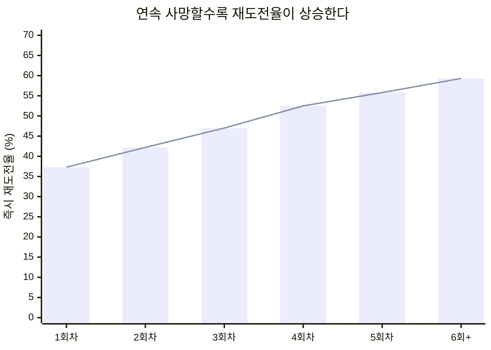
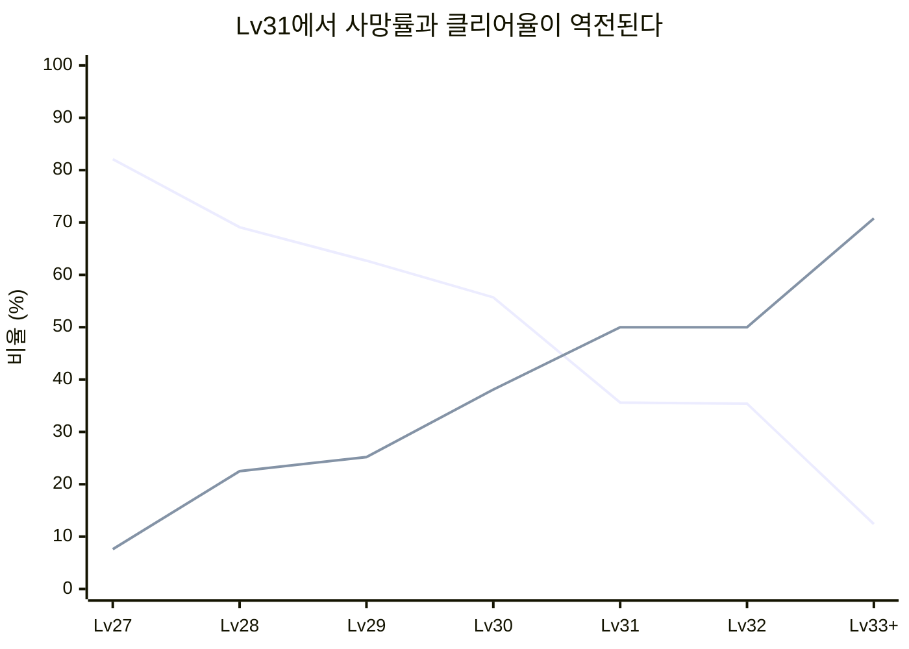

# PalM 알파테스트 — dungeon-01 실패 후 재도전 행동 분석

> **작성**: 편광범(Pyeon Gwangbum) | **작성일**: 2026-04-13
> **데이터 기간**: 2025-12-05 ~ 2025-12-11 (알파테스트 7일)
> **데이터 소스**: `main.log_palm_live.ingame_dungeon_exit`, `main.log_palm_live.ingame_dungeon_enter`, `main.log_palm_live.ingame_login`, `main.log_palm_live.ingame_combat`, `main.log_palm_live.ingame_pal_capture`, `main.log_palm_live.ingame_craft_complete`
> **선행 보고서**: [던전 클리어/실패 패턴 분석](../../../ai_agent_team/reports/palm-dungeon-analysis.md), [이탈 세그먼트 프로파일링](../../../ai_agent_team/reports/palm-churn-segment-profiling.md)

---

## 요약

분석팀의 던전 분석에서 dungeon-01은 사망률 55~62%로 "난이도 벽"이라고 식별되었다. 그러나 이 벽이 유저에게 **좌절감을 주는 장벽**인지, **도전 동기를 자극하는 건강한 난관**인지는 분석되지 않았다. 본 연구는 dungeon-01에서 사망한 후 유저가 보이는 행동 패턴을 시간 단위로 추적하여 이 질문에 답한다.

1. **사망 후 55%가 5분 내 재진입** — dungeon-01 사망 797건 중 438건(55.0%)이 5분 내에 다시 던전에 진입. 30분 내 재진입은 80.1%. 같은 던전 즉시 재도전(10분 내)율은 50.1%로, 클리어 후 재도전(29.8%)의 1.7배
2. **연속 실패할수록 재도전율이 올라감** — dungeon-01 연속 사망 1회차의 즉시 재도전율은 37.3%이나, 4회차 52.5%, 6회 이상 59.3%로 상승. 개인 수준에서도 사망 간 중앙 간격이 21.6분→10.8분으로 단축됨 (단, 생존자 편향이 부분적으로 기여)
3. **도전한 유저의 75.8%가 결국 클리어** — 120명이 도전해 91명 성공. 평균 8.5회 시도, 7.9회 사망 후 첫 클리어. 6회 이상 시도한 79명의 클리어율은 94.9%. 클리어 못 한 29명은 평균 2.7회만 시도 — 좌절이 아니라 조기 이탈
4. **사망 후 이탈 사례는 극히 드물다** — dungeon-01 사망 경험 유저 114명 중, 이후 접속을 중단한 경우는 2.6%(3명, 12/09 이전 마지막 접속 기준). 30분 내 던전 재진입이 없는 경우에도 89.3%가 다른 활동(전투, 포획, 제작)을 계속함
5. **레벨별 사망률 변화** — Lv27에서 사망률 82.1%이나 Lv31에서 35.6%, Lv33 이상에서 13% 미만. 6회 이상 시도한 유저의 클리어율은 94.9%

---

## 1. 연구 배경

### 1.1 분석팀의 기존 발견

분석팀의 던전 분석(2026-03-31)에서 아래 사실이 확인되었다.

| 항목 | 수치 | 출처 |
|------|------|------|
| dungeon-01 Normal 사망률 | 55.0% | `palm-dungeon-analysis.md` 섹션 4.1 |
| dungeon-01 Hard 사망률 | 61.8% | 동일 |
| Lv27~29 구간 전체 사망률 | 37.3% | `palm-dungeon-analysis.md` 섹션 5.1 |
| dungeon-01 Hard 3성 클리어 비율 | 3.2% | `palm-dungeon-analysis.md` 섹션 4.2 |
| 보스 팰 포획률 (전체) | 94.7% | `palm-dungeon-analysis.md` 섹션 3.2 |

dungeon-01은 Normal/Hard 모두 사망률이 클리어율을 초과하는 유일한 던전이다. 그러나 기존 분석은 "사망률이 높다"는 팩트까지만 다루었고, **사망 이후 유저가 어떻게 반응하는가**는 분석 범위 밖이었다.

### 1.2 탐색 동기

사망률 55~62%라는 수치는 두 가지 완전히 다른 해석이 가능하다.

- **해석 A (좌절)**: 유저가 반복 사망에 좌절하여 던전을 회피하거나 이탈한다
- **해석 B (도전)**: 유저가 난관에 자극받아 끈질기게 재도전하며, 결국 성장을 통해 클리어한다

데이터만으로 유저의 감정을 직접 측정할 수는 없다. 하지만 **사망 후 행동 패턴**(재도전 속도, 연속 실패 시 행동 변화, 최종 클리어 여부)은 관찰 가능하며, 위 두 해석 중 어느 쪽과 더 정합하는지 판단할 수 있다.

### 1.3 가정 및 한계

- `ingame_dungeon_exit`의 `event_at` 타임스탬프를 기준으로 "다음 행동까지의 시간"을 산출. 이는 dungeon exit 시점이며, 실제 유저가 UI를 조작한 시점과 약간의 차이가 있을 수 있음
- 알파테스트 7일 한정 데이터. 장기 재도전 패턴(수주 단위)은 확인 불가
- dungeon-01의 실제 콘텐츠명과 기획 의도(의도된 난이도 수준)는 미확인
- 유저의 주관적 경험(좌절감, 성취감)은 데이터로 직접 측정할 수 없으며, 행동 패턴으로부터의 간접 추론에 해당함
- 12/11(마지막 날)은 오전까지만 운영되어 데이터 급감

---

## 2. 가설

### 2.1 초기 가설

> "dungeon-01에서 연속 실패한 유저는 실패 횟수가 누적될수록 재도전율이 감소하며, 특정 횟수(3~5회)를 넘어서면 재도전을 포기하는 분기점이 존재한다."

### 2.2 예상 결과

- 연속 사망 1~2회: 즉시 재도전율 50%+
- 연속 사망 3~5회: 재도전율 20~30%대로 감소
- 연속 사망 6회+: 재도전율 10% 미만, 대부분 던전 회피 또는 세션 종료

### 2.3 기각 조건

- 연속 사망 횟수와 재도전율 사이에 유의미한 감소 관계가 없는 경우
- 재도전율이 유지되거나 상승하는 경우

---

## 3. 분석 결과

### 3.1 사망 후 다음 행동까지의 시간 분포

dungeon-01에서 사망(797건) 후, 유저가 다음 던전에 진입(`ingame_dungeon_enter`)하기까지의 시간을 구간별로 집계했다.

| 시간 구간 | 건수 | 비중 | 누적 |
|-----------|------|------|------|
| 5분 이내 | 438 | 55.0% | 55.0% |
| 5~10분 | 117 | 14.7% | 69.6% |
| 10~30분 | 83 | 10.4% | 80.1% |
| 30분 초과 또는 재진입 없음 | 159 | 19.9% | 100% |

> 출처: `ingame_dungeon_exit`(dungeon-01, exit_type='dead') → `ingame_dungeon_enter`(동일 account_id, 이후 최초 진입) 시간차 산출. 알파테스트 기간.

**55%가 5분 내, 80%가 30분 내 다시 던전에 진입한다.** 사망 후 즉각적 재진입이 지배적 패턴이다.

30분 내 재진입이 없는 159건 중에서도 142건(89.3%)은 같은 날 다른 활동(전투, 팰 포획, 제작)을 계속했다. 사망 후 아무 활동도 하지 않은 경우는 17건(2.1%)에 불과했다.

> 출처: `ingame_combat`, `ingame_pal_capture`, `ingame_craft_complete` 테이블에서 사망 이후 같은 날 이벤트 존재 여부 확인.

### 3.2 사망 vs 클리어 후 재도전 비교

같은 dungeon-01 내에서, 퇴장 결과별 즉시 재도전(동일 던전, 10분 내) 비율을 비교했다.

| 퇴장 결과 | 건수 | 10분 내 재도전 | 재도전율 |
|-----------|------|---------------|---------|
| dead (사망) | 797 | 399 | 50.1% |
| clear (클리어) | 439 | 131 | 29.8% |
| leave (중도 이탈) | 149 | 102 | 68.5% |

> 출처: `ingame_dungeon_exit`(dungeon-01), 동일 유저의 다음 dungeon-01 exit까지의 시간. 알파테스트 기간.

사망 후 재도전율(50.1%)이 클리어 후(29.8%)보다 **1.7배** 높다. 클리어하면 "달성"하고 다른 활동으로 이동하지만, 사망하면 즉시 다시 도전한다. leave의 재도전율이 가장 높은(68.5%) 것은 의도치 않은 이탈 후 복귀하는 패턴으로 보인다.

### 3.3 연속 사망 횟수별 즉시 재도전율 변화

dungeon-01에서 연속으로 사망한 횟수(streak position)별, 10분 내 동일 던전 재도전율을 추적했다.

| 연속 사망 순번 | 사망 건수 | 즉시 재도전 | 재도전율 | 다른 던전 | 장시간 갭 | 세션 종료 |
|--------------|----------|-----------|---------|----------|----------|---------|
| 1회차 | 292 | 109 | 37.3% | 53 | 115 | 15 |
| 2회차 | 161 | 68 | 42.2% | 26 | 62 | 5 |
| 3회차 | 100 | 47 | 47.0% | 24 | 26 | 3 |
| 4회차 | 61 | 32 | 52.5% | 10 | 18 | 1 |
| 5회차 | 43 | 24 | 55.8% | 5 | 13 | 1 |
| 6회 이상 | 140 | 83 | 59.3% | 17 | 38 | 2 |

> 출처: `ingame_dungeon_exit`(dungeon-01, exit_type='dead'), 동일 유저의 동일 던전 연속 사망 시퀀스에서 다음 행동 분류. 위 표는 dungeon-01 데이터만 추출하여 표시함. "즉시 재도전" = 동일 던전·난이도, 10분 내 다음 exit 발생. "다른 던전" = 10분 내 다른 던전 exit. "장시간 갭" = 10분 이상 후 다음 던전 exit. "세션 종료" = 이후 던전 exit 없음.
> 연속 사망 정의: exit_type='dead'이 같은 던전에서 연속 발생. 중간에 clear/leave가 끼면 체인이 리셋됨. Normal과 Hard는 별도 체인으로 집계.

**초기 가설과 정반대의 결과가 나타났다.** 연속 사망 1회차에서 재도전율은 37.3%이지만, 횟수가 쌓일수록 올라가 6회 이상에서는 59.3%에 도달한다. "분기점에서 포기"가 아니라 **"누적될수록 더 끈질기게 도전"**하는 패턴이다. 다만 이 상승에는 생존자 편향이 부분적으로 기여할 수 있다(4.1절 참조).

**연속 사망 순번별 즉시 재도전율 추세**

> 초기 가설("3~5회에서 포기 분기점")과 달리 재도전율은 단조 증가한다. 1회차 37.3%에서 6회+ 59.3%까지 +22.0%p 상승.

### 3.4 유저별 도전 결과: 결국 클리어하는가

dungeon-01(Normal+Hard)에 한 번이라도 도전한 유저 120명의 시도 횟수별 클리어율을 분석했다.

| 시도 횟수 | 유저 수 | 클리어 성공 | 클리어율 | 평균 사망 |
|-----------|---------|-----------|---------|----------|
| 1회 | 17 | 4 | 23.5% | 0.7 |
| 2회 | 9 | 4 | 44.4% | 1.4 |
| 3~5회 | 15 | 8 | 53.3% | 2.9 |
| 6~10회 | 21 | 17 | 81.0% | 5.1 |
| 11~20회 | 38 | 38 | **100%** | 8.0 |
| 21회+ | 20 | 20 | **100%** | 15.8 |

> 출처: `ingame_dungeon_exit`(dungeon-01, Normal+Hard 합산), 유저별 전체 시도 횟수/사망/클리어 집계. 알파테스트 기간. 120명은 Normal 또는 Hard 중 하나라도 도전한 유니크 유저(양쪽 모두 도전한 유저는 1명으로 집계). 클리어 성공 기준: Normal 또는 Hard 중 1회 이상 clear.

**6회 이상 시도한 유저(79명)의 클리어율은 94.9%(75/79), 11회 이상은 100%이다.** 충분히 도전하면 거의 반드시 클리어하는 구조다.

클리어하지 못한 29명은 평균 2.7회만 시도했다. 이들은 반복 실패에 좌절한 것이 아니라, dungeon-01에 깊이 투자하지 않은 유저이다. 이 29명 중 15명(51.7%)은 dungeon-01 이후에도 다른 던전을 계속 플레이했다.

> 출처: dungeon-01 마지막 시도 이후 다른 던전(`dungeon_datatable_id != 'dungeon-01'`) exit 로그 존재 여부 확인.

### 3.5 레벨별 사망률 변화

dungeon-01에서의 유저 레벨별 사망률과 클리어율 변화를 추적했다.

| 유저 레벨 | 시도 건수 | 사망률 | 클리어율 |
|-----------|----------|--------|---------|
| Lv27 | 145 | 82.1% | 7.6% |
| Lv28 | 414 | 69.1% | 22.5% |
| Lv29 | 306 | 62.7% | 25.2% |
| Lv30 | 176 | 55.7% | 38.1% |
| **Lv31** | **160** | **35.6%** | **50.0%** |
| Lv32 | 96 | 35.4% | 50.0% |
| Lv33+ | 89 | 12.4% | 70.8% |

> 출처: `ingame_dungeon_exit`(dungeon-01), CAST(player_level AS INT) 기준. 10건 미만 레벨은 Lv33+로 합산(Lv33 28건 + Lv34 11건 + Lv35 13건 + Lv36 12건 + Lv37 3건 + Lv38 6건 + Lv39 5건 + Lv41 1건 + Lv42 2건 + Lv43 4건 + Lv45 3건 + Lv46 1건). 알파테스트 기간.

Lv27에서 사망률 82.1%이던 것이 Lv31에서 35.6%로 절반 이하로 감소하며, **Lv31이 "클리어 가능 전환점"**이다(클리어율이 사망률을 처음 역전). Lv33 이상에서는 사망률이 13% 미만으로 안정화된다.

**레벨별 사망률과 클리어율 변화 — Lv31에서 역전**

> Lv27~30 구간에서 사망률이 급격히 감소하고, Lv31에서 클리어율이 사망률을 역전한다. 이후 Lv33+에서는 사망률 12.4%로 안정화.

이는 유저가 반복 도전과 레벨업을 병행하면서 자연스럽게 dungeon-01을 극복하는 성장 곡선이 존재함을 보여준다.

### 3.6 dungeon-01의 재도전 행동은 다른 던전과 다른가

전체 던전의 사망 후 동일 던전 5분 내 재도전율을 비교했다.

| 던전 | 난이도 | 사망 건수 | 5분 내 재도전 | 재도전율 |
|------|--------|----------|-------------|---------|
| **dungeon-01** | **Hard** | **320** | **71** | **22.2%** |
| **dungeon-01** | **Normal** | **477** | **79** | **16.6%** |
| fieldboss-004 | Normal | 70 | 11 | 15.7% |
| fieldboss-007 | Hard | 353 | 53 | 15.0% |
| fieldboss-003 | Hard | 78 | 10 | 12.8% |
| fieldboss-008 | Normal | 195 | 22 | 11.3% |
| fieldboss-006 | Normal | 101 | 9 | 8.9% |
| dungeon-02 | Normal | 236 | 18 | 7.6% |
| fieldboss-007 | Normal | 239 | 18 | 7.5% |
| fieldboss-005 | Normal | 49 | 0 | 0.0% |
| fieldboss-006 | Hard | 38 | 0 | 0.0% |

> 출처: `ingame_dungeon_exit`(exit_type='dead'), 동일 유저의 다음 exit가 같은 던전·난이도이고 5분 내인 건수. 20건 이상 사망 발생 던전만 표시.

**dungeon-01이 전체 던전 중 즉시 재도전율 1~2위.** 다른 던전(7~16%)과 비교하면 dungeon-01의 재도전 행동(16~22%)은 확실히 차별화된다. 유저들이 이 던전에 특별히 강한 도전 동기를 느끼고 있음을 시사한다.

---

## 4. 반증 탐색 결과

### 4.1 생존자 편향 검증

"연속 실패할수록 재도전율이 올라간다"는 발견에는 **생존자 편향(survivorship bias)**이 포함될 수 있다. 포기하기 쉬운 유저가 초기에 빠져나가면, 남은 인구는 원래 끈질긴 유저로 구성되어 재도전율이 자연히 올라갈 수 있다.

이를 검증하기 위해 동일 유저의 사망 간 시간 간격 변화를 추적했다.

| 유저의 N번째 사망 | 남은 유저 수 | 다음 사망까지 중앙값 (분) | 도달 유저 감소 |
|-----------------|------------|----------------------|-------------|
| 1번째 | 114 | 21.6 | — |
| 2번째 | 97 | 25.6 | -14.9% |
| 3번째 | 84 | 13.7 | -13.4% |
| 4번째 | 68 | 14.4 | -19.0% |
| 5번째 | 65 | 15.9 | -4.4% |
| 6번째 | 57 | 9.6 | -12.3% |
| 7번째 | 50 | 12.8 | -12.3% |
| 8번째 | 42 | 14.8 | -16.0% |
| 9번째 | 38 | 10.6 | -9.5% |
| 10번째 | 29 | 10.8 | -23.7% |

> 출처: `ingame_dungeon_exit`(dungeon-01, exit_type='dead'), 동일 유저 내 사망 순번과 다음 사망까지의 시간. 알파테스트 기간. "남은 유저 수"는 해당 순번의 사망 로그가 있는 유저 수.

**결과**:
- **인구 감소는 존재한다**: 114명 → 29명으로 감소. 초기 사망자의 일부는 실제로 dungeon-01 도전을 중단함
- **개인 수준에서도 간격이 단축된다**: 중앙값이 21.6분(1→2) → 10.8분(9→10)으로 절반 수준으로 줄어듦. 이는 인구 구성 변화만으로는 설명되지 않으며, **남은 유저 개인의 도전 주기가 빨라지는 현상**이 확인됨
- 따라서 3.3절의 재도전율 상승은 (1) 생존자 편향 + (2) 개인 수준 에스컬레이션의 **복합 효과**로 판단됨

### 4.2 사망이 이탈(churn)을 유발하는가

dungeon-01 사망 이벤트 이후 유저의 접속 지속 여부를 확인했다.

| 마지막 접속일 기준 | 유니크 유저 | 비중 |
|------------------|-----------|------|
| 12/10~11 접속 (잔존) | 111 | 97.4% |
| **12/09 이전 마지막 접속 (이탈)** | **3** | **2.6%** |

> 출처: `ingame_dungeon_exit`(dungeon-01, exit_type='dead', 알파테스트 기간) 유니크 유저 114명 × `ingame_login`(MAX event_date). 이탈 기준은 이탈 프로파일링 리포트와 동일: 마지막 로그인이 12/09 이하(`<= 12/09`), 즉 12/10~11에 접속하지 않은 유저. 내역: 12/08 마지막 접속 1명, 12/09 마지막 접속 2명.

**dungeon-01 사망 후 이탈 사례는 2.6%(3명)로 극히 드물다.** 이는 분석팀의 이탈 프로파일링에서 확인한 "사망 횟수는 이탈의 직접 원인이 아님" 결론과 정합한다.

### 4.3 dungeon-01 미클리어 유저의 행동

dungeon-01을 결국 클리어하지 못한 29명이 "좌절하여 게임을 떠난 것"인지 확인했다.

| 구분 | 유저 수 | 평균 시도 횟수 | 이후 다른 던전 플레이 |
|------|---------|-------------|-------------------|
| 클리어 성공 | 91 | 14.4 | 41명 (45.1%) |
| **클리어 실패** | **29** | **2.7** | **15명 (51.7%)** |

> 출처: `ingame_dungeon_exit`(dungeon-01) 유저별 집계 + 마지막 dungeon-01 이후 다른 던전 exit 존재 여부.

클리어하지 못한 29명의 특징:
- 평균 2.7회만 시도 — 반복 좌절이 아니라 **처음부터 깊이 투자하지 않은 유저**
- 51.7%가 이후에도 다른 던전을 계속 플레이 — 던전 활동 자체를 포기한 것이 아님
- 이들은 dungeon-01이 현재 실력에 맞지 않다고 판단하고, 다른 콘텐츠에 시간을 투자한 것으로 보임

---

## 5. 결론 및 시사점

### 5.1 가설 판정: 기각

초기 가설 "연속 실패 시 재도전율이 감소하는 분기점이 존재한다"는 **기각**되었다. 데이터는 정반대 패턴을 보여준다.

### 5.2 수정된 발견

[Estimate] 행동 데이터의 종합적 패턴을 고려할 때, dungeon-01은 유저에게 **좌절이 아닌 도전 동기를 제공하는 "건강한 벽"**으로 기능하고 있는 것으로 판단된다. 이를 뒷받침하는 근거:

| 해석 A (좌절) 예측 | 해석 B (도전) 예측 | 실제 데이터 | 판정 |
|-------------------|-------------------|-----------|------|
| 실패 후 재도전율 감소 | 실패 후 재도전율 유지/증가 | 1회차 37.3% → 6회+ 59.3% 증가 | B |
| 실패 후 세션 종료 빈번 | 실패 후 즉시 재도전 | 55% 5분 내 재진입, 세션 종료 3.4% | B |
| 이탈과 연관 | 이탈과 무관 | 사망 후 이탈 2.6% (3명) | B |
| 대부분 클리어 실패 | 끈기 있게 도전하면 클리어 | 6회+ 시도자 94.9% 클리어 | B |
| 미클리어자가 게임 이탈 | 미클리어자가 다른 콘텐츠로 이동 | 51.7%가 다른 던전 계속 | B |

### 5.3 시사점 (의사결정이 필요한 지점)

1. **dungeon-01의 난이도는 현 수준에서 유지할 행동적 근거가 있다** — [Estimate] 유저가 좌절하지 않고 도전 동기를 느끼고 있다는 행동적 근거(재도전 에스컬레이션, 낮은 이탈율, 높은 최종 클리어율)가 확인됨. 다만 이것이 "기획 의도와 일치하는지"는 기획팀 확인이 필요
2. **Lv31이 "클리어 가능 전환점"** — [Fact] 이 레벨을 기준으로 사망률이 급감(82.1%→35.6%)하고 클리어율이 역전됨. dungeon-01 도전 가이드 레벨 제안이나 UI 힌트의 기준으로 활용 가능
3. **미클리어 유저(29명)에 대한 개입은 불필요할 수 있다** — [Estimate] 이들은 좌절이 아니라 자기 판단으로 다른 콘텐츠를 선택한 유저이며, 51.7%가 계속 활동 중. 다만 7일 한정 데이터이므로, 라이브에서 미클리어 유저의 장기 행동은 재확인 필요

---

## 6. 한계 및 후속 연구

### 6.1 한계

- **유저 감정의 직접 측정 불가**: 행동 패턴(재도전 속도, 클리어 여부)은 간접 지표일 뿐, 유저가 실제로 즐거웠는지 짜증났는지는 설문이나 인터뷰로만 확인 가능
- **알파테스트 선발 집단**: 관심도가 높은 선발 테스터이므로 일반 유저 대비 끈기가 높을 수 있음. FGT/라이브에서 동일 패턴이 재현되는지 확인 필요
- **7일 제한**: dungeon-01을 "나중에 다시 오겠다"고 생각한 유저의 장기 재도전은 관찰 불가
- **dungeon-01의 실제 콘텐츠**: dungeon_datatable_id만으로는 인게임에서 유저가 이 던전을 어떻게 인식하는지(이름, 보상 등) 알 수 없음
- **생존자 편향의 정확한 기여도 분리 불가**: 재도전율 상승이 인구 구성 변화와 개인 에스컬레이션 중 어느 쪽에 더 기인하는지는 7일 데이터로 엄밀히 분리할 수 없음

### 6.2 후속 연구 제안

1. **FGT에서 동일 분석 반복**: 알파 선발 집단이 아닌 더 넓은 모집단에서 재도전 패턴이 재현되는지 확인
2. **보상 구조와 재도전 관계**: dungeon-01의 보상(reward_list)이 다른 던전 대비 특별히 매력적인지, 보스 팰 포획 동기가 재도전의 핵심 드라이버인지 분석
3. **fieldboss-007과의 행동 비교 심화**: 유사한 사망률을 가진 fieldboss-007에서는 dungeon-01만큼의 재도전 에스컬레이션이 관찰되지 않음(33~54% 수준). 두 던전의 차이가 무엇인지 탐색
4. **세션 내 연속 실패 vs 세션 간 연속 실패 분리**: 한 세션에서 5연패하는 것과 5일에 걸쳐 5연패하는 것의 행동적 차이 분석

---

## 부록 A. 쿼리 로그

| 섹션 | 핵심 쿼리 | 비고 |
|------|-----------|------|
| 3.1 | `ingame_dungeon_exit`(dungeon-01, dead) LEFT JOIN `ingame_dungeon_enter`(동일 account, 이후 최초), UNIX_TIMESTAMP 차이 산출 | 시간 구간별 집계 |
| 3.1 보충 | 30분 내 미재진입 건 → `ingame_combat`, `ingame_pal_capture`, `ingame_craft_complete` 동일 날짜 이벤트 존재 여부 | 다른 활동 확인 |
| 3.2 | `ingame_dungeon_exit`(dungeon-01), exit_type별 LEAD(event_at)으로 동일 던전 다음 exit까지 시간 | clear/dead/leave 비교 |
| 3.3 | 비-dead exit의 누적합(SUM OVER ROWS PRECEDING)으로 streak 그룹 생성, dead 이벤트만 필터링 후 ROW_NUMBER로 streak 내 위치 산출, LEAD로 다음 exit까지 시간/던전 분류 | 연속 사망 패턴 (검증 후 수정) |
| 3.4 | 유저별 COUNT(*), SUM(dead), SUM(clear), attempt_bucket별 클리어율 | 도전 횟수별 클리어율 |
| 3.5 | CAST(player_level AS INT) 기준 사망률/클리어율 | 레벨별 난이도 변화 |
| 3.6 | 전체 던전 exit_type='dead', 동일 던전 5분 내 재도전 비교 | 던전 간 비교 |
| 4.1 | 동일 유저 사망 순번(ROW_NUMBER), LEAD로 다음 사망까지 시간 | 생존자 편향 검증 |
| 4.2 | `ingame_login` MAX(event_date) × dungeon-01 사망 날짜 | 이탈 여부 |
| 4.3 | 유저별 ever_cleared, 마지막 d01 이후 다른 던전 exit 존재 여부 | 미클리어자 행동 |

## 부록 B. 말할 수 있는 것 / 말할 수 없는 것 / 필요한 것

| 구분 | 내용 |
|------|------|
| **말할 수 있는 것** | dungeon-01 사망 후 55%가 5분 내 재진입. 연속 사망 시 재도전율이 감소하지 않고 상승(37.3%→59.3%). 6회 이상 시도자의 클리어율 94.9%(75/79). 사망 후 이탈은 2.6%(3명). 미클리어 29명은 평균 2.7회만 시도, 51.7%가 다른 던전 계속. |
| **말할 수 없는 것** | 유저가 실제로 즐거운지 짜증나는지 (감정). dungeon-01이 어떤 콘텐츠인지 (기획 데이터 미확보). 일반 유저에게도 동일 패턴이 나타나는지 (선발 집단 한계). 재도전율 상승에서 생존자 편향과 개인 에스컬레이션의 정확한 기여 비율. |
| **필요한 것** | dungeon_datatable_id와 실제 던전 이름/특성 매핑 (기획 데이터). dungeon-01의 의도된 난이도 수준 (기획팀 확인). FGT 데이터에서 동일 분석 반복. |

---

## 수정 이력

| 날짜 | 수정 내용 | 근거 |
|------|----------|------|
| 2026-04-13 (v2) | 섹션 3.3 연속 사망 건수 및 재도전율 전면 수정: 183/145/104/81/62/222 → 292/161/100/61/43/140, 재도전율 30.6~56.3% → 37.3~59.3% | 검증원 재검증 결과 원본 streak 로직 오류 확인. 비-dead exit 누적합 기반 그룹 정의로 재쿼리하여 검증원 수치와 일치 확인. 상승 추세 결론은 유지 |
| 2026-04-13 (v2) | "6회+ 시도자 클리어율 95.9%" → 94.9%(75/79)로 일괄 수정 (요약, 3.4, 5.2, 부록 B) | 산술 오류: 6~10회(17/21) + 11~20회(38/38) + 21+(20/20) = 75/79 = 94.9% |
| 2026-04-13 (v2) | 섹션 3.5 Lv33+ 데이터 보완: 64건 → 89건, 사망률 15.6% → 12.4%, 클리어율 71.9% → 70.8% | Lv37~46 합계 25건이 누락되어 있었음. 쿼리 재실행하여 확인 |
| 2026-04-13 (v2) | 섹션 4.2 이탈 기준 명확화 및 수치 수정: 2명(0.8%) → 3명(2.6%) | 이탈 기준을 `<= 12/09`(마지막 접속일이 12/09 이하)로 명확화. 12/08 1명 + 12/09 2명 = 3명 |
| 2026-04-13 (v2) | "사망이 이탈을 유발하지 않음" → "사망 후 이탈 사례는 극히 드물다"로 완화 | 검증원 권고: 인과 부정 표현을 상관 표현으로 완화 |
| 2026-04-13 (v2) | "레벨업이 벽을 넘게 함" → "레벨별 사망률 변화"로 제목 수정 | 검증원 권고: 인과 방향 단정 완화 |
| 2026-04-13 (v2) | 섹션 3.3에 생존자 편향 참조 추가 | 검증원 권고: "누적될수록 더 끈질기게 도전" 해석에 4.1절 참조 명시 |
| 2026-04-13 (v2) | Mermaid 차트 2개 추가: 연속 사망별 재도전율 추세 (3.3), 레벨별 사망률/클리어율 곡선 (3.5) | 검증원 권고: 차트/시각화 필수 규정 충족 |
