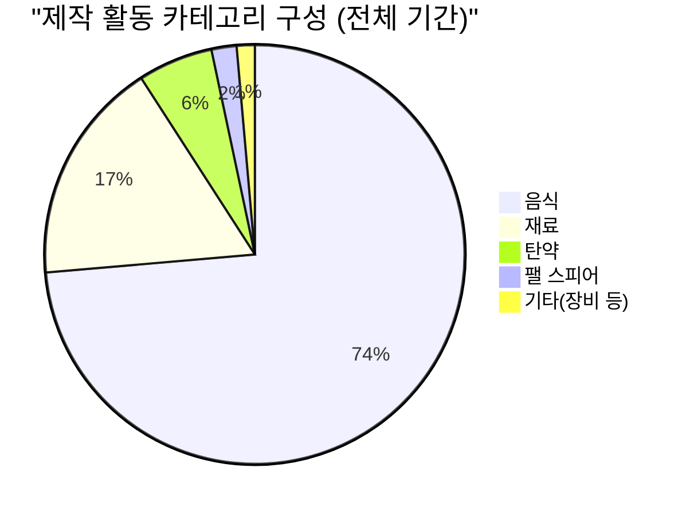

# PalM 알파테스트 경제/자원 흐름 패턴 분석

**작성자**: 편광범(Pyeon Gwangbum)  
**작성일**: 2026-04-13  
**분석 기간**: 2025-12-05 ~ 2025-12-11 (알파테스트 7일)  
**데이터 출처**: `main.log_palm_live.ingame_nature_resource_collect`, `ingame_building_resource_collect`, `ingame_craft_complete`  
**분석 대상**: 알파테스트 참여 유저 2,123명

---

## 1. 요약

PalM 알파테스트의 자원 수집-제작-소비 흐름을 분석한 결과, 경제 활동의 무게중심이 **필드 수집에서 기지 생산으로 빠르게 전환**되는 패턴이 확인되었다. 기지 자원 비중은 Day 1의 20%에서 Day 6에 69%로 급증했다. 제작 활동에서는 **음식(구운 열매) 생산이 전체의 71%를 독점**하고 있으며, 고레벨로 갈수록 음식 비중이 더 높아져 Lv31+ 구간에서는 85~93%에 달한다. 이는 팰 먹이 수요가 제작 시스템의 대부분을 점유하고 있음을 의미한다.

| 지표 | 수치 | 출처 |
|------|------|------|
| 총 필드 수집 이벤트 | 591만 건 (2,026명) | ingame_nature_resource_collect |
| 총 기지 수집 이벤트 | 432만 건 (1,018명) | ingame_building_resource_collect |
| 총 제작 완료 이벤트 | 941만 건 (2,020명) | ingame_craft_complete |
| 기지 자원 비중 변화 | Day 1: 20% → Day 6: 69% | 필드+기지 합산 일별 비교 |
| 음식 제작 비중 | 전체 제작의 73.6% (693만 건) | craft_complete 카테고리 분류 |
| 구운 열매(Baked Berries) | 단일 레시피 전체 제작의 70.7% | craft_complete |
| 기지 자원 = 잔존? | 레벨 통제 시 유의미한 차이 없음 | 반증 분석 결과 |

**핵심 시사점**: 제작 시스템이 "음식 공장"으로 수렴하고 있다. 이는 팰 먹이 수요 대비 음식 생산 효율이 낮거나, 음식 소비량이 과도하게 설계되었을 가능성을 시사한다. 스튜디오가 검토할 지점은 (1) 팰 음식 소비량 밸런스, (2) 기지 제작 슬롯이 음식에 집중되는 현상의 의도 여부이다.

---

## 2. 연구 배경

분석팀의 단련 구간 분석에서 "기지 경제가 우세"라는 언급이 있었으나, **자원 수집-제작-소비의 구체적인 흐름**은 분석되지 않았다. 유저가 어떤 자원을 얼마나 수집하고, 무엇을 만들며, 자원 병목이 어디에 있는지는 게임 밸런스의 핵심 데이터다.

기존 연구(세션 패턴, 던전, 포획)가 전투와 탐험 측면에 집중했다면, 이번 연구는 **경제/생산 측면**에서 유저 행동을 탐색한다. 특히 다음 질문에 답하고자 했다:

- 유저의 자원 조달 방식은 시간이 지나면서 어떻게 변하는가?
- 제작 활동의 구성은 어떤가? 특정 아이템에 편중되어 있는가?
- 자원 수집/제작 활동과 게임 진행(잔존) 사이에 관계가 있는가?

---

## 3. 가설

### 가설 1: 기지 자원 비중이 Day별로 증가한다

- **예상 결과**: Day 1 대비 Day 6에 기지 자원 비중이 2배 이상 증가
- **기각 조건**: 기지 자원 비중이 일차별로 증가하지 않거나, 증가폭이 10%p 미만인 경우

### 가설 2: 음식 제작이 전체 제작 활동의 과반을 차지하며, 고레벨에서 비중이 더 높다

- **예상 결과**: 음식 제작이 전체의 50% 이상, Lv21+ 에서 60% 이상
- **기각 조건**: 음식 제작 비중이 전체의 40% 미만이거나, 레벨별 차이가 10%p 미만인 경우

### 가설 3: D1에 기지 경제를 경험한 유저의 잔존율이 높다

- **예상 결과**: D1 기지 자원 수집 유저가 미경험 유저 대비 잔존율 20%p 이상 높음
- **기각 조건**: 레벨을 통제(같은 수준으로 비교)했을 때 차이가 10%p 미만인 경우

---

## 4. 분석 결과

### 4.1 자원 수집 전체 현황

알파테스트 기간 동안 수집된 자원의 총량(필드 + 기지 합산)은 다음과 같다.

| 자원 | 필드 수집량 | 기지 생산량 | 합계 | 기지 비중 |
|------|----------:|----------:|-----:|--------:|
| 열매(Berries) | 0 | 9,492,475 | 9,492,475 | 100% |
| 나무(Wood) | 4,302,579 | 1,566,036 | 5,868,615 | 26.7% |
| 돌(Stone) | 3,631,033 | 1,323,112 | 4,954,145 | 26.7% |
| 구리광석(CopperOre) | 1,025,645 | 843,260 | 1,868,905 | 45.1% |
| 팰 결정(Pal_crystal_S) | 1,385,680 | 0 | 1,385,680 | 0% |
| 섬유(Fiber) | 1,275,487 | 0 | 1,275,487 | 0% |
| 밀(Wheat) | 0 | 615,525 | 615,525 | 100% |
| 유황(Sulfur) | 138,804 | 441,139 | 579,943 | 76.1% |

*출처: ingame_nature_resource_collect (EXPLODE collect_item_list), ingame_building_resource_collect*

[Fact] 열매와 밀은 기지 농장(FarmBlock)에서만 생산된다. 팰 결정과 섬유는 필드에서만 수집 가능하다.  
[Fact] 유황은 필드(24%)보다 기지(76%)에서 압도적으로 많이 생산된다. 유황 채굴장(SulfurPit) 이용 유저 321명 vs 필드 유황 수집 유저 490명이지만, 기지 1인당 생산량이 훨씬 크다.

### 4.2 필드 → 기지 전환: 일별 변화

기지 자원의 비중은 Day 1의 20.4%에서 Day 6에 69.3%로, **7일 만에 3.4배** 증가했다.

```mermaid
xychart-beta
    title "일별 자원 조달 경로 변화 (유저당 평균)"
    x-axis ["Day1", "Day2", "Day3", "Day4", "Day5", "Day6"]
    y-axis "유저당 평균 수집량" 0 --> 5000
    bar [1684, 1911, 1954, 1725, 1607, 1480]
    bar [433, 1548, 2390, 2945, 3254, 3333]
```

| 일차 | 접속 유저 | 유저당 필드 | 유저당 기지 | 기지 비중 |
|------|--------:|----------:|----------:|--------:|
| Day 1 (12/05) | 1,578 | 1,684 | 433 | 20.4% |
| Day 2 (12/06) | 1,211 | 1,911 | 1,548 | 44.7% |
| Day 3 (12/07) | 1,063 | 1,954 | 2,390 | **55.0%** |
| Day 4 (12/08) | 1,048 | 1,725 | 2,945 | 63.1% |
| Day 5 (12/09) | 937 | 1,607 | 3,254 | 66.9% |
| Day 6 (12/10) | 831 | 1,480 | 3,333 | **69.3%** |

*출처: ingame_nature_resource_collect + ingame_building_resource_collect, 유저당 평균. Day 7(12/11)은 테스트 종료일로 부분 데이터(280명)이므로 제외.*

[Fact] 필드 수집량(유저당)은 Day 2를 정점으로 완만히 감소(-22%, 1,911→1,480)한 반면, 기지 생산량은 Day 1 대비 Day 6에 **7.7배** 증가(433→3,333)했다. 기지 자원이 필드를 추월하는 전환점(crossover)은 **Day 3(12/07)**이다.

### 4.3 기지 생산 설비별 현황

기지에서 자원을 생산하는 설비 6종의 이용 현황:

| 설비 | 수집 이벤트 | 이용 유저 | 생산 자원 |
|------|----------:|--------:|----------|
| 벌목장(StationDeforest2) | 1,566,036 | 972 | 나무 |
| 채석장(StonePit) | 1,323,112 | 989 | 돌 |
| 구리 채굴장(CopperPit) | 843,260 | 450 | 구리광석 |
| 유황 채굴장(SulfurPit) | 441,139 | 321 | 유황 |
| 열매 농장(FarmBlock_Berries) | 128,340 | 839 | 열매 |
| 밀 농장(FarmBlock_Wheat) | 13,863 | 262 | 밀 |

*출처: ingame_building_resource_collect*

[Fact] 열매 농장은 이벤트 수(128,340)는 적지만, 1회당 생산량이 매우 높아 총 생산량 949만 개로 전체 자원 중 1위다.  
[Fact] 구리 채굴장 이용 유저(450명)는 채석장(989명)의 절반 미만이다. 구리는 제련(CopperIngot) 과정이 필요하며, 중급 설비 해금 이후 본격적으로 사용된다.

### 4.4 제작(크래프트) 활동 분석

#### 전체 카테고리 분포

| 카테고리 | 제작 건수 | 비중 | 이용 유저 |
|---------|--------:|-----:|--------:|
| 음식(Food) | 6,931,999 | 73.6% | 1,622 |
| 재료(Material) | 1,625,917 | 17.3% | 785 |
| 탄약(Ammo) | 543,650 | 5.8% | 1,673 |
| 팰 스피어(PalSphere) | 181,956 | 1.9% | 1,939 |
| 장비/기타(Equipment+Other) | 131,173 | 1.4% | 2,019 |

*출처: ingame_craft_complete, 카테고리는 recipe_datatable_id 기반 분류*

[Fact] 음식 제작이 전체의 73.6%를 차지한다. 그 중 **구운 열매(Baked_Berries) 단일 레시피가 666만 건으로 전체 제작의 70.7%**에 해당한다.

#### 인기 제작 레시피 Top 10

| 순위 | 레시피 | 제작 건수 | 이용 유저 | 총 생산량 |
|-----:|-------|--------:|--------:|--------:|
| 1 | 구운 열매(Baked_Berries) | 6,661,692 | 1,096 | 6,661,692 |
| 2 | 숯(Charcoal) | 708,791 | 752 | 708,791 |
| 3 | 구리 주괴(CopperIngot) | 607,900 | 773 | 607,900 |
| 4 | 화살(Arrow) | 382,776 | 1,672 | 3,827,760 |
| 5 | 화약(Gunpowder2) | 201,814 | 403 | 201,814 |
| 6 | 밀가루(Flour) | 110,594 | 241 | 110,594 |
| 7 | 메가 스피어(PalSphere_Mega_Perfect) | 105,125 | 1,207 | 105,125 |
| 8 | 팰 결정 가공(Pal_crystal_S) | 95,899 | 627 | 95,899 |
| 9 | 섬유(Fiber) | 77,933 | 121 | 155,866 |
| 10 | 기본 스피어(PalSphere) | 63,816 | 1,938 | 63,816 |

*출처: ingame_craft_complete*

[Fact] 화살(Arrow)은 1회 제작에 10개가 생산되어, 총 생산량은 383만 개(제작 건수 38만)로 탄약 중 1위다.  
[Fact] 기본 스피어(PalSphere)는 이용 유저 1,938명으로 가장 많은 유저가 사용했으나, 제작 건수(63,816)는 적다. 초반 1~2회 제작 후 메가 스피어로 전환하는 패턴으로 보인다.

### 4.5 레벨별 제작 구성 변화

음식 제작의 비중은 레벨이 올라갈수록 극적으로 증가한다.

| 레벨 구간 | 음식 비중 | 주요 제작 항목 | 유저 수 |
|----------|--------:|-------------|------:|
| Lv1-10 | 17.7% | 팰 스피어(35.6%), 화살(33.3%), 음식(17.7%) | 2,018 |
| Lv11-20 | 52.4% | 음식(52.4%), 재료(23.2%), 스피어(10.8%) | 1,259 |
| Lv21-30 | 66.5% | 음식(66.5%), 재료(25.8%), 탄약(5.3%) | 571 |
| Lv31-40 | 86.8% | 음식(86.8%), 재료(7.9%), 탄약(4.8%) | 48 |
| Lv41+ | 93.3% | 음식(93.3%), 재료(3.7%), 탄약(2.5%) | 5 |

*출처: ingame_craft_complete, player_level 기준*

[Fact] Lv1-10에서는 팰 스피어와 화살이 주된 제작물이다(합산 68.9%). Lv11부터 음식이 과반을 넘기 시작하며, Lv31+ 에서는 음식이 거의 유일한 제작 활동이다.  
[Fact] 구운 열매의 비중만 보면, Lv1-10에서 11.4% → Lv21-30에서 62.9% → Lv41+에서 92.5%로, 레벨이 올라갈수록 **제작 = 구운 열매 생산**으로 수렴한다.

#### 인당 제작 강도(intensity) 변화

| 레벨 구간 | 총 제작 건수 | 유저 수 | 인당 제작 수 |
|----------|----------:|------:|----------:|
| Lv1-10 | 111,506 | 2,018 | 55 |
| Lv11-20 | 958,993 | 1,259 | 762 |
| Lv21-30 | 4,302,675 | 571 | 7,535 |
| Lv31-40 | 3,402,165 | 48 | 70,878 |
| Lv41+ | 639,356 | 5 | 127,871 |

*출처: ingame_craft_complete*

[Fact] Lv21-30에서 인당 제작 수가 7,535건으로 급증한다. 이 구간에서 기지 자동 제작이 본격화되는 것으로 추정된다. [Estimate: 자동 제작 여부는 로그에서 직접 확인 불가하나, 인당 건수의 비약적 증가(Lv11-20의 762건 → 10배)가 수동 제작만으로는 설명되지 않으므로 기지 팰의 자동 생산에 의한 것으로 추정]

### 4.6 자원 순환: 수집 → 제작 흐름

주요 자원의 공급-수요 관계를 일별로 추적했다.

**구리광석 → 구리 주괴 (Copper 체인)**

| 일차 | 구리 수집량(필드+기지) | 구리 주괴 생산량 | 소진율 |
|------|------------------:|---------------:|------:|
| Day 1 | 146,713 | 29,428 | 20.1% |
| Day 2 | 288,532 | 88,590 | 30.7% |
| Day 3 | 384,196 | 141,136 | 36.7% |
| Day 4 | 381,148 | 122,801 | 32.2% |
| Day 5 | 355,634 | 120,266 | 33.8% |
| Day 6 | 279,078 | 95,828 | 34.3% |

*소진율 = 구리 주괴 생산량 / 구리 수집량. 구리 주괴 1개 = 구리광석 2개가 아닌 1:1 기준 (레시피 비율 미확인). 출처: 필드+기지 합산 vs craft_complete*

**유황 → 화약 (Sulfur 체인)**

| 일차 | 유황 수집량(필드+기지) | 화약 생산량 | 소진율 |
|------|------------------:|----------:|------:|
| Day 1 | 8,426 | 879 | 10.4% |
| Day 2 | 64,980 | 18,034 | 27.7% |
| Day 3 | 115,312 | 44,124 | 38.3% |
| Day 4 | 141,663 | 41,365 | 29.2% |
| Day 5 | 136,201 | 53,300 | 39.1% |
| Day 6 | 101,994 | 41,107 | 40.3% |

*출처: 필드+기지 합산 vs craft_complete*

[Fact] 구리와 유황 모두 소진율이 20~40% 수준으로, 수집량 대비 제작에 사용되는 비율은 높지 않다. 이는 중간 재료(주괴, 화약)가 다시 상위 아이템 제작에 소비되는 체인 구조이거나, 유저가 원광석을 재고로 보유하는 패턴일 수 있다.

**팰 결정 순환 (Pal Crystal 체인)**

[Fact] 팰 결정(Pal_crystal_S)은 필드에서만 수집 가능하며 총 1,385,680개가 수집되었다(1,996명). Crusher에서 가공 제작된 팰 결정은 95,899개(627명)이다. 필드 수집 유저당 평균 693.9개, Crusher 이용 유저당 평균 152.7개.

### 4.7 D1 경제 행동과 잔존

Day 1에 기지 자원을 수집한 유저(Both 그룹)의 잔존율은 80.8%로, 필드만 수집한 유저(43.0%)보다 37.8%p 높았다.

| D1 자원 행동 | 유저 수 | 잔존(D5+) | 잔존율 | D1 평균 제작 수 |
|-------------|------:|--------:|------:|------------:|
| 필드 + 기지 둘 다(Both) | 474 | 383 | 80.8% | 901 |
| 필드만(Field Only) | 1,104 | 475 | 43.0% | 53 |
| 자원 수집 없음(None) | 135 | 37 | 27.4% | 0.1 |

*출처: ingame_nature_resource_collect + ingame_building_resource_collect + ingame_login (D1=12/05 로그인 유저 1,713명, 잔존=12/09 이후 마지막 접속)*

[Fact] D1에 기지 자원까지 수집한 유저는 전체 D1 유저의 27.7%(474/1,713)이며, 이들의 잔존율이 가장 높다(80.8%).  
그러나 이 차이가 기지 경험 자체의 효과인지, 단순히 더 많이 플레이한 유저(= 높은 레벨)이기 때문인지는 레벨 통제가 필요하다. → 5절 반증 참조.

### 4.8 구운 열매(Baked Berries) 생산 집중도

구운 열매를 제작한 유저 1,097명의 생산량 분포:

| 생산량 구간 | 유저 수 | 평균 생산량 | 최대 |
|-----------|------:|----------:|-----:|
| 1~100개 | 469 | 32 | 100 |
| 101~1,000개 | 305 | 373 | 996 |
| 1,001~10,000개 | 255 | 3,312 | 9,909 |
| 10,000개 이상 | 68 | 83,649 | 602,159 |

*출처: ingame_craft_complete, Baked_Berries 제작 유저*

[Fact] 상위 68명(6.2%)이 구운 열매 총 생산량의 85.4%(568만/666만)를 생산했다. 이는 고레벨 유저의 기지 자동 생산에 의한 것이다. [Estimate: 1인당 최대 602,159개는 7일간 24시간 가동을 가정해도 분당 약 60개 생산 속도이므로, 복수 화덕 + 팰 자동 제작으로 추정]

---

## 5. 반증 탐색 결과

### 반증 1: D1 기지 경험과 잔존 — 레벨 통제

"D1에 기지를 경험한 유저의 잔존율이 높다"는 단순히 **더 오래 플레이한 유저가 기지도 짓고 잔존도 한 것**일 수 있다. 이를 확인하기 위해 최종 달성 레벨별로 통제했다.

| 레벨 그룹 | D1 기지 경험 | 유저 수 | 잔존율 | D1 미경험 | 유저 수 | 잔존율 | 차이 |
|----------|:-----------:|------:|------:|:---------:|------:|------:|-----:|
| Lv1-15 | O | 32 | 21.9% | X | 915 | 23.9% | -2.0%p |
| Lv16-25 | O | 231 | 73.2% | X | 269 | 88.5% | **-15.3%p** |
| Lv26+ | O | 211 | 98.1% | X | 55 | 100.0% | -1.9%p |

*출처: ingame_login (max user_level), ingame_building_resource_collect (D1 기지 경험 여부)*

**결과: 가설 3 기각.**

[Fact] 레벨을 통제하면 D1 기지 경험의 잔존 효과는 사라진다. 오히려 Lv16-25 구간에서는 D1 미경험 유저의 잔존율이 15.3%p 더 높았다. 이는 D1에 기지까지 도달한 것이 잔존을 촉진한 것이 아니라, 더 많이 플레이한 유저(= 높은 레벨)가 기지도 짓고 잔존도 했을 뿐이라는 해석이 적절하다.

[Fact] D1에 Lv16+ 도달 유저 243명은 100% 기지 경험이 있었다(base_pct=100%). 즉 D1에 충분히 플레이하면 기지는 자연스럽게 경험하는 것이지, 기지 경험이 잔존을 유발하는 것은 아니다.

### 반증 2: 음식 제작 편중은 고레벨 소수 유저의 왜곡인가?

음식 비중 73.6%가 소수 고레벨 유저에 의해 부풀려진 것일 수 있다. 이를 확인하기 위해 유저 수준에서 음식 비중 분포를 점검했다.

| 음식 비중 그룹 | 유저 수 | 평균 총 제작 | 평균 음식 비중 |
|--------------|------:|----------:|----------:|
| 50% 미만 | 1,352 | 1,123 | 16.6% |
| 50~69% | 249 | 6,233 | 58.3% |
| 70~89% | 95 | 37,264 | 78.6% |
| 90% 이상 | 17 | 164,867 | 93.9% |

*출처: ingame_craft_complete, 10건 이상 제작 유저 1,713명 대상*

[Fact] 유저 수 기준으로는 78.9%(1,352명)가 음식 비중 50% 미만이다. 건수 기준 73.6%라는 수치는 **소수 고레벨 유저(112명, 70%+ 그룹)의 대량 생산에 의한 편향**이 있다. 그러나 50~69% 그룹도 249명으로 적지 않으며, Lv11-20 구간부터 이미 음식 비중이 과반(52.4%)이므로 **레벨 진행에 따라 모든 유저에게 해당하는 구조적 현상**이다.

### 반증 3: 일별 기지 비중 증가는 잔존 유저(= 고레벨)만 남아서인가?

이탈 유저가 빠지면서 남은 유저의 평균 레벨이 올라가고, 그에 따라 기지 비중이 자연 증가하는 것일 수 있다. 이는 부분적으로 사실이다 — Day 1에 1,578명이 접속했고 Day 6에는 831명만 남았다. 그러나 필드 수집의 유저당 평균도 Day 2(1,911) → Day 6(1,480)으로 감소한 반면, 기지 평균은 433 → 3,333으로 **7.7배 증가**했다. [Fact] 유저 감소(-47%)만으로는 기지 비중의 3.4배 증가를 설명할 수 없다. 잔존 유저 내에서도 개인 수준의 필드→기지 전환이 일어나고 있다.

---

## 6. 결론 및 시사점

### 가설 판정

| 가설 | 판정 | 근거 |
|------|------|------|
| H1: 기지 자원 비중 일별 증가 | **채택** | 20.4% → 69.3%, Day 3에 crossover |
| H2: 음식 제작이 과반 + 고레벨에서 비중 증가 | **채택** | 전체 73.6%, Lv21-30에서 66.5%, Lv31+에서 87~93% |
| H3: D1 기지 경험 → 높은 잔존 | **기각** | 레벨 통제 시 차이 없음 또는 역전 |

### 시사점

1. **제작 시스템이 "음식 공장"으로 수렴**: 구운 열매 단일 레시피가 전체 제작의 70.7%를 차지한다. 이는 팰 먹이 수요가 제작 시스템을 압도하고 있음을 의미한다. 스튜디오가 판단할 지점: **의도된 설계인가? 팰 먹이 소비 속도 또는 열매 농장 생산 효율이 적절한가?**

2. **필드 → 기지 전환은 자연스럽지만, 속도가 빠르다**: Day 3에 이미 기지가 필드를 추월한다. 필드 탐험의 보상 매력이 기지 자동 생산 대비 부족할 수 있다. 스튜디오가 판단할 지점: **필드 탐험에 더 강한 자원 인센티브가 필요한가?**

3. **유황은 기지 의존도가 가장 높은 자원**: 총량의 76%가 기지에서 생산되며, 화약(탄약 원료) 제작에 필수다. 유황 채굴장 미해금 유저는 필드 유황에 의존하는데, 필드 유황 수집량은 기지의 1/3 수준이다. 스튜디오가 판단할 지점: **유황 접근성이 중반 게임 진행의 병목이 되는가?**

4. **팰 결정은 필드 전용 자원으로, 필드 탐험 동기를 유지하는 역할**: 다른 자원은 기지 대체가 가능하지만, 팰 결정(138만 개 수집)은 필드에서만 획득된다. 기지 경제가 확장되어도 팰 결정 수요가 필드 탐험을 견인하는 구조이다.

---

## 7. 한계 및 후속 연구

1. **자원 소비 로그 부재**: `craft_complete`는 생산 로그이지 소비 로그가 아니다. 팰이 음식을 실제로 얼마나 소비하는지, 유저 인벤토리에 자원이 얼마나 쌓이는지는 확인할 수 없다. 자원 재고 스냅샷 데이터가 있다면 병목 분석의 정확도가 높아질 것이다.

2. **레시피 원재료 비율 미확인**: 구리 주괴 1개에 구리광석이 몇 개 필요한지, 화약 1개에 유황/숯이 각 몇 개인지 데이터에서 확인할 수 없다. 본 분석의 "소진율"은 원재료:생산물 비율을 1:1로 가정한 참고 수치이다.

3. **자동 제작 vs 수동 제작 구분 불가**: craft_complete 로그에는 자동/수동 구분이 없다. 고레벨 유저의 대량 음식 생산이 기지 팰 자동 제작인지 유저 수동 조작인지 확인할 수 없다.

4. **알파테스트 선발 집단**: 2,123명의 선발 테스터로, 일반 유저 모집단과 행동 패턴이 다를 수 있다.

5. **7일 제한**: 장기적 자원 고갈/포화 패턴은 7일 데이터로 확인할 수 없다.

### 후속 연구 제안

- 팰 먹이 소비 로그가 있다면, "음식 생산량 vs 실제 소비량" 분석으로 정확한 음식 수급 밸런스 확인
- 유저 인벤토리 무게(player_current_weight) 추이와 자원 수집량의 관계 분석 (무게 제한이 수집 행동에 미치는 영향)
- 기지 건설(building) 로그와 연계하여, 설비 해금 시점이 제작 패턴 변화에 미치는 영향 분석

---

## 부록

### A. 일별 주요 레시피 생산량

| 일차 | 구운 열매 | 숯 | 구리 주괴 | 화약 | 화살 | 팰 스피어(합) |
|------|--------:|---:|--------:|-----:|-----:|----------:|
| Day 1 | 235,771 | 41,595 | 29,428 | 879 | 630,150 | 56,811 |
| Day 2 | 790,954 | 108,606 | 88,590 | 18,034 | 582,230 | 39,388 |
| Day 3 | 1,118,544 | 144,093 | 141,136 | 44,124 | 561,810 | 29,139 |
| Day 4 | 1,297,723 | 153,449 | 122,801 | 41,365 | 618,640 | 22,925 |
| Day 5 | 1,529,177 | 139,354 | 120,266 | 53,300 | 815,980 | 18,090 |
| Day 6 | 1,540,170 | 113,131 | 95,828 | 41,107 | 579,440 | 14,044 |

*출처: ingame_craft_complete. Day 7(12/11)은 부분 데이터로 제외.*

### B. D1 레벨별 기지 도달율

| D1 달성 레벨 | 유저 수 | 기지 경험 유저 | 기지 도달율 |
|-------------|------:|----------:|--------:|
| Lv1-10 | 1,140 | 41 | 3.6% |
| Lv11-15 | 329 | 190 | 57.8% |
| Lv16+ | 243 | 243 | 100.0% |

*출처: ingame_login (D1 max user_level), ingame_building_resource_collect (D1 기지 이벤트 유무)*

### C. 제작 레시피 카테고리 분류 기준

- **음식**: Baked_Berries, BakedMeat_SheepBall, BakedMeat_ChickenPal, BakedMushroom, FriedEggs, MarinatedMushrooms, BakedMeat_BerryGoat, BakedMeat_Eagle, BakedMeat_Boar, Eaglestew, HotMilk, JamBun, Pancake, Pan, Flour
- **재료**: Charcoal, CopperIngot, Gunpowder2, Fiber, MachineParts
- **탄약**: Arrow, Bolt, ReinforcedArrow, MakeshiftHandgunBullet, MakeshiftSubmachinegunBullet, MakeshiftAssaultRifleBullet, MakeshiftShotgunBullet, HandgunBullet, RoughBullet, AssaultRifleBullet
- **팰 스피어**: PalSphere, PalSphere_Mega_Perfect, PalSphere_Giga_Perfect
- **장비/기타**: 위 카테고리에 해당하지 않는 모든 레시피 (Axe, Pickaxe, Bat, Armor, Shield, Bow, Medicine 등)

### D. 일별 제작 카테고리 건수

| 일차 | 음식 | 재료 | 탄약 | 스피어 | 기타 |
|------|-----:|-----:|-----:|------:|-----:|
| Day 1 | 251,085 | 79,208 | 79,207 | 56,811 | 19,327 |
| Day 2 | 811,204 | 233,831 | 83,159 | 39,388 | 29,109 |
| Day 3 | 1,169,652 | 350,500 | 90,409 | 29,139 | 28,115 |
| Day 4 | 1,368,712 | 340,082 | 94,917 | 22,925 | 20,653 |
| Day 5 | 1,585,993 | 335,264 | 107,666 | 18,090 | 18,114 |
| Day 6 | 1,590,531 | 264,594 | 83,205 | 14,044 | 14,683 |

*출처: ingame_craft_complete, Day 7 제외*
