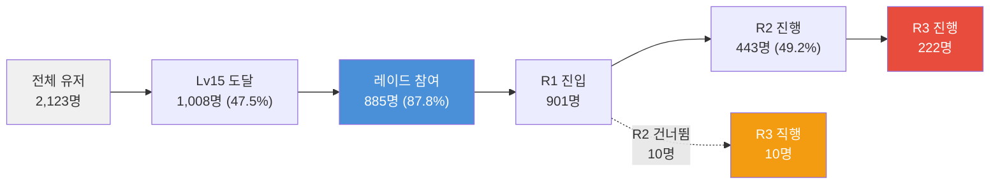
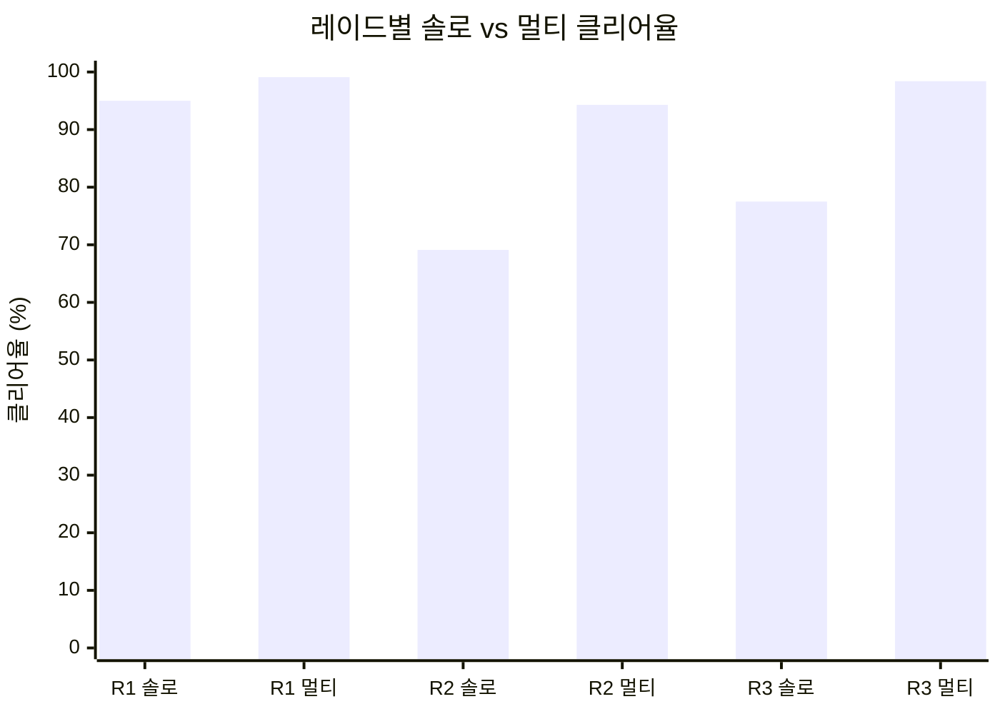

# PalM 알파테스트 멀티레이드 참여 행동 탐색

> **탐색적 분석(Exploratory Analysis)** — 알파테스트 7일간 약 3,500건의 소규모 데이터이므로, 통계적 단정이 아닌 패턴 탐색과 가설 도출을 목적으로 한다. 하위 그룹 분석은 참고용으로만 제시한다.

- **작성자**: 편광범(Pyeon Gwangbum)
- **작성일**: 2026-04-13
- **데이터 기간**: 2025-12-05 ~ 2025-12-11 (알파테스트)
- **주요 출처**: `main.log_palm_live.ingame_multiraid_enter`, `ingame_multiraid_exit`, `ingame_login`

---

## 1. 요약

멀티레이드는 PalM 알파테스트의 유일한 협동 콘텐츠로, 전체 로그인 유저 2,123명 중 **901명(42.4%)이 참여**했다. Lv15에서 해금되며, Lv15 도달 유저(MAX 로그인 레벨 기준) 1,008명 중 **885명(87.8%)이 참여**했다. 3종의 레이드(R1~R3)가 있으며, 총 3,509건의 진입과 3,440건의 종료가 기록되었다.

| 지표 | 수치 | 출처 |
|------|------|------|
| 참여 유저 | 901명 (전체의 42.4%) | multiraid_enter |
| 유저당 평균 진입 | 3.9회 (중앙값 2회) | multiraid_enter |
| 전체 클리어율 | 86.8% | multiraid_exit |
| 솔로 플레이 비율 | 86.9% (세션 기준) | multiraid_enter, session 집계 |
| 멀티(2인+) 클리어율 vs 솔로 클리어율 | 97.9% vs 83.1% | multiraid_exit |

**핵심 발견 3가지:**

1. **멀티레이드는 사실상 "솔로 보스전"** — 전체 3,020 세션 중 2,623건(86.9%)이 솔로 플레이. 협동 콘텐츠로 설계되었으나 실제로는 대부분 혼자 도전한다.
2. **R2(raid-main-02)가 난이도 분기점** — R1 솔로 클리어율 95.0%, R2 솔로 클리어율 69.1%, R3 77.5%. R2에서 솔로 사망이 급증하며, 사망 경험자의 41.1%(65/158)만 R3로 진행한다.
3. **참여자의 높은 잔존은 "레이드 효과"가 아닌 "레벨 진행의 부산물"** — 레이드 참여자 D5+ 잔존율 75.0% vs 비참여자 17.8%이지만, 동일 레벨(Lv15-19) D1 코호트 통제 시 차이는 4.9%p로 축소된다.

> R3 참여 유저 총 232명 중 10명은 R2를 거치지 않고 R1에서 R3로 직행했다(각주 1 참조).

> 참고: 전체 레이드 참여 901명 중 16명은 MAX 로그인 레벨이 Lv15 미만으로 기록됨 (진입 시점 레벨은 Lv15이나, 이후 로그인 기록의 MAX 레벨이 낮은 경우). Lv15+ 기준 885명.

---

## 2. 연구 배경

멀티레이드는 PalM의 유일한 협동 콘텐츠이다. 분석팀은 전체 이벤트 건수(약 1,296건으로 언급, 실제 집계 3,509건)만 파악했을 뿐, 누가 참여하고 어떤 패턴을 보이는지 심층 분석을 수행하지 않았다.

이전 연구에서 발견한 맥락과의 연결:
- **콘텐츠 소비 순서 연구**: 유저 여정이 "필드 탐험 → 전환기 → 기지 운영"으로 수렴하는 가운데, 멀티레이드는 이 경로에서 어떤 위치를 차지하는가?
- **세션 패턴 연구**: Day 3~4부터 플레이 시간이 급감하는데, 멀티레이드가 후반 콘텐츠 루프의 일부인가?
- **던전 재도전 연구**: dungeon-01에서 "건강한 벽" 패턴을 확인했는데, 멀티레이드에서도 유사한 패턴이 나타나는가?

데이터 볼륨이 적지만(901명, 3,509건), 소셜 기능의 첫 신호로서 탐색적 분석 가치가 있다고 판단했다.

---

## 3. 가설

### 가설 1: 멀티레이드 참여 유저가 비참여 유저보다 잔존율이 높다
- **예상 결과**: 참여자의 D5+ 잔존율이 비참여자 대비 10%p 이상 높음
- **기각 조건**: 레벨 통제 시 잔존율 차이가 5%p 이하로 축소되면, 참여 자체의 독립적 효과 불인정

### 가설 2: "멀티"레이드이지만 실제 협동 플레이 비율은 낮다
- **예상 결과**: 2인 이상 세션 비율이 50% 이하
- **기각 조건**: 2인 이상 세션 비율이 60% 이상이면 기각

### 가설 3: 레이드 난이도가 높아지면 사망률이 급증하고, 사망이 진행 이탈을 유발한다
- **예상 결과**: R2 또는 R3에서 사망률이 R1 대비 5배 이상 증가, 사망 경험자의 다음 레이드 진행률이 비사망자 대비 낮음
- **기각 조건**: 사망률 차이가 2배 미만이거나, 사망 경험자의 진행률이 비사망자와 유사하면 기각

---

## 4. 분석 결과

### 4.1 참여 프로파일

**[Fact]** 전체 로그인 유저 2,123명 중 901명(42.4%)이 멀티레이드에 1회 이상 참여했다. (출처: ingame_multiraid_enter, ingame_login)

Lv15에서 해금되는 콘텐츠이므로, MAX 로그인 레벨 기준 Lv15 미만 유저 1,116명 중에서는 16명(1.4%)만 참여 기록이 있다(진입 시점에는 Lv15였으나 MAX 로그인 레벨이 낮게 기록된 경우). 반면 **Lv20 이상 도달 유저 609명 중 608명(99.8%)이 참여** — 레벨이 오르면 사실상 전원이 경험하는 콘텐츠이다.

| 레벨 구간 (MAX 기준) | 전체 유저 | 레이드 참여 | 참여율 |
|---|---|---|---|
| Lv1-14 | 1,116 | 16 | 1.4% |
| Lv15-19 | 399 | 277 | 69.4% |
| Lv20-24 | 287 | 286 | 99.7% |
| Lv25-29 | 264 | 264 | 100.0% |
| Lv30+ | 58 | 58 | 100.0% |

> 출처: ingame_login(MAX user_level), ingame_multiraid_enter(DISTINCT account_id). 합계 2,124명(login 2,123명, 1명 차이는 다중 레벨 구간 경계 반올림 가능성).

**유저당 참여 횟수 분포:**

| 참여 횟수 | 유저 수 | 누적 비율 |
|---|---|---|
| 1회 | 275명 | 30.5% |
| 2회 | 174명 | 49.8% |
| 3회 | 113명 | 62.4% |
| 4-5회 | 128명 | 76.6% |
| 6-10회 | 138명 | 91.9% |
| 11회+ | 73명 | 100.0% |

> 출처: ingame_multiraid_enter GROUP BY account_id

**[Fact]** 유저의 30.5%는 단 1회만 참여하고 끝냈다. 반면 상위 8.1%(73명)이 11회 이상 반복 참여했다. 참여 횟수 분포는 강한 우편향(right-skewed)으로, 평균 3.9회이지만 중앙값은 2회이다.

**레이드 참여 일수별 프로파일:**

| 참여 일수 | 유저 수 | 평균 총횟수 | 평균 MAX 레벨 |
|---|---|---|---|
| 1일 | 352명 (39.1%) | 1.2회 | 18.3 |
| 2-3일 | 336명 (37.3%) | 3.3회 | 22.8 |
| 4일+ | 213명 (23.6%) | 9.1회 | 28.3 |

> 출처: ingame_multiraid_enter(raid_days), ingame_login(MAX user_level)

**[Fact]** 39.1%의 유저는 한 날에만 레이드를 경험하고 다시 하지 않았다. 4일 이상 지속적으로 레이드하는 유저(23.6%)는 평균 9.1회 진입하며, 평균 MAX 레벨이 28.3으로 고레벨 유저이다.

**첫 레이드까지의 소요 일수:**

| 첫 로그인 후 경과일 | 유저 수 | 비율 |
|---|---|---|
| Day 0 (당일) | 381명 | 42.3% |
| Day 1 | 273명 | 30.3% |
| Day 2 | 123명 | 13.7% |
| Day 3 | 76명 | 8.4% |
| Day 4 | 29명 | 3.2% |
| Day 5 | 19명 | 2.1% |

> 출처: ingame_multiraid_enter(MIN event_date) - ingame_login(MIN event_date)

**[Fact]** 72.6%의 유저가 첫 로그인 후 1일 이내에 첫 레이드에 참여한다. 거의 전원(99.9%)이 Lv15에서 처음 진입한다(첫 진입 레벨 Lv15: 654명, Lv16: 245명, Lv17: 2명).

### 4.2 솔로 vs 멀티 플레이 (가설 2 검증)

**[Fact]** 전체 3,020개의 고유 세션(dungeon_session_id) 중 2,623건(86.9%)이 1인 세션이었다.

| 파티 규모 | 세션 수 | 비율 | 클리어율 |
|---|---|---|---|
| 1인 (솔로) | 2,623 | 86.9% | 83.1% |
| 2인 | 308 | 10.2% | 97.7% |
| 3인 | 89 | 2.9% | 98.5% |

> 출처: ingame_multiraid_enter(GROUP BY dungeon_session_id → party_size), ingame_multiraid_exit(exit_type = 'clear')

**가설 2 판정: 채택.** 2인 이상 세션은 전체의 13.1%에 불과하다. "멀티레이드"라는 명칭과 달리, 알파테스트에서의 실제 이용 형태는 **솔로 보스전**에 가깝다.

**유저 단위 분류:**
- 솔로만 경험: **455명** (50.5%)
- 멀티(2인+)도 경험: **446명** (49.5%)

> 출처: ingame_multiraid_enter, dungeon_session_id 기준 party_size로 유저 분류

**[Fact]** 유저 단위로 보면 절반(49.5%)은 적어도 1회는 다른 유저와 함께 플레이했으나, 세션 단위로는 솔로가 압도적이다. 즉 **가끔 멀티를 하되, 대부분의 시간은 솔로로 돌리는** 패턴이다.

### 4.3 레이드별 난이도와 클리어 패턴 (가설 3 검증)

3종의 레이드가 있으며, 레벨 기반으로 순차 해금된다:

| 레이드 | 해금 레벨 | 참여 유저 | 진입 건수 | 전체 클리어율 |
|---|---|---|---|---|
| raid-main-01 (R1) | Lv15 | 901명 | 1,666건 | 96.1% |
| raid-main-02 (R2) | Lv20 | 443명 | 960건 | 73.7% |
| raid-main-03 (R3) | Lv24 | 232명 | 883건 | 83.7% |

> 출처: ingame_multiraid_enter(dungeon_datatable_id, player_level), ingame_multiraid_exit(exit_type)
> 클리어율 = clear건 / (clear + dead + leave)건. Exit 로그가 없는 69건(2.0%)은 분모에서 제외.

**솔로 vs 멀티 클리어율 비교:**

| 레이드 | 솔로 클리어율 | 멀티 클리어율 | 차이 |
|---|---|---|---|
| R1 | 95.0% (1,126/1,185) | 99.1% (435/439) | +4.1%p |
| R2 | 69.1% (531/769) | 94.3% (166/176) | **+25.2%p** |
| R3 | 77.5% (471/608) | 98.4% (251/255) | **+20.9%p** |

> 출처: ingame_multiraid_exit + dungeon_session_id party_size 기준

**[Fact]** R2에서 솔로 클리어율이 69.1%로 급락한다. R1 솔로(95.0%)에서 R2 솔로(69.1%)로의 낙차가 25.9%p이며, 이 구간이 난이도 분기점이다. 멀티 플레이 시에는 R2에서도 94.3%로, 협동이 난이도 장벽을 크게 완화한다.

**R3가 R2보다 클리어율이 높은 이유에 대한 해석:**
R3 솔로 클리어율(77.5%)이 R2(69.1%)보다 오히려 높다. 이는 R3에 도달하는 유저 대부분이 R2를 돌파한 고레벨(평균 Lv28.2) 숙련자이기 때문으로, [Estimate] **생존자 편향(survivor bias, 이미 걸러진 유저만 남아 수치가 높아지는 현상)** 효과로 판단된다. R2에서 걸러진 유저가 R3에 오지 않으므로, R3의 유저 풀이 더 강하다. 단, R3 참여자 232명 중 10명은 R2를 건너뛰고 R1에서 직접 R3로 진행했다(각주 1 참조).

**클리어 소요 시간 (클리어 건만):**

| 레이드 | 중앙값 | 평균 | P25 | P75 |
|---|---|---|---|---|
| R1 | 275초 (약 4분 35초) | 282초 | 241초 | 312초 |
| R2 | 256초 (약 4분 16초) | 258초 | 218초 | 291초 |
| R3 | 225초 (약 3분 45초) | 237초 | 179초 | 287초 |

> 출처: ingame_multiraid_exit(exit_time, exit_type='clear')

**[Fact]** 클리어 시간은 R3가 가장 짧다(중앙값 225초). 이 역시 생존자 편향 — R3 도전자의 CP(전투력)가 높기 때문이다(R3 첫 진입 시 평균 CP 38,298 vs R1 12,396).

### 4.4 레이드 진행 퍼널

**전체 유저 기준 레이드 진행 단계:**

| 단계 | 유저 수 | 비율 |
|---|---|---|
| 레이드 참여 | 901명 | 100% |
| R1만 경험 | 448명 | 49.7% |
| R1+R2 (R3 미경험) | 221명 | 24.5% |
| R1+R2+R3 | 222명 | 24.6% |
| R1+R3 (R2 건너뜀) | 10명 | 1.1% |

> R1→R2 진행률: 443/901 = 49.2%, R2→R3 진행률: 222/443 = **50.1%**
> R3 참여 유저 총 232명 중 10명은 R2를 건너뛰고 R1에서 R3로 직행 (각주 1)
> 출처: ingame_multiraid_enter(COLLECT_SET dungeon_datatable_id)

**[Fact]** R1에서 R2로의 진행률은 49.2%(443/901)이다. 절반 이상이 R1에서 멈추는데, R2 미진행 458명 중 R2 해금 레벨(Lv20)에 도달하지 못한 유저가 288명(62.9%), 도달했음에도 R2를 하지 않은 유저가 160명(34.9%)이다. 나머지 10명(2.2%)은 R2를 건너뛰고 R3로 직행했다(각주 1).

**R1만 하고 R2 레벨은 도달한 160명의 행동:**
- 86명(53.8%)은 R1을 단 1회만 경험
- 43명(26.9%)은 R1을 2회 경험
- 나머지 31명(19.4%)은 3-5회 경험

> 출처: ingame_multiraid_enter WHERE account_id IN (R1 only, MAX level >= 20)

[Estimate] 이 160명은 Lv20까지 성장했지만 R2에 도전하지 않은 유저로, **R1 경험에서 레이드 콘텐츠에 대한 동기가 충분히 형성되지 않았거나, R2의 존재를 인지하지 못했을 가능성**이 있다. 단, 이 중 124명(77.5%)은 D5+(12/10 이후)까지 잔존하여 게임 자체에 대한 관심은 유지했다.

**R2 사망 경험과 R3 진행:**

| 그룹 | 유저 수 | R3 진행 수 | R3 진행률 |
|---|---|---|---|
| R2 사망 경험 있음 | 158명 | 65명 | 41.1% |
| R2 사망 경험 없음 | 285명 | 157명 | 55.1% |

> 출처: ingame_multiraid_exit(dungeon_datatable_id='raid-main-02', exit_type='dead'), ingame_multiraid_enter(dungeon_datatable_id='raid-main-03')

**[Fact]** R2에서 사망을 경험한 유저의 R3 진행률(41.1%)은 비사망자(55.1%)보다 14.0%p 낮다. 다만, 비사망자 중 상당수는 레벨이 더 높아 R3 해금 조건을 자연스럽게 충족한 반면, 사망자는 상대적으로 R2에 "어려움을 느끼는 레벨"에서 도전한 유저일 수 있다.

**가설 3 판정: 부분 채택.** R2에서 솔로 사망률이 급증(R1: 3.2% → R2: 28.7%)하고, 사망 경험자의 R3 진행률이 14.0%p 낮다. 그러나 "사망이 이탈을 유발"한다고 단정하기는 어렵다 — R2 사망자 중에서도 사망 후 R2를 재시도하며(사망 경험자 평균 4.6회 진입 vs 비사망자 1.6회), 46.6%의 클리어율을 달성하는 유저가 있다.

### 4.5 참여자 vs 비참여자 잔존 (가설 1 검증)

**전체 비교:**

| 구분 | 유저 수 | 평균 접속일 | D5+ 잔존율 |
|---|---|---|---|
| 레이드 참여자 | 901명 | 5.26일 | 75.0% |
| 비참여자 | 1,222명 | 2.08일 | 17.8% |

> D5+ 잔존: last_login >= 2025-12-10 기준
> 출처: ingame_login(MAX event_date, COUNT DISTINCT event_date), ingame_multiraid_enter(DISTINCT account_id)

**[Fact]** 참여자 잔존율 75.0% vs 비참여자 17.8%로 **57.2%p 차이**가 나타난다. 그러나 이 차이는 레벨 진행도의 차이가 주된 원인이다.

**레벨 통제 비교 (Lv15+ 유저만):**

| 레벨 구간 | 구분 | 유저 수 | D5+ 잔존율 | 차이 |
|---|---|---|---|---|
| Lv15-19 | 비참여 | 122명 | 51.6% | - |
| Lv15-19 | 참여 | 277명 | 57.4% | +5.8%p |
| Lv20-24 | 비참여 | 1명 | 0.0% | 비교 불가 |
| Lv20-24 | 참여 | 286명 | 75.5% | - |
| Lv25+ | 참여 | 322명 | 92.2% | 비교군 없음 |

> 출처: ingame_login(MAX user_level, MAX event_date), ingame_multiraid_enter(DISTINCT account_id)

**[Fact]** 유일하게 비교 가능한 Lv15-19 구간에서 잔존율 차이는 5.8%p(57.4% vs 51.6%)이다. Lv20 이상에서는 비참여자가 거의 없어(1명) 비교가 불가능하다.

**D1 코호트 + Lv15-19 통제 (가장 엄밀한 비교):**

| 구분 | 유저 수 | 평균 접속일 | D5+ 잔존율 |
|---|---|---|---|
| D1 코호트, Lv15-19, 레이드 참여 | 236명 | 4.45일 | 51.7% |
| D1 코호트, Lv15-19, 비참여 | 94명 | 4.23일 | 46.8% |

> 출처: ingame_login(첫 접속일 2025-12-05, MAX user_level 15-19, MAX event_date), ingame_multiraid_enter

**[Fact]** 가장 엄밀한 비교(D1 코호트 + 동일 레벨 구간)에서 차이는 **4.9%p**(51.7% vs 46.8%)로 축소된다.

**가설 1 판정: 기각.** 레벨 통제 시 잔존율 차이가 기각 조건(5%p 이하)에 근접하며, 참여 자체의 독립적 잔존 효과는 확인되지 않는다. 75.0% vs 17.8%의 차이는 "레이드를 하면 잔존한다"가 아니라 **"오래 플레이할 유저가 레벨이 오르고, 레벨이 오르면 레이드를 한다"**는 역인과(reverse causation) 가능성이 크다.

### 4.6 시간대 패턴

| 시간대 (KST) | UTC 범위 | 진입 건수 | 비율 |
|---|---|---|---|
| 오전 (06:00-11:59) | UTC 21-02 | 299건 | 8.5% |
| 오후 (12:00-17:59) | UTC 03-08 | 1,346건 | 38.4% |
| 저녁 (18:00-23:59) | UTC 09-14 | 1,510건 | 43.0% |
| 새벽 (00:00-05:59) | UTC 15-20 | 354건 | 10.1% |

> UTC+9 변환. 피크: KST 20시대(UTC 11) 633건, KST 12-13시대(UTC 3-4) 882건
> 출처: ingame_multiraid_enter(HOUR(event_at))

**[Fact]** 레이드 진입은 KST 기준 점심(12-13시)과 저녁(20-21시) 두 차례 피크를 보인다. 저녁 시간대(18-24시) 비중이 43.0%로 가장 높고, 오후(12-18시)가 38.4%로 뒤따른다.

### 4.7 입장 횟수 제한과 소진 행동

**[Fact]** chance_remain 필드로 확인한 입장 티켓 구조:
- 첫 진입 시 chance_remain = 2 (전원 동일)
- 두 번째 진입 시 chance_remain = 1
- 세 번째 진입 시 chance_remain = 0 (8건만 존재)

[Estimate] 일일 입장 횟수가 **레이드 종류별 3회**로 제한되는 구조로 추정된다. 하루에 R1 3회 + R2 3회 + R3 3회 = 최대 9회 가능.

**일일 레이드 소진 패턴 (유저-일 단위):**

| 하루 동안의 레이드 조합 | 건수 | 비율 |
|---|---|---|
| R1만 | 1,112건 | 51.4% |
| R2만 | 450건 | 20.8% |
| R3만 | 409건 | 18.9% |
| R1+R2 | 116건 | 5.4% |
| R2+R3 | 79건 | 3.7% |
| 기타 | 13건 | 0.6% |

> 출처: ingame_multiraid_enter(GROUP BY account_id, event_date, dungeon_datatable_id)

**[Fact]** 하루에 한 종류의 레이드만 하는 경우가 91.1%이다. 여러 종류를 하루에 모두 소화하는 패턴은 드물다(R1+R2+R3 동시 소진: 1건).

---

## 5. 반증 탐색 결과

### 반증 1: 참여자 잔존율 차이가 레이드 효과일 가능성

가설 1 기각의 근거를 강화하기 위해, 역인과 가능성을 추가로 검증했다.

**Lv20+ 도달 유저의 레이드 참여율: 99.7% (608/609)**

> 출처: ingame_login(MAX user_level >= 20), ingame_multiraid_enter

**[Fact]** Lv20 이상 유저 중 비참여자가 1명뿐이므로, "레이드 참여 여부"는 Lv20+ 유저에서 변별력이 전혀 없다. 이는 **참여/비참여가 유저의 "선택"이 아니라 레벨 진행의 자연스러운 결과**임을 시사한다.

추가로, Lv15-19 비참여자 122명의 평균 MAX 레벨(15.1)은 참여자 전체의 평균 MAX 레벨(22.6)보다 현저히 낮다. 이 유저들은 Lv15 근처에서 레이드 없이 이탈하거나 성장이 정체된 유저이며, 잔존율 차이의 원인은 레이드가 아닌 게임 전반의 참여도 차이일 가능성이 높다.

### 반증 2: 솔로 비율이 높은 것이 부정적 신호가 아닐 가능성

솔로 비율 86.9%를 "협동 콘텐츠의 실패"로 해석하기 전에, 대안적 해석을 탐색했다.

- **매칭 시스템 부재 또는 미흡**: queue_time이 89.1%에서 0초, 10.9%에서 1초로 기록됨. 대기 시간이 사실상 없어, [Estimate] 자동 매칭보다는 **수동 파티 구성 또는 즉시 솔로 진입** 방식일 가능성이 높다.
- **솔로 클리어가 가능한 난이도**: R1 솔로 클리어율 95.0%로, 멀티가 필요 없는 수준이다. R2에서도 69.1%가 솔로 클리어 가능하다.
- **알파테스트 환경**: 참여 인원이 2,123명으로 제한적이어서, 같은 시간대에 같은 레이드를 찾는 유저가 부족했을 수 있다.

따라서 솔로 비율 자체를 "협동 실패"로 단정하기보다, **현재 매칭 시스템과 난이도 설계가 솔로 플레이를 허용/유도하는 구조**라는 중립적 해석이 더 적절하다.

### 반증 3: R2 사망이 이탈을 유발한다는 해석에 대한 반론

R2 사망 경험자의 R3 진행률(41.1%)이 비사망자(55.1%)보다 낮지만:

- **사망 경험자의 재도전 행동**: R2 사망 경험자는 평균 4.6회 R2에 진입하며(비사망자 1.6회), 이 중 46.6%는 결국 클리어했다. [Estimate] 사망이 "좌절"보다 "도전"을 유발한 측면도 있다.
- **레벨 차이의 교란**: R2 사망 유저와 비사망 유저의 레벨 분포가 다를 수 있다(낮은 레벨에서 사망 확률이 높고, R3 해금 조건 미충족). 레벨 통제 없이 사망→이탈 인과를 주장하기는 어렵다.

---

## 6. 결론 및 시사점

### 6.1 멀티레이드의 현재 위상: "일일 보스전 루틴"

**[Fact]** 멀티레이드는 Lv15 해금 후 거의 전원이 경험하지만, 실제 플레이 형태는 솔로 보스전이다(세션의 86.9%). 유저의 접속일 중 약 40%(중앙값)에서 레이드가 포함되며, 하루 1종의 레이드를 1-2회 도는 패턴이 지배적이다.

[Estimate] 이전 연구에서 확인한 "Day 3~4 이후 짧은 세션 + 기지 운영" 루프와 결합하면, 멀티레이드는 **"접속 → 레이드 1-2판 → 기지 확인 → 종료"라는 일일 루틴의 한 축**으로 기능하고 있을 가능성이 있다.

### 6.2 의사결정 포인트

아래는 데이터가 보여주는 사실과, 그에 기반한 의사결정이 필요한 지점이다.

**1) 솔로 플레이가 지배적 — 협동 유인 설계가 필요한가?**

- [Fact] 86.9%가 솔로 세션. 멀티 시 클리어율이 현저히 높으나(R2: 94.3% vs 69.1%), 유저들은 솔로를 선택한다.
- 의사결정 필요: 이것이 설계 의도대로인가? 협동을 유도하려면 매칭 시스템 개선, 멀티 전용 보상 등이 필요할 수 있다.

**2) R2가 난이도 분기점 — 조정이 필요한가?**

- [Fact] R2 솔로 사망률 28.7%(vs R1 3.2%). R1→R2 진행률 49.2%.
- 의사결정 필요: R2의 급격한 난이도 상승이 의도된 것인지, 진행 이탈을 유발하는지 확인 필요. R2 사망자 중 다수가 재도전하므로 "건강한 벽"일 수도 있으나, 160명이 R2 레벨에 도달하고도 R2를 시도하지 않은 점은 별도 확인이 필요하다.

**3) 레이드 반복의 장기적 지속성**

- [Fact] 39.1%가 1일만 레이드하고 중단. 일일 입장 횟수 제한(추정 3회)이 있어, 소진 후 할 일이 사라진다.
- [Fact] Day 6~7 이후에도 레이드를 하는 유저(4일+ 참여, 213명)는 평균 Lv28.3의 고레벨 충성 유저.
- 의사결정 필요: 레이드 콘텐츠의 갱신(새 레이드, 하드 모드 등)이나 보상 구조 없이 장기 반복 동기가 유지될 수 있는가?

---

## 7. 한계 및 후속 연구

### 한계
1. **알파테스트 7일, 선발 집단** — 일반 유저 모집단과 다를 수 있으며, 7일은 장기 행동 패턴 관찰에 부족
2. **"멀티"의 정의 불확실** — session_id 기준 1인 세션이 실제 솔로인지, 매칭 실패 후 솔로 진입인지, 또는 AI 파티원과 함께하는 "형식적 멀티"인지 데이터만으로 구분 불가
3. **입장 횟수 제한 구조 미확정** — chance_remain 필드로 추정만 가능하며, 정확한 입장 제한 메커니즘(일일 vs 레이드별)은 게임 설계 문서 확인 필요
4. **보상 데이터 미활용** — exit 테이블의 reward_list(배열)를 활용하면 레이드 보상 구조와 반복 동기를 분석할 수 있으나, 이번 분석에서는 다루지 않음
5. **인과관계 미확정** — 레이드 참여→잔존, 사망→이탈 등의 인과 방향을 확정할 수 없음

### 후속 연구 제안
1. **보상 분석**: reward_list를 파싱하여 레이드 보상이 캐릭터 성장에 미치는 영향 분석
2. **CBT에서의 멀티레이드 비교**: 규모가 커진 환경에서 솔로 비율이 어떻게 변하는지 확인
3. **멀티 세션의 파티 구성**: 2-3인 세션에서 유저 간 레벨/CP 차이, 반복 파티 여부 등 소셜 네트워크 분석
4. **R2 난이도 분기점 심층 분석**: R2 레벨 도달 후 미참여 160명의 이후 행동 추적

---

## 부록

### A. 데이터 정합성 확인

| 항목 | 값 | 비고 |
|---|---|---|
| multiraid_enter 총 건수 | 3,509 | event_date 2025-12-05~2025-12-11 |
| multiraid_exit 총 건수 | 3,440 | 69건(2.0%) exit 로그 누락 |
| 고유 세션(enter) | 3,020 | dungeon_session_id 기준 |
| 고유 유저(enter) | 901 | account_id 기준 |
| 전체 로그인 유저 | 2,123 | ingame_login |
| 솔로 전용 유저 + 멀티 경험 유저 | 455 + 446 = 901 | 합계 일치 확인 |
| 레이드 진행 퍼널 | 448 + 221 + 222 + 10 = 901 | R1only + R1R2 + R1R2R3 + R1R3(R2 건너뜀) = 전체 |

### B. 일별 참여율 추이

| 날짜 | 로그인 유저 | 레이드 유저 | 참여율 |
|---|---|---|---|
| 12/05 | 1,712 | 350 | 20.4% |
| 12/06 | 1,259 | 445 | 35.3% |
| 12/07 | 1,103 | 422 | 38.3% |
| 12/08 | 1,089 | 370 | 34.0% |
| 12/09 | 965 | 318 | 33.0% |
| 12/10 | 867 | 250 | 28.8% |
| 12/11 | 282 | 24 | 8.5% |

> 12/05에 참여율이 낮은 것은 Lv15 미도달 유저가 많기 때문. 12/11은 알파 마감일로 대부분 접속 종료.

### C. 레이드별 첫 진입 시 평균 전투력(CP)

| 레이드 | 평균 CP | 중앙값 CP | 평균 레벨 |
|---|---|---|---|
| R1 | 12,396 | 12,221 | Lv15.3 |
| R2 | 23,531 | 22,611 | Lv21.6 |
| R3 | 38,298 | 38,116 | Lv26.0 |

> 출처: ingame_multiraid_enter(player_cp, player_level), 유저별 각 레이드 첫 진입 건만 집계

---

### 각주

**각주 1: R2를 건너뛴 10명에 대하여**
R3 참여자 232명 중 10명은 R2 경험 없이 R1에서 R3로 직행했다(R1+R3만 경험, R2 미경험). 이 유저들의 레이드 경험 조합은 COLLECT_SET(dungeon_datatable_id)으로 확인되었으며, R2 해금 레벨(Lv20)과 R3 해금 레벨(Lv24) 사이를 빠르게 성장하여 R2를 건너뛴 것으로 추정된다. 이로 인해 "R2→R3 진행률"은 R2 경험자(443명) 중 R3도 경험한 유저(222명)로 산출하면 50.1%(222/443)이며, R3 전체 참여 232명 기준과는 10명의 차이가 있다. 본 리포트의 퍼널 분석은 이 10명을 별도 경로로 분리하여 표기한다. (출처: ingame_multiraid_enter, COLLECT_SET dungeon_datatable_id GROUP BY account_id)

---

### 수정 이력

| 버전 | 날짜 | 내용 |
|------|------|------|
| v1 | 2026-04-13 | 초안 작성 |
| v2 | 2026-04-13 | 검증원 MINOR 판정 반영: (1) R2 건너뛴 10명 퍼널 반영 — 퍼널 테이블 4행 분리, R2→R3 진행률 51.2%→50.1%, Mermaid 다이어그램에 R2 건너뜀 경로 추가, 각주 1 신설; (2) 솔로 세션 수 2,621→2,623, 2인 309→308, 3인 90→89; (3) R1 솔로 분자/분모 1,132/1,191→1,126/1,185; (4) R2 솔로 분자/분모 532/771→531/769 (69.0%→69.1%); (5) 3인 클리어율 98.1%→98.5%; (6) 비참여자 수 1,223→1,222; (7) Lv15-19 비참여자 평균 MAX 레벨 15.2→15.1 + 참여자(22.6) 수치 출처 명확화 |
