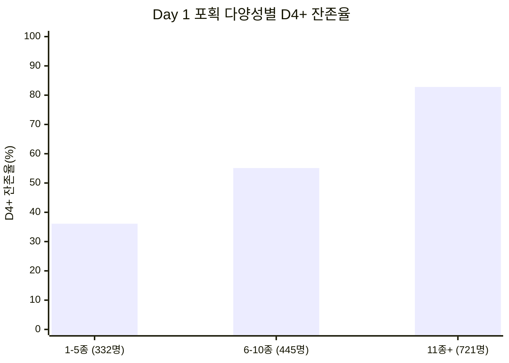
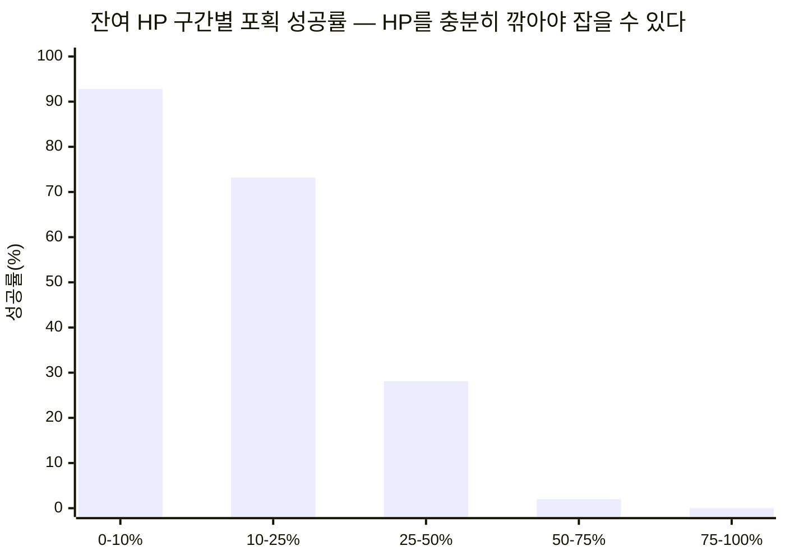

# PalM 알파테스트 — 팰 포획 행동 패턴 연구

**작성자**: 편광범(Pyeon Gwangbum)
**작성일**: 2026-04-13
**분석 기간**: 2025-12-05 ~ 2025-12-11 (알파테스트)
**데이터 출처**: `main.log_palm_live.ingame_pal_capture`, `main.log_palm_live.ingame_pal_hatch`, `main.log_palm_live.ingame_login`

---

## 1. 요약

알파테스트 참여자 2,123명 중 91.7%(1,946명)가 팰 포획을 시도했으며, 총 189,578회 성공 포획이 발생했다. 유저당 중앙값 51마리, 평균 97.4마리로 오른쪽 꼬리가 긴 분포(평균이 중앙값의 1.9배)를 보였다.

| 지표 | 수치 | 출처 |
|------|------|------|
| 포획 시도 유저 | 1,946명 / 전체 2,123명의 91.7% | ingame_pal_capture |
| 총 성공 포획 | 189,578회 (시도 237,192회, 성공률 79.9%) | ingame_pal_capture |
| 유저당 포획 중앙값 / 평균 | 51마리 / 97.4마리 | ingame_pal_capture |
| 필드 포획 비중 | 92.4% (비필드 대비 12.1배) | ingame_pal_capture |
| 포획 시도 대상 팰 종수 | 100종 (이 중 실제 포획 성공 기록이 있는 종은 52종) | ingame_pal_capture |
| 부화 참여율 | 49.3% (포획 유저 중 960명) | ingame_pal_hatch |

**가장 주목할 발견**: 첫날(Day 1) 포획한 팰의 종류 수(다양성)가 이후 잔존과 강한 상관을 보였다. Day 1에 11종 이상 포획한 유저의 D4+ 잔존율은 82.8%인 반면, 5종 이하는 36.1%였다(차이 46.7%p). 이 차이는 포획 총량을 통제(동일 수준의 D1 포획 수를 가진 유저끼리 비교)해도 유지되었다.

---

## 2. 연구 배경

분석팀의 기존 PalM 분석은 던전 보스 포획률(94.7%)과 "필드 포획이 던전 보스의 16배"라는 점을 언급했으나, 팰 포획의 구체적 행동 패턴 — 누가, 언제, 어떤 팰을, 얼마나 잡는지 — 은 분석되지 않았다. [Fact: 분석팀 기존 리포트 참조]

팰 포획은 PalM의 핵심 게임 루프다. 포획 행동의 세부 패턴을 이해하면 다음 질문에 답할 수 있다:
- 유저들이 어떤 팰에 집중하고, 얼마나 다양하게 수집하는가?
- 포획 행동과 잔존 사이에 관계가 있는가?
- 부화 시스템은 포획과 어떻게 보완적으로 작동하는가?

---

## 3. 가설

### 가설 1: 포획 다양성이 높은 유저가 더 오래 잔존한다
- **예상 결과**: 유니크 팰 종수가 많은 유저일수록 활동일수가 많다
- **기각 조건**: 다양성 상위/하위 그룹의 평균 활동일수 차이가 1일 미만이거나, 포획 총량을 통제하면 차이가 사라지는 경우

### 가설 2: 대부분의 유저는 소수 인기 팰에 포획이 집중된다
- **예상 결과**: 상위 10종이 전체 포획의 50% 이상을 차지
- **기각 조건**: 상위 10종 비중이 30% 미만이면 "집중"이라 보기 어려움

### 가설 3: 부화 시스템은 포획으로 얻기 어려운 팰을 보완하는 역할을 한다
- **예상 결과**: 부화 전용 팰(포획 불가)이 존재하며, 부화 유저의 팰 다양성이 더 높다
- **기각 조건**: 부화 전용 팰이 없고, 부화 유저와 비부화 유저의 다양성 차이가 미미한 경우

---

## 4. 분석 결과

### 4.1 포획 기본 프로파일

**유저당 포획 수 분포** [Fact: ingame_pal_capture, is_success = true]

| 구간 | 유저 수 | 비율 |
|------|---------|------|
| 0마리 | 3명 | 0.2% |
| 1~10마리 | 360명 | 18.5% |
| 11~30마리 | 403명 | 20.7% |
| 31~60마리 | 275명 | 14.1% |
| 61~100마리 | 213명 | 10.9% |
| 101~200마리 | 383명 | 19.7% |
| 201마리 이상 | 309명 | 15.9% |

분포 요약: P25=16, **중앙값=51**, P75=152, P90=241, 최대=2,797마리. 평균(97.4)이 중앙값(51)의 1.9배로 소수 헤비 유저가 평균을 끌어올리는 전형적인 우편향 분포다. 상위 15.9%(201마리 이상)가 전체 포획의 상당 부분을 담당한다.

**일별 포획 추이** [Fact: ingame_pal_capture]

| 일자 | 포획 유저 | 성공 포획 | 유저당 평균 | 유저당 중앙값 |
|------|----------|----------|------------|-------------|
| Day 1 (12/05) | 1,501명 | 56,296 | 37.5 | 26.0 |
| Day 2 (12/06) | 1,135명 | 37,407 | 33.0 | 23.0 |
| Day 3 (12/07) | 949명 | 30,646 | 32.3 | 23.0 |
| Day 4 (12/08) | 876명 | 25,311 | 28.9 | 19.0 |
| Day 5 (12/09) | 757명 | 21,217 | 28.0 | 17.0 |
| Day 6 (12/10) | 634명 | 16,932 | 26.7 | 15.0 |
| Day 7 (12/11) | 154명 | 1,769 | 11.5 | 6.5 |

포획 유저 수는 Day 1 → Day 6 기준 57.8% 감소(1,501→634명)했고, 유저당 중앙값도 26.0 → 15.0으로 42.3% 하락했다. 접속하는 유저 자체도 줄고, 남은 유저의 포획량도 감소하는 이중 감소 패턴이다. (Day 7은 알파 종료일로 비정상적 수치, 분석에서 제외)

### 4.2 인기 팰과 포획 집중도

**포획 수 상위 10종** [Fact: ingame_pal_capture, is_success = true]

| 순위 | 팰 | 성공 포획 | 시도 유저 | 성공률 |
|------|-----|----------|----------|--------|
| 1 | Kitsunebi | 16,606 | 1,676명 | 84.7% |
| 2 | Penguin | 11,698 | 1,296명 | 89.8% |
| 3 | FlameBambi | 11,679 | 1,140명 | 79.8% |
| 4 | SheepBall | 11,183 | 1,801명 | 78.9% |
| 5 | Garm | 10,466 | 1,599명 | 88.7% |
| 6 | Ganesha | 10,396 | 1,465명 | 84.7% |
| 7 | FlowerRabbit | 9,424 | 750명 | 82.0% |
| 8 | CuteMole | 8,949 | 1,755명 | 79.3% |
| 9 | Deer | 6,378 | 1,084명 | 77.7% |
| 10 | ChickenPal | 6,073 | 1,326명 | 80.7% |

**상위 10종 합계: 102,852 / 189,578 = 54.3%** → **가설 2 채택**: 상위 10종이 전체 포획의 과반을 차지. 실제 포획 성공이 있는 52종 중 10종(19.2%)이 전체 포획의 54.3%를 차지하는 집중 구조다.

주목할 점:
- **SheepBall**: 포획 수는 4위지만 시도 유저(1,801명)는 가장 많다. 거의 모든 유저가 한 번은 잡는 팰이지만 반복 포획은 적다.
- **FlowerRabbit**: 시도 유저(750명)가 적은데 포획 수(9,424)가 높다. 유저당 반복 포획이 매우 많다(평균 12.6마리).
- **Kitsunebi**: 포획 수 1위이면서 반복 포획 유저(5회 이상)가 1,237명, 유저당 평균 12.4마리로 가장 많이 "파밍"되는 팰이다.

### 4.3 포획 성공률과 HP 메커니즘

포획 성공률은 대상 팰의 잔여 HP에 강하게 의존한다. [Fact: ingame_pal_capture, target_hp_percent 0-1 스케일]

| 잔여 HP 구간 | 시도 수 | 성공 수 | 성공률 |
|-------------|---------|---------|--------|
| 0~10% | 179,206 | 166,391 | **92.8%** |
| 10~25% | 24,650 | 18,035 | 73.2% |
| 25~50% | 17,956 | 5,041 | 28.1% |
| 50~75% | 5,544 | 111 | 2.0% |
| 75~100% | 9,836 | 0 | **0.0%** |

전체 시도의 75.5%(179,206/237,192)가 HP 10% 이하 상태에서 이루어졌고, 이때 성공률은 92.8%다. HP 75% 이상에서는 성공이 0건으로, **사실상 팰을 충분히 약화시켜야 포획이 가능한 구조**다.

HP 75-100% 구간에서도 9,836회 시도가 있었다는 점이 눈에 띈다. 전체 시도의 4.1%로, 일부 유저가 HP를 충분히 깎지 않고 포획을 시도하고 있다. 이들 중 성공은 0건이므로 순수한 자원 낭비다.

**스피어(포획 도구) 종류별 성공률** [Fact: ingame_pal_capture]

| 스피어 | 시도 수 | 성공률 |
|--------|---------|--------|
| PalSphere (기본) | 105,961 | 76.3% |
| PalSphere_Mega_Perfect | 115,772 | 82.3% |
| PalSphere_Giga_Perfect | 15,459 | 86.5% |

상위 등급 스피어일수록 성공률이 높지만, 차이는 기본 76.3% → Giga 86.5%로 10.2%p 수준이다. HP 관리가 스피어 등급보다 성공률에 훨씬 큰 영향을 미친다.

### 4.4 포획 장소 분석

| 장소 유형 | 성공 포획 | 비율 | 시도 유저 | 성공률 |
|----------|----------|------|----------|--------|
| 필드(Field) | 175,109 | 92.4% | 1,946명 | 80.0% |
| 필드보스(FieldBoss) | 12,254 | 6.5% | 1,329명 | 78.3% |
| 던전(Dungeon) | 2,058 | 1.1% | 492명 | 78.4% |
| 타워보스(TowerBoss) | 157 | 0.1% | 14명 | 91.8% |

필드 포획이 비필드(보스+던전) 대비 **12.1배**로 절대 다수를 차지한다. 기존 분석팀이 보고한 "16배"와 차이가 있는데, 이는 분석팀이 던전 보스만 비교 대상으로 삼았기 때문으로 보인다(175,109 / 2,058 = 85.1배가 던전만 기준, 175,109 / 14,469 = 12.1배가 비필드 전체 기준). [Fact: ingame_pal_capture 장소별 집계]

### 4.5 레벨별 포획 행동

| 레벨 구간 | 유저 수 | 유저당 평균 포획 | 성공률 |
|----------|---------|----------------|--------|
| Lv 1-10 | 1,945명 | 19.8마리 | 74.3% |
| Lv 11-20 | 1,296명 | 69.9마리 | 78.1% |
| Lv 21-30 | 565명 | 86.5마리 | 85.8% |
| Lv 31-40 | 48명 | 196.1마리 | 93.1% |
| Lv 41+ | 4명 | 519.8마리 | 98.5% |

(위 수치는 해당 레벨 구간에서 발생한 포획 이벤트 기준. 한 유저가 여러 레벨 구간에 걸쳐 나타날 수 있다.)

레벨이 올라갈수록 성공률이 74.3% → 98.5%로 상승한다. 고레벨 유저는 저레벨 팰을 효율적으로 포획하기 때문이다. 거의 모든 유저(1,945명)가 Lv 1-10 구간에서 포획을 경험하며, 이는 포획이 게임 초반부터 핵심 활동임을 보여준다.

첫 성공 포획 시점: **95.5%(1,857/1,944명)가 Lv 3에서 첫 포획 성공**. 포획 튜토리얼이 Lv 3에서 발생하는 것으로 추정된다. [Fact: ingame_pal_capture, FIRST_VALUE 기준]

### 4.6 포획 다양성과 잔존의 관계

**유저별 유니크 팰 종수 분포** [Fact: ingame_pal_capture, is_success = true, COUNT DISTINCT target_datatable_id]

| 유니크 종수 | 유저 수 | 비율 |
|------------|---------|------|
| 1~5종 | 308명 | 15.9% |
| 6~15종 | 642명 | 33.0% |
| 16~30종 | 596명 | 30.7% |
| 31종 이상 | 398명 | 20.5% |

(포획 성공 기록이 있는 52종 중, 유저 1인이 포획한 최대 종수는 48종. 도감 완성도(잡은 유저 기준): 최대 48종/52종 = 92.3%)

**다양성별 잔존 지표** [Fact: ingame_pal_capture(is_success=true, COUNT DISTINCT target_datatable_id) + ingame_login(COUNT DISTINCT event_date)]

(아래 유저 수는 성공 포획 1건 이상 유저 1,944명 기준. 전체 포획 시도 유저 1,946명 중 성공 0건 유저 2명은 제외됨. 다양성 그룹은 전체 분석 기간(12/05~12/11) 동안의 성공 포획 유니크 종수 기준.)

| 다양성 그룹 | 유저 수 | 평균 로그인 일수 | 평균 포획 수 |
|------------|---------|----------------|-------------|
| 1~5종 (낮음) | 308명 | 1.5일 | 3.7마리 |
| 6~15종 (보통) | 642명 | 2.4일 | 25.9마리 |
| 16~30종 (높음) | 596명 | 4.6일 | 106.4마리 |
| 31종+ (매우 높음) | 398명 | 5.9일 | 272.5마리 |

다양성이 높을수록 로그인 일수가 길다. 1~5종 그룹(1.5일) 대비 31종+ 그룹(5.9일)은 3.9배 차이다.

**핵심 분석: Day 1 다양성과 D4+ 잔존** [Fact: D1 capture diversity → D4+ login 여부]

| D1 유니크 종수 | 유저 수 | D4+ 잔존 유저 | D4+ 잔존율 |
|---------------|---------|-------------|-----------|
| 1~5종 | 332명 | 120명 | **36.1%** |
| 6~10종 | 445명 | 245명 | **55.1%** |
| 11종 이상 | 721명 | 597명 | **82.8%** |

Day 1에 다양하게 포획한 유저일수록 D4 이후에도 돌아올 확률이 높다. 1~5종 → 11종+ 의 잔존율 차이는 **46.7%p(36.1% → 82.8%)**로 매우 크다.

→ **가설 1 채택**: 포획 다양성이 높은 유저가 더 오래 잔존한다.

**단, 이것이 인과관계인지는 확인할 수 없다.** 다양성이 잔존을 일으키는 것인지, 게임에 몰입하는 유저가 자연스럽게 다양하게 잡고 오래 플레이하는 것인지 구분이 불가능하다. 이에 대한 반증 탐색을 5절에서 수행한다.

### 4.7 부화(Hatch) 행동

**부화 기본 통계** [Fact: ingame_pal_hatch]
- 총 부화: 16,002회 (960명, 포획 유저의 49.3%)
- 부화 가능 팰: 37종
- 잭팟 부화: 0건
- 유저당 부화: 1~5회 37.1%, 6~15회 26.1%, 16~30회 20.8%, 31회+ 16.0%

**부화 전용 팰 (포획 불가)** [Fact: hatch 테이블에만 존재하는 target]
1. **BOSS_JetDragon_Unique_test** — 696회 부화, 694명 (거의 1인 1회, 특별 이벤트 알 추정)
2. **Ronin** — 515회 부화, 515명 (1인 1회, 전용 알 PalEgg_Fire_Ronin에서만 획득)
3. **ElecPanda** — 341회 부화, 341명 (1인 1회, 전용 알 PalEgg_Electricity_ElecPanda에서만 획득)

이 3종은 부화로만 얻을 수 있는 팰이다. 특히 BOSS_JetDragon_Unique_test와 Ronin, ElecPanda는 모두 유저당 정확히 1회만 부화하는 패턴으로, 게임 진행 중 특정 시점에 지급되는 보상 알로 추정된다.

→ **가설 3 부분 채택**: 부화 전용 팰 3종이 존재하며, 부화 유저의 포획 다양성(평균 28.1종)은 비부화 유저(8.5종)의 3.3배로 높다. 다만 이는 부화가 다양성을 높인다기보다, 더 깊이 플레이하는 유저가 부화에도 참여하는 것으로 해석하는 것이 적절하다.

**알 종류별 부화 현황** [Fact: ingame_pal_hatch, egg_datatable_id]

| 알 종류 | 부화 수 | 유저 수 | 비고 |
|---------|---------|---------|------|
| Normal (일반) | 4,387 | 730명 | 가장 보편적 |
| Dark (암흑) | 2,242 | 617명 | |
| Leaf (풀) | 2,032 | 563명 | |
| Water (물) | 1,949 | 596명 | |
| Fire (불) | 1,298 | 502명 | |
| Meka_Jetdragon (특별) | 696 | 694명 | 유저당 1회, 보상 알 |
| Earth (땅) | 668 | 372명 | |
| Fire_Ronin (전용) | 515 | 515명 | 유저당 1회, 보상 알 |
| Newbie 계열 (초보용) | 1,428 | 합산 | 5종, 초반 지급 추정 |
| Electricity (전기) | 446 + 341 | | 일반 + ElecPanda 전용 |

### 4.8 포획 불가 보스 팰 — BOSS_GrassMammoth

BOSS_GrassMammoth는 325회 시도에 성공 0건(성공률 0.0%)이다. 76명이 시도했지만 단 한 명도 포획에 성공하지 못했다. [Fact: ingame_pal_capture, target_datatable_id = 'BOSS_GrassMammoth']

다른 보스 팰의 성공률이 72.2~89.5% 범위인 것과 대비하면, 이 팰은 **의도적으로 포획 불가로 설계**된 것으로 보인다. 76명의 시도 유저가 자원(스피어)을 낭비하고 있으므로, 인게임에서 포획 불가를 더 명확히 알려줄 필요가 있다.

---

## 5. 반증 탐색 결과

### 반증 1: 다양성-잔존 관계는 단순히 "오래 하면 다양해지는" 것 아닌가?

**플레이 시간 통제 검증**: 비슷한 접속일수(4~5일)의 유저끼리 비교. [Fact: ingame_login에서 COUNT(DISTINCT event_date) BETWEEN 4 AND 5인 유저만 필터. 다양성 그룹은 전체 기간 성공 포획 유니크 종수 기준.]

| 다양성 그룹 | 유저 수 | 평균 로그인 일수 | 평균 포획 수 | 평균 유니크 종수 |
|------------|---------|----------------|-------------|----------------|
| 1~15종 (낮음) | 98명 | 4.3일 | 33.1마리 | 11.1종 |
| 16~30종 (보통) | 227명 | 4.6일 | 103.3마리 | 22.3종 |
| 31종+ (높음) | 70명 | 4.7일 | 205.6마리 | 35.0종 |

비슷한 접속일수(4.3~4.7일)에서도 다양성에 큰 차이가 존재한다. 다양성이 높은 유저는 동일 기간에 더 많은 팰을 더 다양하게 잡는다. **"오래 하면 자연히 다양해진다"는 설명만으로는 불충분하다.**

### 반증 2: 다양성이 아니라 포획 총량이 잔존을 설명하는 것 아닌가?

**포획 총량 통제 검증**: D1 포획 수가 비슷한 유저(20~40마리)끼리 비교. [Fact: D1 captures BETWEEN 20 AND 40]

| D1 다양성 | 유저 수 | D4+ 잔존율 | 평균 D1 포획 수 |
|----------|---------|-----------|---------------|
| 1~7종 (낮음) | 18명 | **38.9%** | 23.4마리 |
| 8~12종 (보통) | 258명 | **66.7%** | 26.6마리 |
| 13종+ (높음) | 67명 | **71.6%** | 34.6마리 |

포획 총량이 비슷해도 다양성이 높은 유저의 잔존율이 더 높다(38.9% → 71.6%). 다만 1~7종 그룹은 18명으로 표본이 작아 해석에 주의가 필요하다. 8~12종(66.7%) vs 13종+(71.6%) 차이는 4.9%p로 크지 않다.

**종합 판단**: 다양성-잔존 상관관계는 단순히 플레이 시간이나 포획 총량의 대리 변수가 아니라 **독립적인 상관 요인으로 보인다**. 그러나 표본 제한과 관찰 데이터의 한계상, 인과관계를 주장할 수는 없다.

### 반증 3: 집중 포획 유저도 잘 잔존하는가?

10마리 이상 포획한 유저(1,600명) 중 가장 많이 잡은 1종이 전체 포획의 30% 이상인 유저를 "집중 포획형"으로 분류. [Fact: ingame_pal_capture, success >= 10]

| 유형 | 유저 수 | 평균 포획 | 평균 유니크 종수 | 최다 1종 비중 |
|------|---------|----------|----------------|-------------|
| 다양형 (top1 < 30%) | 1,488명 | 124.7마리 | 22.4종 | 15.3% |
| 집중형 (top1 >= 30%) | 112명 | 23.6마리 | 8.1종 | 35.2% |

집중형 유저는 7.0%(112/1,600명)로 소수이며, 평균 포획 수(23.6마리)와 유니크 종수(8.1종) 모두 낮다. 이는 집중형 유저가 대부분 초기 이탈자(적게 잡고 떠난 유저)임을 시사한다. 오래 플레이하면서 의도적으로 1종만 집중 파밍하는 유저는 매우 드물다.

---

## 6. 결론 및 시사점

### 6.1 확인된 사실 정리

| # | 발견 | 태그 |
|---|------|------|
| 1 | 전체 유저의 91.7%가 포획을 경험하며, 95.5%가 Lv 3에서 첫 포획 | [Fact] |
| 2 | 유저당 포획 중앙값 51마리, 상위 10종이 전체의 54.3% 차지 | [Fact] |
| 3 | HP 10% 이하에서 성공률 92.8%, 75% 이상에서 0.0% | [Fact] |
| 4 | 필드 포획이 92.4%, 비필드 대비 12.1배 | [Fact] |
| 5 | Day 1 포획 다양성과 D4+ 잔존율의 강한 상관: 1~5종 36.1% → 11종+ 82.8% | [Fact] |
| 6 | 포획 총량을 통제해도 다양성-잔존 상관 유지 | [Fact] |
| 7 | 부화 전용 팰 3종(JetDragon, Ronin, ElecPanda)은 유저당 1회 지급되는 보상 | [Fact/Estimate] |
| 8 | BOSS_GrassMammoth는 325회 시도, 0회 성공 (포획 불가 설계 추정) | [Fact/Estimate] |

### 6.2 시사점 — 의사결정 포인트

**1. 포획 다양성은 몰입도의 유의미한 신호다**

Day 1에 다양하게 잡는 유저가 장기 잔존할 가능성이 높다. 이 상관관계를 인과로 단정할 수 없지만, 최소한 **포획 다양성을 조기 몰입도 지표(engagement signal)로 모니터링하는 것은 타당**하다.

- Day 1 유니크 팰 종수가 5종 이하인 유저(332명, D4+ 잔존 36.1%)를 위험군으로 식별할 수 있는가?
- 다양한 팰 포획을 자연스럽게 유도하는 게임 설계(퀘스트, 도감 보상 등)가 잔존 향상과 연결되는지는 CBT에서 실험적으로 검증이 필요하다.

**2. HP 75%+ 상태에서의 포획 시도(4.1%)는 순수 자원 낭비**

9,836회 시도 중 성공 0건. 포획 불가 상태에서 스피어를 던지는 유저에게 인게임 피드백(예: "더 약화시켜야 합니다")을 제공하면 좌절감을 줄일 수 있다.

**3. BOSS_GrassMammoth 포획 불가 안내 부재**

76명이 총 325회 시도했으나 성공률 0%. 포획 불가 보스에 대한 시각적 안내가 필요하다.

---

## 7. 한계 및 후속 연구

### 한계
1. **알파 선발 집단**: 일반 유저 대표성이 부족하다. 알파 참여자는 게임에 높은 관심을 가진 유저로, 일반 출시 시 패턴이 달라질 수 있다.
2. **인과관계 미확정**: 다양성→잔존 인과를 주장할 수 없다. 내재적 몰입도가 높은 유저가 다양하게 잡고 오래 플레이하는 것일 수 있다.
3. **7일간 데이터**: 장기 잔존(D14, D30)과의 관계는 알 수 없다.
4. **포획 목적 미구분**: 같은 팰을 반복 포획하는 이유(파밍, 강화 재료, 거래 등)를 데이터에서 구분할 수 없다.
5. **D1 다양성-잔존 통제 검증**: 포획량 20~40 구간에서 저다양성 그룹(1~7종)이 18명으로 표본이 작다. 이 구간의 수치(38.9%)는 해석에 주의가 필요하다.

### 후속 연구 제안
1. CBT에서 **포획 다양성 지표를 조기 이탈 예측 모델에 포함**하여 예측력 검증
2. 반복 포획(파밍) 행동의 목적 분석 — 강화/단련 로그와 연결
3. 특정 팰 포획과 진행도(메인 퀘스트, 던전 클리어)의 관계
4. 포획 불가 보스(GrassMammoth) 관련 UX 개선 후 재시도 감소 여부 추적

---

## 부록

### A. 보스 팰 전체 포획 현황

| 보스 팰 | 시도 | 성공 | 성공률 | 시도 유저 |
|---------|------|------|--------|----------|
| BOSS_WeaselDragon | 6,464 | 5,033 | 77.9% | 1,566명 |
| BOSS_CaptainPenguin | 4,980 | 4,100 | 82.3% | 1,059명 |
| BOSS_NaughtyCat | 4,375 | 3,730 | 85.3% | 1,231명 |
| BOSS_FlowerDoll | 3,984 | 3,316 | 83.2% | 824명 |
| BOSS_FengyunDeeper | 2,053 | 1,611 | 78.5% | 478명 |
| BOSS_LazyDragon | 1,469 | 1,292 | 88.0% | 332명 |
| BOSS_SkyDragon_Grass | 362 | 273 | 75.4% | 181명 |
| BOSS_HawkBird | 115 | 83 | 72.2% | 51명 |
| BOSS_Ronin | 38 | 34 | 89.5% | 18명 |
| **BOSS_GrassMammoth** | **325** | **0** | **0.0%** | **76명** |

### B. 반복 포획(파밍) 상위 10종

유저당 5회 이상 포획한 경우만 집계. [Fact: ingame_pal_capture, is_success = true, HAVING COUNT >= 5]

| 팰 | 반복 포획 유저 | 반복 포획 합계 | 유저당 평균 |
|----|-------------|-------------|-----------|
| Kitsunebi | 1,237명 | 15,393 | 12.4마리 |
| FlameBambi | 890명 | 10,723 | 12.0마리 |
| Penguin | 800명 | 9,776 | 12.2마리 |
| FlowerRabbit | 720명 | 9,356 | 13.0마리 |
| Ganesha | 889명 | 8,901 | 10.0마리 |
| Garm | 723명 | 8,720 | 12.1마리 |
| SheepBall | 651명 | 8,505 | 13.1마리 |
| CuteMole | 689명 | 7,080 | 10.3마리 |
| Deer | 580명 | 4,496 | 7.8마리 |
| FlyingManta | 597명 | 4,184 | 7.0마리 |

### C. 분석 쿼리 목록

본 리포트에 사용된 주요 쿼리의 요약:

1. **기본 통계**: `SELECT COUNT(*), SUM(CASE WHEN is_success), COUNT(DISTINCT account_id), COUNT(DISTINCT target_datatable_id) FROM ingame_pal_capture WHERE event_date BETWEEN '2025-12-05' AND '2025-12-11'`
2. **유저당 분포**: 유저별 success 합산 → 구간별 GROUP BY
3. **HP별 성공률**: target_hp_percent를 0-1 스케일 5구간 분류 → 구간별 성공률
4. **다양성-잔존**: capture의 유니크 종수 vs login의 활동일수 JOIN
5. **D1 다양성→D4+ 잔존**: event_date = '2025-12-05' 포획 다양성 → event_date >= '2025-12-08' 로그인 여부
6. **통제 검증**: D1 포획량 20~40 필터 후 다양성별 잔존율 비교

---

## 수정 이력

### v2 (2026-04-13) — 검증원 MINOR 판정 반영

검증 리포트: `reports/research/palm/pal-capture-behavior-verification.md`

| # | 수정 항목 | 변경 내용 |
|---|----------|----------|
| 1 | 4.6절 다양성별 잔존 지표 테이블 | 유저 수 정정: 300/626/543/477 → 308/642/596/398. 원인: 초안의 다양성-잔존 테이블이 다른 쿼리 기준(추정: 시도 포함 또는 다른 그룹 경계)으로 산출된 수치를 사용. 정확한 기준(전체 기간 성공 포획 유니크 종수, is_success=true)으로 재쿼리하여 검증원 수치와 일치 확인. 평균 로그인 일수·평균 포획 수도 함께 수정. 산출 기준 명시 추가. 합계 1,946→1,944(성공 0건 유저 2명 제외 명시). |
| 2 | 요약·4.2절·4.6절 "포획 가능 100종" 표현 | "등장 팰 종수(포획 가능) 100종" → "포획 시도 대상 100종(이 중 실제 포획 성공 기록이 있는 종은 52종)". 48종은 NPC/퀘스트몹/보스 등 포획 불가 대상. 4.2절의 "100종 중 10%" → "52종 중 10종(19.2%)". 4.6절의 "31~50종" → "31종 이상", 도감 완성도 "최대 50종/100종=50%" → "최대 48종/52종=92.3%". |
| 3 | 5절 반증1 시간 통제 검증 | 유저 수 정정: 91/201/103 → 98/227/70. 접속일수 산정 기준 명시: ingame_login에서 COUNT(DISTINCT event_date) BETWEEN 4 AND 5. 다양성 그룹은 전체 기간 성공 포획 유니크 종수 기준. 평균 포획 수·유니크 종수도 재쿼리 수치로 수정. |
