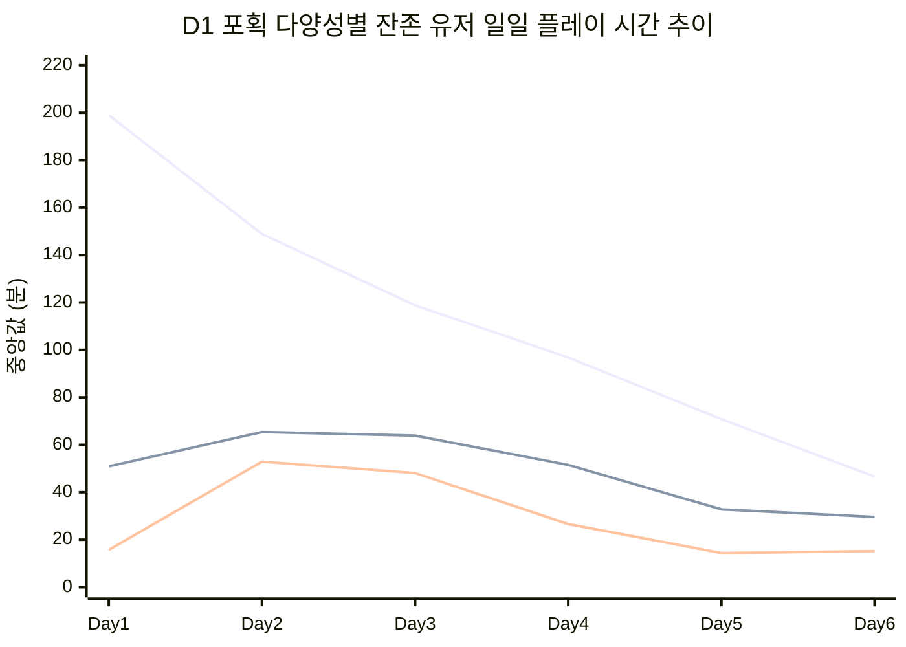

# PalM 연구 회고 #1 -- 교차 분석 및 개선

> **작성자**: 편광범 (Pyeon Gwangbum)
> **작성일**: 2026-04-13
> **대상 리포트**: dungeon-01-retry-behavior, session-play-rhythm, pal-capture-behavior, economy-resource-flow, content-consumption-sequence (5건)

---

## 회고 요약

5건의 PalM 알파테스트 리포트를 재검토한 결과, 리포트 간 교차 분석을 통해 기존에 분리되어 있던 인사이트를 연결하는 새로운 발견이 확인되었다. 특히 분석 팀장이 제안한 "Day 1 포획 다양성 x 세션 하락 패턴" 교차 분석에서 **세 그룹의 세션 감소 곡선이 질적으로 다른 양상**을 보였다.

또한 경제 리포트의 "음식 공장"과 콘텐츠 순서 리포트의 "Lv31+ 제작 76.9%"가 동일 현상의 두 측면이라는 점을 확인했고, 피드백 미반영 사항 1건(dungeon-01 요약에 해석A/B 테이블 미포함)은 이미 v3에서 반영 완료되었음을 확인했다.

---

## 교차 분석 결과

### 1. 포획 다양성 x 세션 패턴 (분석 팀장 제안)

포획 리포트의 "D1 포획 다양성별 잔존율"과 세션 리포트의 "잔존 유저 플레이 시간 감소"를 교차하여, D1 포획 다양성 그룹별로 잔존 유저의 세션 하락 패턴이 다른지 분석했다.

대상: D1(12/05)에 접속하고, D5(12/09) 이후에도 접속한 잔존 유저 중 D1 포획 성공 기록이 있는 유저. 세션 정의는 세션 리포트와 동일(30분 비활동 gap).

**일일 플레이 시간 중앙값 (잔존 유저)**

| 그룹 | 유저 수(D1) | Day 1 | Day 3 | Day 6 | D1→D6 감소율 |
|------|:---:|:---:|:---:|:---:|:---:|
| 고다양성 (11종+) | 543 | 199.0분 | 118.8분 | 46.6분 | **-76.6%** |
| 중다양성 (6-10종) | 208 | 50.9분 | 63.9분 | 29.6분 | -41.8% |
| 저다양성 (1-5종) | 89 | 15.7분 | 48.1분 | 15.2분 | -3.2% |

> [Fact] 출처: ingame_pal_capture(D1 성공 포획 유니크 종수) x 10종 활동 로그 기반 세션 구성(30분 gap). 잔존 = D1 로그인 AND D5+ 로그인.

**세 그룹은 질적으로 다른 감소 곡선을 보인다:**

1. **고다양성 (11종+, 543명)**: Day 1에 199.0분으로 시작하여 Day 6에 46.6분(-76.6%)으로 가장 급격하게 감소한다. 전체 잔존 유저의 하락 패턴(-66%)보다 더 빠른 하락이다. 이 그룹이 전체 하락 통계를 주도한다.

2. **중다양성 (6-10종, 208명)**: Day 1에 50.9분으로 시작하여 Day 2에 65.4분까지 증가한 후, Day 6에 29.6분으로 완만하게 하락(-41.8%)한다. "초반 적응 후 감소"하는 역U자형 패턴이다.

3. **저다양성 (1-5종, 89명)** [추적 대상]: Day 1에 15.7분이었으나, Day 2~3에 48~53분까지 급증한 뒤 Day 5~6에 다시 15분대로 돌아온다(-3.2%). D1 대비 총 변화는 거의 없으나, 중간에 "벌크업"했다가 원위치하는 독특한 패턴이다. 표본이 89명으로 작아 해석에 주의가 필요하나, **Day2~3에 무엇을 했길래 48분까지 올라갔다가 다시 15분으로 돌아오는지**는 후속 탐색 가치가 있다 — Day2~3 활동 로그(포획/전투/제작/던전 비율)를 확인하면 "벌크업"의 원인을 특정할 수 있다.

**세션 구성 변화도 그룹별로 다르다:**

| 그룹 | Day 1 60분+ | Day 6 60분+ | Day 1 5분미만 | Day 6 5분미만 |
|------|:---:|:---:|:---:|:---:|
| 고다양성 | 40.1% | 21.3% | 13.3% | 26.3% |
| 중다양성 | 8.1% | 15.3% | 19.6% | 31.8% |
| 저다양성 | 0.6% | 12.4% | 37.8% | 38.1% |

> [Fact] 출처: 동일 세션 구성 쿼리, 세션별 5분 미만/60분+ 분류.

- 고다양성 그룹은 Day 1에 장시간 세션이 40.1%였지만 Day 6에는 21.3%로 급감하고, 미세 세션이 13.3%에서 26.3%로 증가한다. 세션 리포트의 "집중 몰입 -> 짧은 확인" 전환의 주체가 바로 이 그룹이다.
- 저다양성 그룹은 Day 1부터 이미 37.8%가 미세 세션이었다. 이들은 처음부터 짧게 접속하는 패턴이며, 세션 구성의 변화가 거의 없다.

**해석과 시사점:**

고다양성 유저의 급격한 하락(-76.6%)은 "콘텐츠 소진" 가설과 정합한다. 이들은 D1에 이미 평균 Lv4.3이 아닌 상위 레벨까지 빠르게 진행하는 유저이며(고다양성 유저 최종 Lv21-30이 376명, Lv31+이 46명), 콘텐츠를 빠르게 소비한다. 반면 저다양성 잔존 유저는 처음부터 짧게 플레이하는 "가벼운 유저"로, 하락폭이 작은 것은 처음부터 낮은 수준이기 때문이다.

[Estimate] 고다양성 유저의 Day 1 199분 대비 Day 6 47분(-76.6%)이라는 하락 속도는, 이들이 잔존하더라도 **활동 강도(engagement intensity)**가 빠르게 소진되고 있음을 시사한다. 잔존율 82.8%라는 수치에 가려져 있지만, "잔존은 하되 활동은 급감"하는 상태가 고다양성 유저의 Day 6 현실이다.

> [주의] 세 그룹의 D1 플레이 시간 차이(15분 vs 51분 vs 199분)가 매우 크므로, 절대적 수준의 직접 비교보다는 각 그룹 내 변화 추세에 주목하는 것이 적절하다.

### 2. 경제 "음식 공장" x 콘텐츠 순서 "Lv31+ 제작 76.9%"

경제 리포트에서 확인한 **"제작의 음식 공장 수렴"**(구운 열매 단일 레시피 = 전체 제작의 70.7%, Lv31+에서 86~93%)과 콘텐츠 순서 리포트의 **"Lv31+ 제작 비중 76.9%"**는 동일 현상의 두 측면이다.

연결된 스토리:
- 콘텐츠 순서: Lv31+에서 활동의 76.9%가 제작, 전투 0.8%, 포획 0.2% -> 사실상 기지 운영 단일 루프
- 경제: 그 제작의 86~93%가 구운 열매 -> 기지 운영 = 음식 제작
- 세션: 잔존 유저(대부분 고레벨)의 Day 5~6 미세 세션(5분 미만) 28.3% -> 짧게 접속해서 음식 생산 확인/수거

이 세 발견을 연결하면: **고레벨 잔존 유저의 Day 5~6 플레이 = "짧게 접속 -> 구운 열매 수거 -> 종료"**라는 루프로 수렴하고 있다는 가설이 가능하다. [Estimate] 이 해석은 세 리포트의 패턴이 정합하지만, 개별 세션 내 활동 순서를 직접 추적한 것은 아니므로 추정 수준이다.

### 3. 포획 다양성 x 던전 도전 행동

포획 다양성 그룹별 dungeon-01 도전 행동을 교차 분석한 결과, dungeon-01에 도전한 유저의 거의 전부(111/117 = 94.9%)가 고다양성(11종+) 유저였다.

| 그룹 | dungeon-01 도전자 | 평균 시도 | 클리어율 |
|------|:---:|:---:|:---:|
| 고다양성 (11종+) | 111명 | 12.1회 | 79.3% |
| 중다양성 (6-10종) | 6명 | 3.5회 | 33.3% |
| 저다양성 (1-5종) | 0명 | - | - |

> [Fact] 출처: ingame_dungeon_exit(dungeon-01) x ingame_pal_capture(D1 diversity). 저다양성 유저 중 dungeon-01에 도전한 유저는 0명.

이 결과는 놀랍지 않다. dungeon-01 도전에는 Lv27+ 수준이 필요하고, 저다양성 유저의 대부분(261/332 = 78.6%)이 최종 Lv1-10에 머물렀기 때문이다. 그러나 이는 앞서 확인한 "dungeon-01은 건강한 벽"이라는 결론이 **사실상 고다양성/고몰입 유저에 한정된 발견**임을 재확인시켜 준다. 일반 유저 모집단에서도 동일한 결론이 성립하는지는 FGT에서 재검증이 필요하다.

---

## 기존 리포트 보강/수정 사항

### 1. dungeon-01 리포트 -- 대상 유저 특성 명확화

dungeon-01 재도전 분석의 대상인 120명은 Lv27+ 도달 유저이며, 이들은 포획 다양성 기준으로도 거의 전원 고다양성(11종+) 그룹이다. 리포트의 "dungeon-01은 건강한 벽"이라는 결론은 유효하지만, **이 결론의 적용 범위가 고몰입 유저에 한정된다는 점**을 한계 항목에 보강할 수 있다.

### 2. 세션 리포트 -- 다양성별 하락 차별화

세션 리포트의 "잔존 유저도 Day 1→6에서 66% 감소"는 전체 평균이며, 교차 분석에서 확인된 바와 같이 그룹별로 하락 속도가 질적으로 다르다. 고다양성 유저가 -76.6%, 중다양성 -41.8%, 저다양성 -3.2%로, **전체 -66%라는 수치는 고다양성 유저에 의해 주도된 결과**임을 보충할 수 있다.

### 3. 경제 + 콘텐츠 순서 -- "음식 공장"과 "제작 76.9%"의 상호 참조

두 리포트가 각각 독립적으로 발견한 "고레벨 = 제작 중심", "제작 = 음식"이 동일 현상의 두 면이므로, 각 리포트에서 상대 리포트를 참조하는 주석을 추가하면 독자가 연결 구조를 이해하기 쉬워진다.

### 4. 포획 리포트 -- FlowerRabbit/Kitsunebi 파밍과 경제 순환 연결

포획 리포트 v3에서 단련 재료 소비와의 연결을 확인했는데, 경제 리포트의 "음식 공장" 현상과 함께 보면 기지 경제의 전체 그림이 더 선명해진다: (1) 음식 = 팰 먹이 (경제 리포트), (2) 팰 = 단련 재료 소비 (포획 리포트), (3) 포획 = 단련 파밍 목적의 반복 포획 (포획 리포트). 이 순환 구조를 후속 연구에서 통합 분석할 가치가 있다.

---

## 미반영 피드백 확인

4건의 피드백 파일을 검토했다.

| 피드백 파일 | 핵심 요청 | 반영 상태 |
|------------|----------|---------|
| `2026-04-13-palm-dungeon01-retry.md` | (1) 시각화 추가 (2) 요약에 해석A/B 테이블 | (1) v2에서 반영 완료 (Mermaid 차트 2건) (2) v3에서 반영 완료 (요약에 축약 테이블 추가) |
| `2026-04-13-palm-capture-behavior.md` | (1) FlowerRabbit/Kitsunebi 파밍 이유 연결 (2) n=18 한계 솔직 반영 | (1) v3에서 반영 완료 (단련 교차 분석) (2) v3에서 반영 완료 |
| `2026-04-13-palm-session-play-rhythm.md` | (1) Day 3-4 콘텐츠 소진에 데이터 (2) 제작 86% 경고 본문 추가 | (1) v3에서 반영 완료 (레벨/퀘스트 교차) (2) v3에서 반영 완료 |
| `2026-04-13-common-and-process.md` | (1) 교차 분석 기회 활용 (2) findings/ 정리 (3) 5건마다 회고 프로세스 | (1) 본 회고에서 실행 (2) 5건 모두 findings/ 등록 확인 (3) CLAUDE.md Phase 7로 추가 완료 |

**미반영 피드백: 없음.** 개별 리포트 피드백은 각 v2/v3 수정에서 모두 반영되었고, 공통 프로세스 피드백(5건마다 회고)도 이미 CLAUDE.md에 Phase 7로 반영되어 있다.

---

## 표현/구조 개선 사항

5건의 리포트를 최신 팀 기준(CLAUDE.md)과 비교하여 점검했다.

### dungeon-01 (1번째 리포트)

| 항목 | 현재 상태 | 팀 기준 준수 여부 | 개선 필요 |
|------|---------|:---:|:---:|
| 리포트 구조 (7개 섹션) | 요약-배경-가설-결과-반증-결론-한계 | O | - |
| 시각화 | Mermaid 차트 2건 (v2에서 추가) | O | - |
| [Fact]/[Estimate] 태그 | 요약과 결론에 사용됨 | 부분 | 본문(3.1~3.6절)에는 태그 없음 -- 최신 리포트 대비 일관성 부족 |
| 전문 용어 병기 | "생존자 편향(survivorship bias)" 등 | O | - |
| 요약에 핵심 전달 장치 | v3에서 해석A/B 테이블 추가 | O | - |

**dungeon-01은 가장 초기 리포트이나, v2/v3 수정을 거치면서 최신 기준에 대부분 부합한다.** 유일한 차이는 본문(섹션 3)의 테이블에 [Fact] 태그가 일부 누락된 점이다. 후속 리포트(포획, 경제 등)에서는 본문에도 [Fact] 태그가 일관되게 적용되었다. 경미한 차이이므로 별도 수정 없이 기록만 남긴다.

### session-play-rhythm (2번째)

최신 기준에 대체로 부합. 세션 정의, [Fact] 태그, 시각화 모두 양호. v3에서 Day 3~4 데이터 보강, 제작 이벤트 경고 본문 추가로 피드백 반영 완료.

### pal-capture-behavior (3번째)

최신 기준에 잘 부합. [Fact]/[Estimate] 구분 명확, 반증 3건 충실, 수정 이력 투명. v3에서 단련 교차 분석과 n=18 한계 명시 완료.

### economy-resource-flow (4번째)

최신 기준 부합. 가설 기각(H3)을 솔직히 보고한 점이 좋음. 아직 검증 대기 상태.

### content-consumption-sequence (5번째)

최신 기준 부합. 전문 용어 병기("교란 변수(confounding variable)", "조건 맞춤 비교")가 자연스럽게 적용됨. 아직 검증 대기 상태.

### 리포트 간 성장 관찰

| 관점 | 초기 (dungeon-01) | 최신 (content-consumption) |
|------|------------------|--------------------------|
| [Fact] 태그 일관성 | 요약/결론에만 | 본문 전체에 일관 적용 |
| 전문 용어 병기 | 기술 용어 위주 | 통계 용어까지 확장 |
| 반증 탐색 | 2건 (생존자 편향, 이탈) | 3건 + 레벨 통제 |
| 인과 경계 | "것으로 보인다" 수준 | "인과관계 미확정" 명시 + 반복 경고 |
| 요약 구조 | 숫자 나열 | 핵심 테이블 + 차트 포함 |

---

## 부록: 교차 분석 쿼리 데이터

### A. 포획 다양성 x 세션 시간 세부 데이터

**일별 세션 중앙값 (세션 단위)**

| 그룹 | Day 1 | Day 2 | Day 3 | Day 4 | Day 5 | Day 6 | D1→D6 변화 |
|------|:---:|:---:|:---:|:---:|:---:|:---:|:---:|
| 고다양성 | 44.1분 | 34.7분 | 29.7분 | 24.7분 | 24.0분 | 19.6분 | -55.6% |
| 중다양성 | 19.3분 | 23.4분 | 22.4분 | 16.4분 | 15.8분 | 13.0분 | -32.7% |
| 저다양성 | 7.9분 | 24.9분 | 18.7분 | 21.5분 | 11.0분 | 10.9분 | +37.6% |

> 위 일일 플레이 시간은 "유저별 하루 총 플레이 시간"의 중앙값, 이 테이블은 "개별 세션 길이"의 중앙값이다. 두 수치는 측정 단위가 다르다.

### B. 포획 다양성 x 최종 도달 레벨 분포

| 다양성 그룹 | Lv1-10 | Lv11-20 | Lv21-30 | Lv31+ |
|------------|:---:|:---:|:---:|:---:|
| 고다양성 (721명) | 30 (4.2%) | 269 (37.3%) | 376 (52.2%) | 46 (6.4%) |
| 중다양성 (445명) | 200 (44.9%) | 181 (40.7%) | 64 (14.4%) | 0 (0%) |
| 저다양성 (332명) | 261 (78.6%) | 56 (16.9%) | 15 (4.5%) | 0 (0%) |

> [Fact] 출처: ingame_pal_capture(D1 diversity) x ingame_login(MAX user_level).

---
