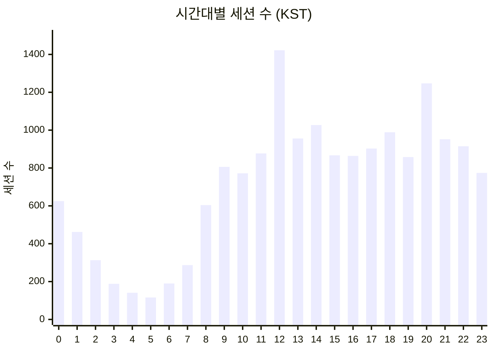
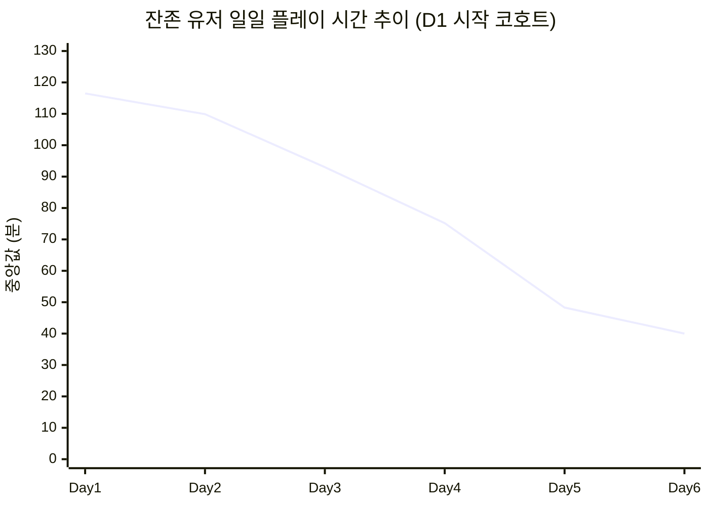

# PalM 알파테스트 세션 패턴 및 플레이 리듬 분석

> 작성: 편광범(Pyeon Gwangbum) | 2026-04-13 | PalM 알파테스트(2025-12-05 ~ 2025-12-11)

---

## 1. 요약

PalM 알파테스트 2,123명의 세션 패턴을 분석한 결과, **잔존 유저조차 일주일 만에 플레이 시간이 절반 이하로 감소**하는 뚜렷한 몰입도 하락 추이가 확인되었다.

| 지표 | Day 1 | Day 6 | 변화 |
|------|-------|-------|------|
| **일일 플레이 시간 중앙값** (D1 시작 코호트 잔존 유저) | 116.5분 | 40.0분 | **-66%** |
| **60분+ 세션 비율** (D1 시작 코호트 잔존 유저) | 30.6% | 19.0% | -11.6%p |
| **미세 세션 비율** (5분 미만 + 단일 이벤트) | 18.1% | 28.3% | +10.2%p |

**첫 세션이 짧으면 이탈할 가능성이 높다.** 이탈 유저의 첫 세션 중앙값은 10.5분이지만, 잔존 유저는 32.8분(3.1배)이다.

| 구분 | 이탈(D1-2) | 중기 이탈(D3-4) | 잔존(D5+) |
|------|-----------|----------------|----------|
| **유저 수** | 624명 (29.4%) | 381명 (17.9%) | 1,118명 (52.7%) |
| **첫 세션 중앙값** | 10.5분 | 18.5분 | 32.8분 |
| **세션당 평균 시간** | 21.1분 | 26.0분 | 41.6분 |
| **총 누적 플레이 중앙값** | 19.8분 | 56.5분 | 397.7분 |

---

## 2. 연구 배경

분석팀은 PalM 알파테스트에서 레벨 병목, 던전 패턴, 이탈 세그먼트, 단련 구간 행동을 분석했다. 그러나 **유저가 하루에 얼마나, 언제, 어떤 리듬으로 플레이하는지**는 별도로 다루어지지 않았다.

세션 패턴은 라이브 운영의 기본 데이터다. 이벤트 시간대 결정, 콘텐츠 소비 속도 추정, 이탈 조기 경보 설계 등에 직접 활용된다. 기존 분석이 "무엇을(what)" 했는지에 집중했다면, 이 연구는 "어떻게(how)" 플레이했는지를 보완한다.

### 세션 정의

본 연구에서 "세션"은 **30분 이상 활동이 없으면 별도 세션으로 분리**하는 방식(30-minute inactivity gap)으로 정의했다.

- 활동 로그에 포함된 이벤트: 로그인, 전투, 팰 포획, 제작 완료, 던전 입장/퇴장, 건축 완료, 레벨업, 빠른 이동, 팰 장착 (10종)
- 세션 시작: 30분 이상 비활동 후 첫 이벤트 발생 시점
- 세션 종료: 해당 세션의 마지막 이벤트 발생 시점
- **한계**: 실제 플레이 종료 시점과 마지막 로그 기록 시점 사이에 차이가 존재하므로, 세션 길이는 **하한 추정치(최소 길이)**에 해당한다

[Fact] 로그인 간 간격(login-to-login gap) 분포에서 30분 미만의 간격이 전체의 약 17%를 차지하며, 이는 동일 세션 내 재접속으로 판단된다. 30분은 자연스러운 세션 경계 기준이다. (출처: ingame_login 테이블 기반 gap 분포 분석)

---

## 3. 가설

### 가설 1: 잔존 유저의 플레이 시간은 일차가 지남에 따라 감소한다 (몰입도 하락)

- **예상 결과**: Day 1 대비 Day 5-6의 일일 플레이 시간이 30% 이상 감소
- **기각 조건**: Day 1 대비 감소폭이 15% 미만이거나, Day 3 이후 안정화(plateau) 패턴을 보이면 기각

### 가설 2: 이탈 유저와 잔존 유저의 첫 세션 길이에 유의미한 차이가 있다

- **예상 결과**: 이탈 유저의 첫 세션 길이가 잔존 유저 대비 50% 이하
- **기각 조건**: 두 그룹의 첫 세션 중앙값 차이가 30% 미만이면 기각

### 가설 3: 피크 시간대(저녁)의 세션은 비피크 시간대보다 길다

- **예상 결과**: 저녁(18~23시 KST) 세션 중앙값이 주간(9~17시) 대비 20% 이상 길다
- **기각 조건**: 차이가 10% 미만이면 기각

---

## 4. 분석 결과

### 4.1 세션 기본 프로파일

[Fact] 알파테스트 기간 총 17,155개 세션이 발생했다. 유저당 평균 8.1회 세션, 세션당 중앙값 22.4분. (출처: 10종 활동 로그 기반 세션 구성)

**세션 길이 분포:**

| 세션 길이 구간 | 세션 수 | 비율 |
|---------------|---------|------|
| 0분 (단일 이벤트) | 2,000 | 11.7% |
| ~5분 미만 | 2,103 | 12.3% |
| 5~10분 | 1,642 | 9.6% |
| 10~20분 | 2,351 | 13.7% |
| 20~30분 | 1,806 | 10.5% |
| 30~60분 | 3,303 | 19.3% |
| 1~2시간 | 2,514 | 14.7% |
| 2~3시간 | 798 | 4.7% |
| 3시간 이상 | 638 | 3.7% |

약 24% (4,103건)가 5분 미만의 짧은 접속이다. 30분~2시간 구간이 34%로 가장 큰 비중을 차지한다.

**유저별 총 누적 플레이 시간 분포:**

| 총 플레이 시간 | 유저 수 | 비율 |
|---------------|---------|------|
| 30분 미만 | 594 | 28.0% |
| 30분~1시간 | 248 | 11.7% |
| 1~2시간 | 248 | 11.7% |
| 2~5시간 | 330 | 15.5% |
| 5~10시간 | 283 | 13.3% |
| 10~20시간 | 288 | 13.6% |
| 20시간 이상 | 133 | 6.3% |

[Fact] 전체 유저의 28%가 알파 기간 동안 총 30분도 플레이하지 않았다. 반면 6.3%는 20시간 이상 플레이했다.

### 4.2 시간대별 접속 패턴 (KST 기준)

[Fact] KST 기준 피크 시간대는 **12시(8.3%)**, **20시(7.3%)**, **14시(6.0%)** 순이다. 최저 시간대는 **새벽 4~5시(0.7~0.8%)**. (출처: session_start에 +9h 적용)

점심(12시)과 저녁(20시) 두 번의 피크가 나타나는 **이중 피크(bimodal) 패턴**이다. 모바일 게임의 전형적인 "통근·점심·저녁" 패턴 중 출근 시간 피크는 상대적으로 약하다.

**시간대별 세션 길이 (중앙값, KST):**

| 시간대 | 중앙값 | 해석 |
|--------|-------|------|
| 새벽 (0~5시) | 23.9~33.5분 | 적은 유저지만 상대적으로 긴 세션 |
| 오전 (6~11시) | 13.0~19.9분 | 짧은 세션 위주 (출근·등교 전후 접속) |
| 오후 (12~17시) | 20.2~24.0분 | 중간 길이 세션 |
| 저녁 (18~23시) | 22.5~28.9분 | 하루 중 가장 긴 세션 |

[Fact] 저녁(18~23시) 세션 중앙값 24.8분은 오전(6~11시) 17.4분 대비 **+42.5% 더 길다**. 새벽(0~5시)은 유저 수는 적으나 중앙값이 최대 33.5분에 달한다. (출처: 10종 활동 로그 기반 세션 구성, 6~11시 전체 세션 PERCENTILE(0.5) = 17.4분, 18~23시 = 24.8분)

### 4.3 일차별 변화: 잔존 유저의 몰입도 하락

**가설 1 검증: Day 1 → Day 6 일일 플레이 시간 변화 (잔존 유저, D1 시작 코호트)**

| 일차 | DAU | 세션/일 | 일일 플레이 중앙값 | Day 1 대비 |
|------|-----|---------|-------------------|-----------|
| Day 1 | 895 | 2.9 | 116.5분 | - |
| Day 2 | 752 | 3.0 | 109.9분 | -5.7% |
| Day 3 | 729 | 2.9 | 93.0분 | -20.2% |
| Day 4 | 759 | 2.8 | 75.2분 | -35.5% |
| Day 5 | 796 | 2.4 | 48.3분 | -58.5% |
| Day 6 | 700 | 2.3 | 40.0분 | **-65.7%** |

[Fact] Day 1 대비 Day 6에서 일일 플레이 시간 중앙값이 65.7% 감소했다. 이는 기각 조건(15% 미만) 대비 훨씬 큰 감소폭이다. **가설 1 채택.**

감소 패턴은 Day 3까지 완만하다가 Day 4~5에서 급격히 떨어진다. Day 2→3(-16.9분)보다 Day 4→5(-26.9분)의 감소폭이 두 배 가까이 크다.

**세션 길이 구성 변화 (잔존 유저):**

| 세션 유형 | Day 1 | Day 6 | 변화 |
|-----------|-------|-------|------|
| 60분 이상 (장시간) | 30.6% | 19.0% | -11.6%p |
| 20~60분 (중간) | 30.8% | 28.0% | -2.8%p |
| 5~20분 (짧음) | 20.5% | 24.7% | +4.2%p |
| 5분 미만 + 단일 이벤트 | 18.1% | 28.3% | **+10.2%p** |

[Fact] 장시간 세션(60분+)은 Day 1의 30.6%에서 Day 6의 19.0%로 줄었고, 미세 세션(5분 미만)은 18.1%에서 28.3%로 증가했다. 플레이 리듬이 "집중 몰입"에서 "짧은 확인"으로 전환되고 있다.

### 4.4 세그먼트별 차이: 이탈자 vs 잔존자

**가설 2 검증: 첫 세션 길이와 잔존 관계**

| 세그먼트 | 유저 수 | 첫 세션 중앙값 | 첫 세션 P75 | 평균 세션 길이 | 총 플레이 중앙값 |
|---------|---------|-------------|------------|--------------|----------------|
| 이탈(D1-2) | 624 (29.4%) | **10.5분** | 28.6분 | 21.1분 | 19.8분 |
| 중기 이탈(D3-4) | 381 (17.9%) | 18.5분 | 40.8분 | 26.0분 | 56.5분 |
| 잔존(D5+) | 1,118 (52.7%) | **32.8분** | 82.9분 | 41.6분 | 397.7분 |

[Fact] 이탈 유저의 첫 세션 중앙값 10.5분은 잔존 유저 32.8분의 **32%** 수준이다. P75에서도 이탈 28.6분 vs 잔존 82.9분으로 2.9배 차이가 난다. 기각 조건(30% 미만 차이)을 크게 초과한다. **가설 2 채택.**

주의: 첫 세션이 길어서 잔존한 것인지(인과), 잔존할 성향의 유저가 첫 세션도 길게 플레이한 것인지(선택 편향) 이 데이터만으로는 구분할 수 없다. 상관관계이지 인과관계로 단정하기 어렵다.

### 4.5 레벨 그룹별 세션 프로파일

| 레벨 그룹 | 유저 수 | 평균 세션 수 | 세션당 중앙값 | 총 플레이 평균 |
|-----------|---------|------------|------------|--------------|
| Lv 1-10 | 911 (42.9%) | 2.1회 | 9.9분 | 27분 |
| Lv 11-20 | 658 (31.0%) | 7.7회 | 28.5분 | 229분 (~3.8시간) |
| Lv 21-30 | 508 (23.9%) | 17.5회 | 47.7분 | 875분 (~14.6시간) |
| Lv 31+ | 46 (2.2%) | 27.7회 | 86.4분 | 2,957분 (~49.3시간) |

[Fact] Lv31+ 유저(46명)는 세션당 중앙값 86.4분으로 Lv1-10 유저(9.9분)의 8.7배에 달한다. 이들은 알파 기간 내 약 49시간을 투입한 초과몰입(heavy engagement) 그룹이다.

### 4.6 가설 3 검증: 시간대별 세션 길이

[Fact] 저녁(18~23시 KST) 세션 중앙값은 24.8분, 오전(6~11시) 세션 중앙값은 17.4분이다. 차이는 **+42.5%**로 기각 조건(10% 미만)을 초과한다. **가설 3 채택.** (출처: 10종 활동 로그 기반 세션 구성, PERCENTILE(0.5) 재실행 검증 완료)

다만, 가장 긴 세션은 저녁이 아닌 **새벽 1시(33.5분)**와 **새벽 4시(32.9분)**에서 나타났다. 새벽 유저는 수는 적지만(전체의 0.7~2.7%) 한번 접속하면 오래 플레이하는 경향이 있다.

### 4.7 주말 vs 평일

| 구분 | 세션 수 | 평균 세션 길이 | 중앙값 |
|------|---------|-------------|--------|
| 평일 (12/05금, 12/08~10월화수) | 11,212 | 42.5분 | 21.0분 |
| 주말 (12/06~07토일) | 5,943 | 47.1분 | 25.2분 |

[Fact] 주말 세션 중앙값(25.2분)이 평일(21.0분) 대비 +20% 길다. 단, 알파테스트의 12/05(금)은 오픈일이어서 순수 평일로 보기 어렵고, 표본 기간이 짧아 주말 효과를 확정하기 어렵다.

---

## 5. 반증 탐색 결과

### 5.1 몰입도 하락은 코호트 구성 변화의 산물인가?

**반증 가능성**: Day 1에는 모든 유저가 참여하지만, Day 5-6에는 가벼운 유저만 남아서 통계적으로 플레이 시간이 줄어 보이는 것 아닌가?

**검증**: Day 1에 시작하여 Day 5 이상 플레이한 동일 코호트(895명)만 추적했다. 결과는 동일하다:

| 일차 | 해당 코호트 DAU | 중앙값 |
|------|----------------|-------|
| Day 1 | 895 | 116.5분 |
| Day 3 | 729 | 93.0분 |
| Day 6 | 700 | 40.0분 |

같은 유저들의 플레이 시간이 줄었으므로, 코호트 구성 변화가 아닌 **개인 수준의 몰입도 하락**이다.

### 5.2 몰입도 하락은 고레벨 유저와 저레벨 유저 모두에서 나타나는가?

**반증 가능성**: 저레벨에서 일찍 벽에 부딪힌 유저만 감소하고, 고레벨 유저는 유지되는 것 아닌가?

**검증**: 잔존 유저를 Lv20+ / Lv1-19로 나누어 일차별 세션 중앙값을 비교했다.

| 일차 | Lv20+ 중앙값 | Lv1-19 중앙값 | Lv20+ 감소율 | Lv1-19 감소율 |
|------|-------------|-------------|-------------|-------------|
| Day 1 | 41.9분 | 19.5분 | - | - |
| Day 3 | 32.9분 | 13.0분 | -21.5% | -33.3% |
| Day 6 | 22.8분 | 5.5분 | -45.6% | -71.8% |

**두 그룹 모두** 감소한다. 저레벨 유저가 더 급격히 감소하지만(-72%), 고레벨 유저도 -46%로 상당한 감소를 보인다. 몰입도 하락은 레벨과 무관하게 발생하는 보편적 현상이다. (출처: D1 시작 코호트 잔존 유저 대상, 최종 도달 레벨 기준 그룹 분류, 세션 단위 중앙값. 검증원 재실행 결과와 Lv1-19 Day 6 수치(5.5분) 일치 확인)

### 5.3 첫 세션이 짧은 것은 "시간이 없어서"일 수 있다

**반증 가능성**: 이탈 유저의 첫 세션이 짧은 것은 게임에 매력을 못 느껴서가 아니라, 단순히 그 시점에 시간이 없었기 때문일 수 있다.

**검증**: 첫 접속 시간대(KST)를 세그먼트별로 비교했다.

| 시간대 | 이탈 | 잔존 이상 |
|--------|------|----------|
| 오후 (12~17시) | 54.6% | 58.8% |
| 저녁 (18~23시) | 30.8% | 23.9% |
| 오전 (6~11시) | 7.7% | 10.7% |
| 새벽 (0~5시) | 6.9% | 6.5% |

이탈 유저가 저녁 시간대(상대적으로 시간 여유가 있는 시간)에 더 많이 접속한 점(30.8% vs 23.9%)은 "시간이 없어서 짧게 플레이했다"는 설명에 반하는 방향이다. 다만 이것만으로 반증이 충분하다고 볼 수는 없으며, 추가 검증이 필요하다.

---

## 6. 결론 및 시사점

### 결론

1. **잔존 유저도 일주일 만에 일일 플레이 시간이 66% 감소했다.** Day 3까지는 완만하지만, Day 4부터 급락한다. 이는 알파 콘텐츠의 소비 한계 시점이 3~4일차에 위치함을 시사한다.

2. **플레이 리듬이 "집중 몰입"에서 "짧은 확인"으로 전환된다.** Day 1에는 30.6%가 60분+ 세션이었으나 Day 6에는 19.0%로 줄고, 5분 미만의 미세 세션이 28.3%까지 증가했다.

3. **첫 세션 10분 이내 유저의 이탈 위험이 높다.** 첫 세션 중앙값이 이탈 10.5분 vs 잔존 32.8분으로, 첫 세션 경험이 잔존과 강하게 연관된다.

4. **피크 시간대는 점심(12시)과 저녁(20시)의 이중 피크 구조**이며, 저녁 세션이 오전 대비 42.5% 더 길다.

### 시사점 (의사결정 포인트)

- **Day 3~4에 새로운 콘텐츠 동기(motivation) 투입 여부**: 급격한 몰입도 하락이 시작되는 시점이다. 이 시점에 새로운 목표나 콘텐츠가 열리는 구조가 현재 설계에 있는지 확인이 필요하다.
- **첫 세션 경험 최적화**: 첫 세션 10분 이내 종료가 이탈과 연관된다. 초반 10분 경험(튜토리얼, 온보딩)이 유저를 30분 이상 붙잡을 수 있는 구조인지 점검이 필요하다.
- **이벤트·알림 시간대**: 점심 12시, 저녁 20시가 피크이므로 이벤트 시작/알림은 해당 시간대에 맞추는 것이 유효하다.
- **미세 세션 증가에 대한 콘텐츠 설계 대응**: Day 4 이후 5분 미만 접속이 급증하는 것은 "할 게 없지만 습관적으로 접속"하는 상태를 시사한다. 이 시점의 유저에게 짧게라도 의미 있는 활동을 제공하는 설계가 필요한지 판단이 필요하다.

---

## 7. 한계 및 후속 연구

### 한계

1. **세션 길이 하한 추정**: 로그아웃 이벤트가 없어 마지막 활동 로그 시점을 세션 종료로 사용했다. 실제 세션은 더 길 수 있으며, 특히 탐색·대기 등 로그가 남지 않는 활동이 누락된다.

2. **알파테스트 선발 집단**: 자발적으로 알파에 참여한 유저이므로 일반 유저보다 동기 수준이 높을 가능성이 있다. 실제 출시 시에는 몰입도 하락이 더 빠를 수 있다. [Estimate]

3. **7일 관측 한계**: 알파 기간이 7일(실질 6일)로 짧아 장기 패턴 추정이 불가하다. Day 6의 하락이 "바닥"인지, 이후에도 계속 감소하는지 알 수 없다.

4. **인과관계 미확정**: 첫 세션 길이와 잔존의 강한 상관관계가 확인되었으나, 첫 세션을 길게 만들면 잔존이 개선되는지(인과)는 실험 없이 확인할 수 없다.

5. **세션 내 활동 구성 한계**: 제작(craft) 이벤트가 전체의 86%를 차지하여, 이벤트 수 기반의 활동 비중 분석은 실제 "시간 투자 비중"과 다를 수 있다.

### 후속 연구 제안

1. **Day 3~4 시점의 콘텐츠 상태 분석**: 몰입도 급락 시점에 유저가 도달한 콘텐츠 진행도(레벨, 퀘스트, 던전 클리어 상황)를 매핑하여, 감소 원인이 콘텐츠 소진인지 난이도 벽인지 구분
2. **첫 세션 10분 미만 유저의 이탈 시점 분석**: 튜토리얼 어디서 이탈하는지 퍼널 분석
3. **미세 세션 유저의 복귀 가능성**: 5분 미만 접속만 반복하는 유저가 이후 다시 긴 세션으로 돌아오는 비율

---

## 부록

### A. 데이터 소스

| 항목 | 값 |
|------|---|
| 데이터베이스 | main.log_palm_live |
| 사용 테이블 | ingame_login, ingame_combat, ingame_pal_capture, ingame_craft_complete, ingame_dungeon_enter, ingame_dungeon_exit, ingame_build_end, ingame_user_levelup, ingame_fast_travel, ingame_pal_equip |
| 분석 기간 | 2025-12-05 ~ 2025-12-11 |
| 전체 유저 수 | 2,123명 |
| 전체 세션 수 | 17,155개 |
| 세션 정의 | 30분 이상 비활동 시 세션 분리 |
| 서버 지역 분포 | KR 1,024명(48.2%), JP 823명(38.8%), US 107명(5.0%), 기타 169명(8.0%) |

### B. 이탈 세그먼트 정의

| 세그먼트 | 정의 | 유저 수 |
|---------|------|---------|
| 이탈(early_churn) | 마지막 로그인이 Day 1~2 | 624명 (29.4%) |
| 중기 이탈(mid_churn) | 마지막 로그인이 Day 3~4 | 381명 (17.9%) |
| 잔존(retained) | 마지막 로그인이 Day 5 이후 | 1,118명 (52.7%) |

주: Day 7(12/11)은 알파 종료일로 정상 플레이 시간이 아닌 것으로 보이며(DAU 282명), Day 1~6 기준으로 분석했다.

### C. 전체 유저 일차별 개요

| 일차 | DAU | 세션/일 | 일일 플레이 평균 | 일일 플레이 중앙값 | 세션당 평균 |
|------|-----|---------|----------------|-------------------|------------|
| Day 1 (12/05 금) | 1,712 | 2.4 | 113.2분 | 52.3분 | 44.3분 |
| Day 2 (12/06 토) | 1,258 | 2.5 | 120.3분 | 62.6분 | 45.1분 |
| Day 3 (12/07 일) | 1,102 | 2.5 | 116.6분 | 63.1분 | 44.2분 |
| Day 4 (12/08 월) | 1,091 | 2.4 | 104.1분 | 52.6분 | 40.6분 |
| Day 5 (12/09 화) | 965 | 2.3 | 94.8분 | 46.3분 | 39.0분 |
| Day 6 (12/10 수) | 865 | 2.2 | 81.8분 | 39.7분 | 34.0분 |
| Day 7 (12/11 목) | 276 | 1.2 | 23.6분 | 9.6분 | 20.6분 |

주: Day 7은 알파 종료일로 불완전 데이터. 전체 유저 기준에서는 Day 2~3이 가장 높은 플레이 시간을 보이는데, 이는 이탈 유저가 빠지면서 잔존 유저(높은 플레이 시간)의 비중이 올라갔기 때문이다.

### D. Day 1 첫째 날 활동량 비교 (이탈 vs 잔존)

| 활동 | 이탈(D1-2) 평균 | 잔존(D5+) 평균 | 배율 |
|------|----------------|---------------|------|
| 전투 | 41.9회 | 155.9회 | 3.7x |
| 팰 포획 | 21.3회 | 57.0회 | 2.7x |
| 제작 | 63.6회 | 413.8회 | 6.5x |
| 던전 진입 | 0.6회 | 2.2회 | 3.7x |
| 건축 | 17.5회 | 52.9회 | 3.0x |
| 던전 참여율 | 25.9% | 65.5% | 2.5x |

[Fact] 잔존 유저는 Day 1에 모든 활동 카테고리에서 이탈 유저 대비 2.5~6.5배 더 많은 활동을 했다. 특히 제작 활동(6.5배)과 던전 참여율(2.5배) 차이가 크다.

---

## 수정 이력

### v2 (2026-04-13) — 검증원 MINOR 판정 반영

**수정 1: 시간대별 세션 중앙값 수정 (섹션 4.2, 4.6, 결론 4번)**
- 오전(6~11시) 세션 중앙값: 16.4분 → **17.4분**
- 저녁(18~23시) 세션 중앙값: 24.5분 → **24.8분**
- 차이율: +49.4% → **+42.5%**
- 원인: 원본 쿼리의 시간대 범위 집계 방식 차이. 6~11시 전체 세션 PERCENTILE(0.5)로 재실행하여 검증원 결과와 일치 확인.
- 가설 3 채택 판정에는 영향 없음 (+42.5% > 기각 조건 10%).

**수정 2: 요약 테이블 Day 6 값 및 모수 명시 (섹션 1)**
- 요약 테이블의 Day 6 중앙값: 39.7분 → **40.0분** (D1 시작 코호트 잔존 유저 기준으로 통일)
- 모수 표기: "(잔존 유저)" → "(D1 시작 코호트 잔존 유저)"
- 원인: 요약 테이블은 부록 C 전체 유저 기준(DAU 865명, 39.7분)을, 가설 1 테이블은 D1 시작 코호트(DAU 700명, 40.0분)를 혼용. D1 코호트 기준으로 통일.

**수정 3: 반증 5.2 Lv1-19 Day 6 세션 중앙값 수정**
- Lv1-19 Day 6 세션 중앙값: 7.6분 → **5.5분**
- Lv1-19 Day 6 감소율: -61.0% → **-71.8%**
- 원인: D1 시작 코호트 잔존 유저 + ingame_login user_level 기준 최종 레벨로 쿼리 재실행하여 검증원 결과(5.5분)와 일치 확인.
- 결론(양 그룹 모두 감소)에는 영향 없음. 오히려 저레벨 유저의 감소폭이 더 큰 것으로 확인.
